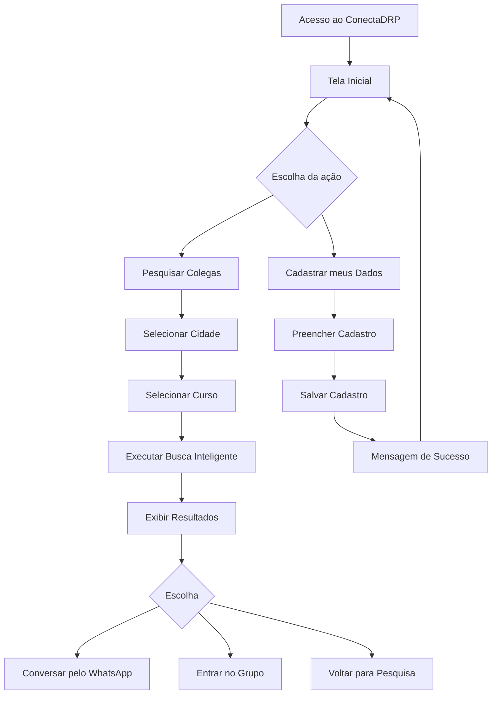
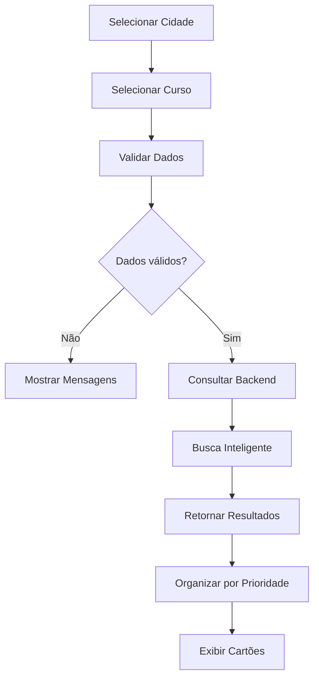
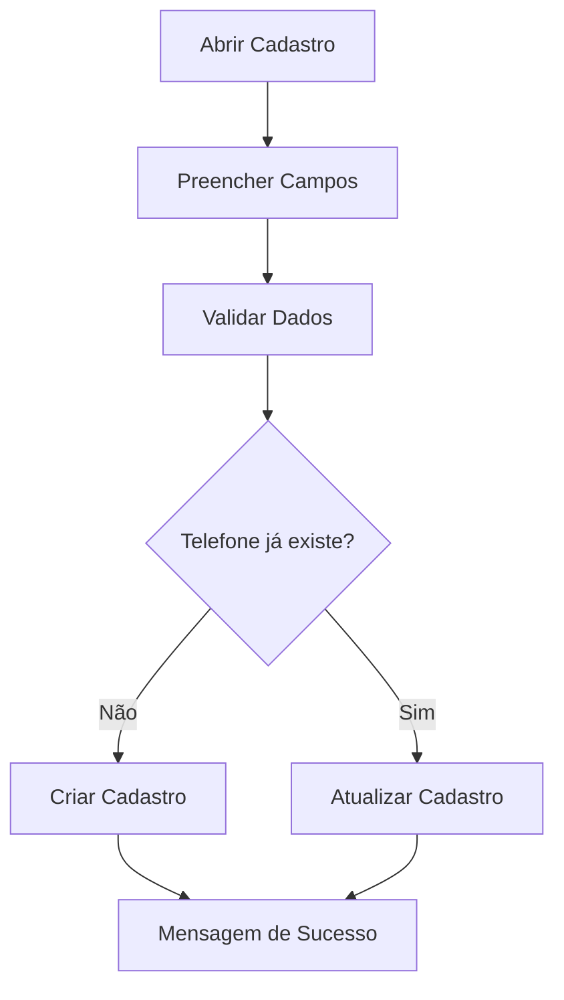
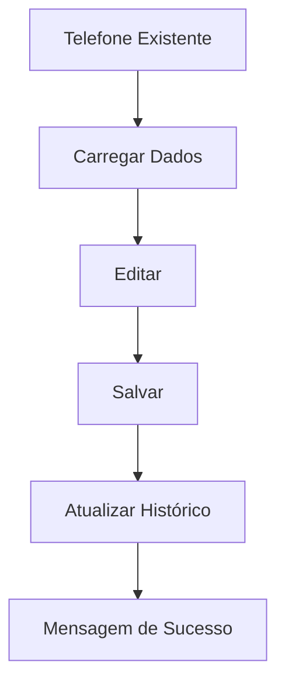
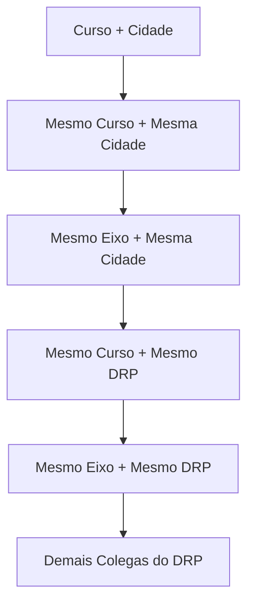
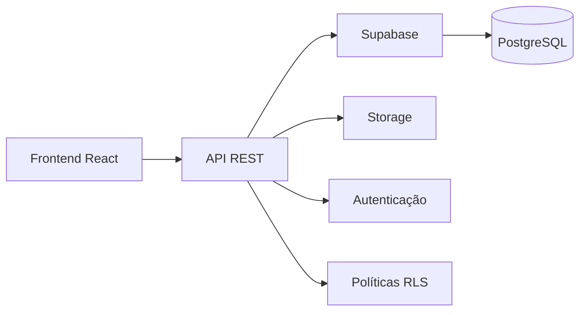
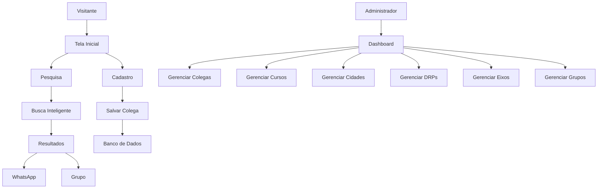

# Documento 02 - Requisitos Funcionais

# ConectaDRP

## Objetivo do Documento

Este documento define integralmente todos os requisitos funcionais do sistema ConectaDRP.

Todos os módulos do sistema deverão ser implementados obrigatoriamente conforme esta especificação.

Nenhuma funcionalidade poderá ser adicionada, removida ou alterada sem atualização desta documentação.

Este documento deverá ser utilizado como principal referência durante o desenvolvimento do Frontend, Backend, Banco de Dados e API.

---

# Índice

1. Objetivo

2. Conceitos Gerais

3. Fluxo Geral do Sistema

4. RF001 - Página Inicial

5. RF002 - Pesquisa de Colegas

6. RF003 - Cadastro de Colega

7. RF004 - Atualização de Cadastro

8. RF005 - Busca Inteligente

9. RF006 - Cartões de Resultado

10. RF007 - Integração com WhatsApp

11. RF008 - Grupos de WhatsApp

12. RF009 - Painel Administrativo

13. RF010 - Componentes Obrigatórios

14. RF011 - Mensagens do Sistema

15. RF012 - Critérios de Aceitação

16. Fluxos de Navegação

17. Considerações Técnicas

---

# 1. Conceitos Gerais

Para efeito desta documentação, considera-se:

## Colega

Pessoa cadastrada no sistema.

Todo usuário cadastrado será tratado internamente pelo sistema como "Colega".

Em toda interface deverá ser utilizada esta nomenclatura.

Nunca utilizar:

Usuário

Aluno

Pessoa

Cliente

Sempre utilizar:

Colega

---

## Visitante

Pessoa que acessa o sistema sem possuir cadastro.

O visitante poderá pesquisar livremente.

O visitante poderá visualizar resultados.

O visitante poderá entrar em contato com colegas.

O visitante somente precisará realizar cadastro caso deseje aparecer nas pesquisas.

---

## Administrador

Pessoa responsável por gerenciar o sistema.

Terá acesso exclusivo ao painel administrativo.

Poderá editar qualquer cadastro.

Poderá remover qualquer cadastro.

Poderá gerenciar cidades.

Poderá gerenciar cursos.

Poderá gerenciar grupos.

Poderá visualizar estatísticas.

---

# 2. Fluxo Geral do Sistema

O fluxo principal deverá ocorrer exatamente nesta ordem.

Visitante acessa o sistema

↓

Tela Inicial

↓

Seleciona Cidade

↓

Seleciona Curso

↓

Sistema identifica automaticamente:

• DRP

• Eixo

↓

Executa Busca Inteligente

↓

Exibe Resultados

↓

Visitante escolhe uma das opções:

• Conversar pelo WhatsApp

ou

• Entrar no Grupo

ou

• Cadastrar seus próprios dados

Não deverá existir qualquer fluxo obrigatório de login.

---

# RF001 - Página Inicial

## Objetivo

Ser a principal tela do sistema.

Todos os visitantes iniciarão obrigatoriamente nesta tela.

---

## Componentes Obrigatórios

Título do sistema

Slogan oficial

Campo Cidade

Campo Curso

Botão "Encontrar Colegas"

Separador visual

Texto incentivando cadastro

Botão "Cadastrar meus Dados"

Rodapé

---

## Layout

O layout deverá seguir o conceito Mobile First.

A tela deverá caber integralmente em smartphones.

Não deverá existir rolagem horizontal.

Todos os componentes deverão possuir largura responsiva.

---

## Cabeçalho

O cabeçalho deverá conter apenas:

Logo do ConectaDRP

Nome do sistema

---

## Nome

ConectaDRP

---

## Slogan

Conectando colegas estudantes da UNIVESP para Projetos Integradores e TCC.

O ensino é a distância.

O estudo pode ser bem perto de você.

---

## Campo Cidade

O campo Cidade deverá funcionar como pesquisa inteligente.

Não será permitido selecionar cidades digitando exatamente o nome.

À medida que o visitante digita, o sistema deverá sugerir cidades.

Exemplo

Digite:

Pres

Resultados

Presidente Prudente

Presidente Bernardes

Presidente Epitácio

Presidente Venceslau

O sistema deverá aceitar pesquisa parcial.

A lista deverá ser filtrada em tempo real.

---

## Campo Curso

O funcionamento deverá ser idêntico ao campo Cidade.

Não utilizar lista fixa extremamente longa.

O visitante digita parte do nome.

O sistema sugere os cursos.

Exemplo

Eng

↓

Engenharia da Computação

---

## Botão Encontrar Colegas

Será o principal botão da aplicação.

Cor predominante:

Azul.

Largura:

100%.

Altura mínima:

48 pixels.

Ícone:

Lupa.

Texto:

Encontrar Colegas.

Ao clicar deverá validar todos os campos obrigatórios.

Caso existam erros, nenhuma pesquisa será realizada.

---

## Validação

Cidade obrigatória.

Curso obrigatório.

Caso algum campo esteja vazio apresentar mensagem imediatamente abaixo do campo correspondente.

Nunca utilizar alert() do navegador.

Todas as mensagens deverão ser exibidas na própria interface.

---

## Botão Cadastrar meus Dados

Posicionado abaixo da pesquisa.

Texto:

Cadastrar meus Dados

Ao clicar deverá abrir a tela de cadastro.

Não deverá abrir modal.

Deverá navegar para uma nova página.

---

## Rodapé

Versão do sistema.

Nome do projeto.

Link para GitHub (quando existir).

Direitos reservados.

---

# Critérios de Aceitação da Página Inicial

A página será considerada aprovada quando:

Carregar em menos de três segundos.

Ser totalmente utilizável em celulares.

Permitir pesquisa parcial de cidades.

Permitir pesquisa parcial de cursos.

Validar todos os campos.

Navegar corretamente para pesquisa.

Navegar corretamente para cadastro.

Não possuir barra de rolagem horizontal.

Apresentar interface limpa.

Apresentar boa legibilidade.

# RF002 - Pesquisa de Colegas

## Objetivo

Permitir que qualquer visitante localize colegas de acordo com sua cidade e curso, retornando resultados organizados por relevância, seguindo rigorosamente as regras de negócio definidas para o ConectaDRP.

A pesquisa é a principal funcionalidade do sistema e deverá possuir prioridade máxima durante o desenvolvimento.

---

## Pré-condições

Para que a pesquisa seja executada deverão existir obrigatoriamente:

- Cidade selecionada.
- Curso selecionado.

Caso qualquer um destes campos não esteja preenchido, a pesquisa não poderá ser iniciada.

---

## Informações Utilizadas

A pesquisa utilizará as seguintes informações:

### Informadas pelo visitante

- Cidade
- Curso

### Identificadas automaticamente pelo sistema

- DRP
- Eixo

Essas informações deverão permanecer transparentes para o visitante.

---

## Fluxo Principal

1. O visitante acessa a tela inicial.

2. Seleciona sua cidade.

3. Seleciona seu curso.

4. Pressiona o botão "Encontrar Colegas".

5. O sistema valida os campos obrigatórios.

6. O sistema identifica automaticamente:

- DRP da cidade informada.
- Eixo do curso informado.

7. O sistema executa a Busca Inteligente.

8. Os resultados são classificados por prioridade.

9. Os resultados são exibidos em blocos separados.

10. Cada bloco deverá possuir seu próprio título.

11. Cada colega será apresentado em formato de cartão.

12. O visitante poderá iniciar conversa via WhatsApp ou entrar em um grupo existente.

---

# Busca Inteligente

A lógica abaixo é obrigatória.

Não poderá ser alterada durante o desenvolvimento.

---

## Prioridade 1

Mesmo Curso

+

Mesma Cidade

Esta é a correspondência perfeita.

Sempre deverá aparecer primeiro.

Exemplo

Cidade pesquisada:

Presidente Prudente

Curso:

Engenharia da Computação

Resultado

Todos os colegas cadastrados exatamente com:

Cidade = Presidente Prudente

Curso = Engenharia da Computação

---

## Prioridade 2

Mesmo Eixo

+

Mesma Cidade

Caso existam outros cursos pertencentes ao mesmo eixo, eles deverão aparecer após os resultados da Prioridade 1.

Exemplo

Cidade

Presidente Prudente

Curso pesquisado

Engenharia da Computação

Eixo identificado

Computação

Resultados

Engenharia da Computação

Ciência de Dados

Tecnologia da Informação

Desde que pertençam ao mesmo eixo.

---

## Prioridade 3

Mesmo Curso

+

Mesmo DRP

Caso a cidade não possua quantidade suficiente de colegas, deverão ser apresentados colegas do mesmo curso pertencentes a outras cidades do mesmo DRP.

Exemplo

Cidade pesquisada

Presidente Prudente

Mesmo DRP

Presidente Bernardes

Pirapozinho

Álvares Machado

Martinópolis

Regente Feijó

Todas pertencentes ao mesmo DRP.

---

## Prioridade 4

Mesmo Eixo

+

Mesmo DRP

Apresentar colegas do mesmo eixo localizados em outras cidades pertencentes ao mesmo DRP.

---

## Prioridade 5

Demais colegas do DRP

Como último recurso deverão ser exibidos todos os demais colegas cadastrados naquele DRP.

Independentemente do curso.

Independentemente do eixo.

---

# Organização dos Resultados

Os resultados deverão ser divididos em blocos.

Jamais deverão ser misturados.

Exemplo

------------------------------------

Mesmo curso na sua cidade

3 colegas encontrados

[ cartões ]

------------------------------------

Mesmo eixo na sua cidade

6 colegas encontrados

[ cartões ]

------------------------------------

Mesmo curso no seu DRP

12 colegas encontrados

[ cartões ]

------------------------------------

Mesmo eixo no seu DRP

18 colegas encontrados

[ cartões ]

------------------------------------

Outros colegas do DRP

27 colegas encontrados

[ cartões ]

---

# Ordenação

Dentro de cada bloco a ordenação deverá obedecer:

1. Nome em ordem alfabética.

Em versões futuras poderá existir ordenação por:

- semestre;
- data de cadastro;
- cidade.

Na versão 1.0 utilizar exclusivamente ordem alfabética.

---

# Quantidade de Resultados

Não deverá existir limite artificial de resultados.

Todos os colegas encontrados deverão ser apresentados.

Caso a quantidade seja elevada, utilizar paginação ou carregamento incremental ("Carregar mais"), preservando a ordem definida.

---

# Informações Apresentadas em Cada Resultado

Cada cartão deverá apresentar obrigatoriamente:

- Nome.
- Cidade.
- Curso.
- Semestre (quando informado).
- Botão Conversar pelo WhatsApp.

Quando existir grupo disponível também apresentar:

Botão Entrar no Grupo.

---

# Informações Opcionais

Quando cadastradas, também poderão aparecer:

- Observações.
- Pequena descrição do colega.

Nunca apresentar informações inexistentes.

Campos vazios não deverão gerar espaços em branco.

---

# Nenhum Resultado Encontrado

Caso nenhuma pessoa seja localizada em qualquer prioridade, apresentar uma tela amigável contendo:

Título

Nenhum colega encontrado.

Mensagem

Ainda não existem colegas cadastrados para esta pesquisa.

Seja o primeiro a cadastrar seus dados e ajude outros estudantes a encontrarem você.

Botão

Cadastrar meus Dados

Nunca apresentar uma tela vazia.

Nunca apresentar erro técnico.

---

# Tempo Máximo de Resposta

Objetivo:

Até 2 segundos.

Tempo máximo aceitável:

3 segundos.

Caso ultrapasse esse tempo deverá ser exibido indicador de carregamento.

---

# Indicador de Carregamento

Durante a pesquisa deverá existir indicador visual.

Texto sugerido

Procurando colegas...

Nunca deixar o visitante sem retorno visual enquanto a pesquisa estiver em execução.

---

# Critérios de Aceitação

A funcionalidade será considerada concluída quando:

✓ Localizar corretamente colegas do mesmo curso e cidade.

✓ Localizar corretamente colegas do mesmo eixo e cidade.

✓ Localizar corretamente colegas do mesmo curso no DRP.

✓ Localizar corretamente colegas do mesmo eixo no DRP.

✓ Localizar corretamente os demais colegas do DRP.

✓ Organizar os resultados em blocos.

✓ Exibir corretamente a quantidade de colegas encontrada em cada bloco.

✓ Abrir corretamente a conversa do WhatsApp.

✓ Exibir o botão de grupo quando existir.

✓ Exibir mensagem amigável quando não houver resultados.

✓ Funcionar corretamente em smartphones.

# RF003 - Cadastro de Colega

## Objetivo

Permitir que qualquer visitante cadastre seus dados para que possa ser encontrado por outros colegas durante as pesquisas.

O processo de cadastro deverá ser simples, rápido e intuitivo, podendo ser concluído em menos de um minuto.

O cadastro não deverá exigir criação de conta, login, senha ou confirmação por e-mail.

---

# Fluxo Principal

1. O visitante acessa a tela inicial.

2. Clica no botão:

"Cadastrar meus Dados"

3. O sistema abre a tela de cadastro.

4. O visitante preenche os campos obrigatórios.

5. O sistema valida todas as informações.

6. Caso não exista outro cadastro utilizando o mesmo telefone, o cadastro será salvo.

7. O sistema identificará automaticamente:

- DRP
- Eixo

8. O sistema apresentará mensagem de sucesso.

9. O visitante poderá imediatamente realizar pesquisas.

---

# Campos Obrigatórios

## Nome

Obrigatório.

Tipo:

Texto.

Tamanho mínimo:

3 caracteres.

Tamanho máximo:

100 caracteres.

Não permitir apenas números.

Não permitir campo vazio.

Remover espaços duplicados automaticamente.

Converter para formato de nome próprio.

Exemplo

joao da silva

↓

João da Silva

---

## Telefone

Obrigatório.

Tipo

Celular.

Formato esperado

DDD + Número.

Exemplo

18998123456

O sistema deverá remover automaticamente:

(

)

-

Espaços

Exemplo

(18) 99812-3456

↓

18998123456

O número será armazenado apenas com dígitos.

---

## Cidade

Obrigatório.

Selecionada através de pesquisa inteligente.

Não permitir digitação livre.

O visitante deverá escolher uma cidade existente.

Ao selecionar a cidade o sistema identificará automaticamente:

DRP.

---

## Curso

Obrigatório.

Selecionado através de pesquisa inteligente.

Não permitir digitação livre.

Ao selecionar o curso o sistema identificará automaticamente:

Eixo.

---

# Campos Opcionais

## Semestre

Opcional.

Valores permitidos

1

2

3

4

5

6

7

8

9

10

Caso não informado, não exibir nos cartões.

---

## Observações

Opcional.

Quantidade máxima

300 caracteres.

Permitido informar:

Área de interesse.

Tema de Projeto Integrador.

Tema de TCC.

Disponibilidade para reuniões.

Exemplo

"Tenho interesse em IA e Desenvolvimento Web."

---

# Campos Automáticos

Jamais deverão aparecer para o visitante.

Serão preenchidos pelo sistema.

## DRP

Obtido automaticamente a partir da cidade.

Nunca poderá ser alterado manualmente.

---

## Eixo

Obtido automaticamente a partir do curso.

Nunca poderá ser alterado manualmente.

---

## Data de Cadastro

Gerada automaticamente.

Formato

AAAA-MM-DD HH:MM:SS

---

## Situação

Todo novo cadastro iniciará como:

Ativo.

---

# Validações

## Nome

Não aceitar:

Campo vazio.

Somente números.

Somente caracteres especiais.

Menos de três letras.

---

## Telefone

Não aceitar:

Quantidade incorreta de dígitos.

Caracteres inválidos.

Telefone já existente.

Caso o telefone exista:

Não criar novo cadastro.

Acionar procedimento descrito no RF004.

---

## Cidade

Obrigatória.

Deverá existir na base oficial.

Caso contrário:

Cidade inválida.

---

## Curso

Obrigatório.

Deverá existir na base oficial.

Caso contrário:

Curso inválido.

---

# Mensagens de Erro

## Nome

Informe seu nome.

---

## Telefone

Informe um telefone válido.

---

## Cidade

Selecione uma cidade.

---

## Curso

Selecione um curso.

---

# Mensagem de Sucesso

Cadastro realizado com sucesso.

Agora outros colegas poderão encontrá-lo.

Botões

Encontrar Colegas

Voltar para Início

---

# Máscaras

## Telefone

Durante a digitação utilizar máscara.

Exemplo

(18) 99812-3456

Ao salvar remover toda a formatação.

---

# Segurança

Todo texto informado pelo visitante deverá ser tratado antes de ser salvo.

Remover:

Scripts.

Tags HTML.

Caracteres maliciosos.

Evitar SQL Injection.

Evitar Cross Site Scripting (XSS).

Toda validação deverá ocorrer:

No Frontend.

E obrigatoriamente novamente no Backend.

---

# Componentes React Envolvidos

CadastroPage

CadastroForm

InputNome

InputTelefone

InputCidade

InputCurso

InputSemestre

InputObservacoes

BotaoCadastrar

MensagemSucesso

MensagemErro

---

# Endpoint Esperado

POST

/api/colegas

Corpo esperado

```json
{
  "nome": "",
  "telefone": "",
  "cidadeId": "",
  "cursoId": "",
  "semestre": "",
  "observacoes": ""
}
```

Resposta esperada

HTTP 201

```json
{
  "success": true,
  "message": "Cadastro realizado com sucesso."
}
```

---

# Critérios de Aceitação

A funcionalidade será considerada concluída quando:

✓ Permitir cadastro em menos de um minuto.

✓ Validar todos os campos obrigatórios.

✓ Identificar automaticamente DRP.

✓ Identificar automaticamente Eixo.

✓ Salvar corretamente no banco de dados.

✓ Impedir telefones duplicados.

✓ Exibir mensagens amigáveis.

✓ Funcionar corretamente em dispositivos móveis.

✓ Exibir confirmação de sucesso.

# RF004 - Atualização de Cadastro

## Objetivo

Garantir que cada colega possua apenas um cadastro ativo no sistema.

O telefone celular será considerado o identificador único do cadastro.

Caso um colega tente realizar um novo cadastro utilizando um telefone já existente, o sistema não deverá criar um novo registro.

O sistema deverá oferecer a atualização do cadastro existente.

---

# Fluxo Principal

1. O visitante acessa a tela de cadastro.

2. Informa todos os dados.

3. Clica em "Cadastrar".

4. O sistema verifica se o telefone informado já existe.

5. Caso o telefone não exista:

Prosseguir normalmente com o cadastro.

6. Caso o telefone exista:

Interromper o cadastro.

Apresentar mensagem informando que já existe um cadastro para aquele telefone.

Oferecer a opção de atualização.

---

# Mensagem ao Usuário

Título

Cadastro encontrado

Mensagem

Encontramos um cadastro utilizando este número de telefone.

Caso seja realmente seu cadastro, você poderá atualizá-lo.

Botões

Atualizar Cadastro

Cancelar

---

# Processo de Atualização

Ao selecionar "Atualizar Cadastro":

O sistema deverá localizar o cadastro correspondente.

Todos os dados existentes deverão ser carregados automaticamente na tela.

Os campos deverão aparecer preenchidos.

O colega poderá alterar apenas as informações desejadas.

---

# Campos Permitidos para Atualização

Nome

Telefone

Cidade

Curso

Semestre

Observações

---

# Atualização Automática

Sempre que Cidade for alterada:

Atualizar automaticamente o DRP correspondente.

Sempre que Curso for alterado:

Atualizar automaticamente o Eixo correspondente.

Estas alterações deverão ocorrer automaticamente.

Nunca permitir edição manual de DRP ou Eixo.

---

# Campos Não Editáveis

Os seguintes campos deverão permanecer internos ao sistema:

ID

Data de Cadastro

Data da Última Atualização

DRP

Eixo

Situação

Quantidade de Pesquisas

Quantidade de Visualizações

---

# Registro da Atualização

Sempre que um cadastro for atualizado o sistema deverá registrar:

Data da atualização.

Hora da atualização.

Campo alterado.

Valor anterior.

Novo valor.

Este histórico será utilizado apenas pelo painel administrativo.

Não será exibido ao colega.

---

# Histórico de Alterações

O sistema deverá manter um histórico completo de alterações.

Exemplo

Cadastro criado

↓

Telefone alterado

↓

Cidade alterada

↓

Curso alterado

↓

Observação atualizada

O histórico permitirá auditoria administrativa.

---

# Validação das Alterações

Antes de salvar:

Validar novamente todos os campos obrigatórios.

Caso algum campo fique inválido:

Cancelar atualização.

Exibir mensagem correspondente.

---

# Atualização do Telefone

Caso o colega altere o telefone:

Verificar se o novo telefone já pertence a outro cadastro.

Caso pertença:

Não permitir atualização.

Mensagem

Este telefone já pertence a outro colega.

---

# Atualização da Cidade

Ao alterar a cidade:

Atualizar automaticamente:

DRP

Região

Município

Caso a cidade não exista:

Não permitir salvar.

---

# Atualização do Curso

Ao alterar o curso:

Atualizar automaticamente:

Curso

Eixo

Área Acadêmica

Nunca permitir inconsistências.

---

# Exclusão de Informações

Campos opcionais poderão ser removidos.

Exemplo

Semestre.

Observações.

Ao apagar um campo opcional:

Salvar valor NULL.

Jamais armazenar texto vazio.

---

# Cancelamento

Caso o colega pressione:

Cancelar

Nenhuma alteração deverá ser salva.

Retornar para a tela inicial.

---

# Confirmação

Após atualização:

Título

Cadastro atualizado com sucesso.

Mensagem

Suas informações foram atualizadas.

Agora outros colegas encontrarão seus dados atualizados durante as pesquisas.

Botões

Pesquisar Colegas

Voltar ao Início

---

# Endpoint Esperado

PUT

/api/colegas/{id}

Exemplo

```json
{
    "nome":"João da Silva",
    "telefone":"18998123456",
    "cidadeId":27,
    "cursoId":8,
    "semestre":5,
    "observacoes":"Disponível para Projeto Integrador."
}
```

Resposta

HTTP 200

```json
{
    "success":true,
    "message":"Cadastro atualizado com sucesso."
}
```

---

# Exclusão de Cadastro

O colega poderá solicitar a exclusão definitiva do seu cadastro.

Antes da exclusão apresentar confirmação.

Mensagem

Tem certeza que deseja excluir seu cadastro?

Esta ação não poderá ser desfeita.

Botões

Excluir Cadastro

Cancelar

---

# Exclusão Lógica

Na versão 1.0 NÃO será realizada exclusão física.

O sistema deverá utilizar exclusão lógica.

Campo

status

Valores possíveis

ATIVO

INATIVO

Cadastros inativos:

Não aparecerão nas pesquisas.

Continuarão armazenados no banco.

Poderão ser restaurados pelo administrador.

---

# Componentes React

AtualizarCadastroPage

AtualizarCadastroForm

BotaoSalvarAlteracoes

BotaoCancelar

ModalConfirmacao

MensagemAtualizacao

MensagemErroAtualizacao

---

# Casos de Teste

CT001

Cadastrar telefone inexistente.

Resultado esperado

Cadastro criado.

---

CT002

Cadastrar telefone já existente.

Resultado esperado

Sistema oferece atualização.

---

CT003

Atualizar cidade.

Resultado esperado

DRP atualizado automaticamente.

---

CT004

Atualizar curso.

Resultado esperado

Eixo atualizado automaticamente.

---

CT005

Cancelar atualização.

Resultado esperado

Nenhum dado alterado.

---

CT006

Excluir cadastro.

Resultado esperado

Cadastro marcado como INATIVO.

---

# Critérios de Aceitação

A funcionalidade será considerada concluída quando:

✓ Não existirem telefones duplicados.

✓ Todo colega possuir apenas um cadastro ativo.

✓ Atualizações ocorrerem corretamente.

✓ Histórico de alterações for registrado.

✓ Exclusão lógica funcionar corretamente.

✓ DRP e Eixo forem recalculados automaticamente.

✓ Todos os testes previstos forem aprovados.

# RF005 - Busca Inteligente

## Objetivo

A Busca Inteligente é o principal diferencial do ConectaDRP.

Seu objetivo é apresentar ao colega os resultados mais relevantes possíveis, priorizando a proximidade geográfica e a afinidade acadêmica.

O algoritmo deverá ser desenvolvido para reduzir ao máximo o esforço do usuário em localizar colegas para Projetos Integradores, Trabalhos de Conclusão de Curso e grupos de estudo.

Toda pesquisa deverá obedecer rigorosamente às regras descritas neste documento.

Nenhuma alteração na ordem de prioridade poderá ser realizada sem atualização oficial desta documentação.

---

# Conceitos

Para compreender o algoritmo de busca, o sistema deverá considerar quatro informações fundamentais:

- Cidade
- Curso
- Eixo
- DRP

Essas quatro informações serão utilizadas para calcular a relevância dos resultados.

---

# Ordem Obrigatória de Prioridade

Toda pesquisa deverá seguir exatamente esta sequência.

## Prioridade 1

Mesmo Curso

+

Mesma Cidade

Este é o cenário ideal.

Sempre deverá aparecer em primeiro lugar.

Exemplo

Cidade pesquisada

Presidente Prudente

Curso

Engenharia da Computação

Resultado esperado

Todos os colegas cadastrados exatamente com:

Cidade

Presidente Prudente

Curso

Engenharia da Computação

---

## Prioridade 2

Mesmo Eixo

+

Mesma Cidade

Caso existam colegas na mesma cidade pertencentes ao mesmo eixo acadêmico, eles deverão aparecer logo após os resultados da Prioridade 1.

Exemplo

Curso pesquisado

Engenharia da Computação

Eixo identificado

Computação

Resultados possíveis

Ciência de Dados

Tecnologia da Informação

Sistemas para Internet

Desde que pertençam ao mesmo eixo.

---

## Prioridade 3

Mesmo Curso

+

Mesmo DRP

Caso não existam colegas suficientes na cidade pesquisada, deverão ser localizados colegas do mesmo curso pertencentes às demais cidades do mesmo DRP.

---

## Prioridade 4

Mesmo Eixo

+

Mesmo DRP

Apresentar colegas pertencentes ao mesmo eixo acadêmico localizados nas demais cidades do DRP.

---

## Prioridade 5

Demais Colegas do DRP

Como último recurso, apresentar todos os demais colegas cadastrados naquele DRP.

Independentemente do curso.

Independentemente do eixo.

---

# Regra Fundamental

Um colega nunca poderá aparecer em dois blocos diferentes.

Assim que um colega for incluído em uma prioridade, ele deverá ser removido automaticamente das próximas.

Exemplo

João

Mesmo curso

Mesma cidade

↓

Não poderá aparecer novamente em:

Mesmo eixo

Mesmo DRP

---

# Agrupamento dos Resultados

Os resultados deverão ser apresentados em blocos independentes.

Cada bloco deverá possuir:

Título

Descrição

Quantidade de colegas encontrados

Lista de cartões

---

Exemplo

Mesmo curso na sua cidade

4 colegas encontrados

[ cartões ]

--------------------------------

Mesmo eixo na sua cidade

8 colegas encontrados

[ cartões ]

--------------------------------

Mesmo curso no seu DRP

15 colegas encontrados

[ cartões ]

--------------------------------

Mesmo eixo no seu DRP

26 colegas encontrados

[ cartões ]

--------------------------------

Outros colegas do DRP

39 colegas encontrados

[ cartões ]

---

# Ordenação Dentro dos Blocos

Todos os cartões deverão obedecer à seguinte ordem:

Primeiro

Nome em ordem alfabética.

Em futuras versões poderá existir ordenação por:

Semestre

Cidade

Data de cadastro

Quantidade de acessos

Na versão 1.0 utilizar exclusivamente ordem alfabética.

---

# Quantidade de Resultados

O sistema não deverá limitar artificialmente a quantidade de colegas.

Caso existam:

5 colegas

Mostrar 5.

Caso existam:

250 colegas

Mostrar todos.

Quando necessário utilizar carregamento progressivo.

---

# Carregamento Progressivo

Caso o bloco possua muitos resultados:

Mostrar inicialmente:

20 cartões.

Exibir botão:

Carregar mais.

Ao clicar:

Adicionar mais 20 cartões.

Sem recarregar a página.

---

# Pesquisa sem Resultados

Caso nenhuma prioridade encontre colegas, apresentar uma tela amigável.

Título

Nenhum colega encontrado.

Mensagem

Ainda não encontramos colegas para esta pesquisa.

Seja o primeiro a cadastrar seus dados e ajude outros estudantes a encontrarem você.

Botão

Cadastrar meus Dados

Botão

Nova Pesquisa

Nunca apresentar página em branco.

Nunca apresentar erro técnico.

---

# Pesquisa Parcial

Os campos Cidade e Curso deverão permitir pesquisa incremental.

Exemplo

Usuário digita

Pres

Sistema apresenta

Presidente Prudente

Presidente Bernardes

Presidente Epitácio

Presidente Venceslau

Outro exemplo

Usuário digita

Comp

Sistema apresenta

Engenharia da Computação

Ciência da Computação

Computação em Nuvem

---

# Tempo Máximo de Pesquisa

Objetivo

Até 2 segundos.

Máximo aceitável

3 segundos.

Caso ultrapasse:

Exibir indicador visual.

---

# Indicador de Pesquisa

Enquanto a pesquisa estiver sendo realizada:

Mostrar animação.

Texto

Procurando colegas próximos...

Não permitir que o visitante clique novamente no botão de pesquisa.

O botão deverá permanecer desabilitado até a conclusão.

---

# Filtros Futuros

A arquitetura deverá permitir facilmente adicionar novos filtros.

Exemplos

Semestre

Cidade vizinha

Disponibilidade

Projeto Integrador

TCC

Tema de interesse

Esses filtros não deverão aparecer na versão 1.0.

Entretanto a arquitetura deverá ser preparada para suportá-los.

---

# Desempenho

A busca deverá utilizar consultas indexadas.

Não será permitido carregar todos os colegas para filtrar no Frontend.

Toda filtragem deverá ocorrer no Backend.

O Frontend deverá receber apenas os resultados necessários.

---

# Componentes React

SearchPage

SearchForm

SearchButton

LoadingIndicator

ResultSection

ResultCard

EmptyState

PaginationButton

---

# Endpoints Esperados

Pesquisar colegas

GET

/api/pesquisa

Parâmetros

cidadeId

cursoId

Exemplo

/api/pesquisa?cidadeId=34&cursoId=12

Resposta esperada

```json
{
  "mesmoCursoMesmaCidade": [],
  "mesmoEixoMesmaCidade": [],
  "mesmoCursoMesmoDRP": [],
  "mesmoEixoMesmoDRP": [],
  "outrosColegasDRP": []
}
```

---

# Casos de Teste

CT001

Existem colegas do mesmo curso na cidade.

Resultado esperado

Exibir apenas no primeiro bloco.

---

CT002

Não existem colegas do mesmo curso.

Existem colegas do mesmo eixo.

Resultado esperado

Exibir segundo bloco.

---

CT003

Não existem colegas na cidade.

Existem colegas no mesmo DRP.

Resultado esperado

Exibir terceiro e quarto blocos.

---

CT004

Não existe nenhum colega.

Resultado esperado

Exibir tela "Nenhum colega encontrado".

---

CT005

Existem mais de 200 colegas.

Resultado esperado

Utilizar carregamento progressivo.

---

# Critérios de Aceitação

A funcionalidade será considerada concluída quando:

✓ Respeitar rigorosamente a ordem das prioridades.

✓ Nunca repetir colegas em blocos diferentes.

✓ Exibir corretamente os títulos dos blocos.

✓ Exibir corretamente a quantidade de colegas encontrados.

✓ Funcionar em celulares sem perda de desempenho.

✓ Utilizar consultas otimizadas no Backend.

✓ Não realizar filtragens complexas no Frontend.

✓ Retornar resultados em até três segundos.

✓ Exibir corretamente a tela de ausência de resultados.

# RF006 - Cartões de Resultado

## Objetivo

Os Cartões de Resultado representam a principal forma de interação entre os colegas cadastrados.

Toda pesquisa realizada pelo sistema retornará uma lista de cartões contendo as informações necessárias para que um colega consiga entrar em contato com outro de maneira rápida.

O cartão deverá ser limpo, organizado e totalmente responsivo.

O objetivo é permitir que o visitante identifique rapidamente quem pode fazer parte do seu grupo de Projeto Integrador, TCC ou estudos.

---

# Estrutura do Cartão

Cada colega será apresentado individualmente.

Nunca apresentar resultados em formato de tabela.

Cada resultado deverá ser um Card independente.

Estrutura:

```
+------------------------------------------------+
| 👤 Nome do Colega                              |
|                                                |
| 📍 Cidade                                      |
| 🎓 Curso                                       |
| 🏛️ Eixo                                        |
| 🏢 DRP                                         |
| 📚 Semestre (quando informado)                 |
|                                                |
| 📝 Observações (quando existirem)              |
|                                                |
| [ Conversar no WhatsApp ]                      |
| [ Entrar no Grupo ] (quando existir)           |
+------------------------------------------------+
```

---

# Informações Obrigatórias

Cada cartão deverá exibir obrigatoriamente:

Nome

Cidade

Curso

---

# Informações Automáticas

Também deverão aparecer:

Eixo

DRP

Esses dados não são informados pelo colega.

São obtidos automaticamente pelo sistema.

---

# Informações Opcionais

Caso tenham sido cadastradas:

Semestre

Observações

Caso estejam vazias

Não deverão aparecer.

Jamais exibir:

Semestre:

Sem informação

Ou

Observações:

-

---

# Nome

O nome deverá possuir maior destaque visual.

Utilizar fonte maior.

Negrito.

Caso o nome seja muito grande:

Quebrar linha automaticamente.

Nunca cortar o texto.

Nunca utilizar "...".

---

# Cidade

Mostrar somente o nome da cidade.

Não mostrar Estado.

Exemplo

Presidente Prudente

---

# Curso

Mostrar exatamente o nome oficial do curso.

Jamais utilizar abreviações.

Exemplo

Engenharia da Computação

---

# Eixo

Mostrar abaixo do curso.

Exemplo

Computação

---

# DRP

Mostrar apenas o nome do DRP.

Exemplo

DRP Presidente Prudente

---

# Semestre

Somente aparecer quando informado.

Exemplo

5º Semestre

---

# Observações

Quando existirem.

Quantidade máxima exibida

200 caracteres.

Caso ultrapasse

Exibir botão

Ver mais

Ao clicar

Expandir o texto.

---

# Botão Conversar pelo WhatsApp

Este será o principal botão do cartão.

Texto

Conversar no WhatsApp

Ícone

WhatsApp

Cor

Verde.

Largura

100%.

Altura mínima

48 pixels.

Ao clicar

Abrir automaticamente conversa no WhatsApp.

---

# Link do WhatsApp

Formato obrigatório

https://wa.me/5518999999999

Sempre utilizar:

Código do Brasil

DDD

Número

Sem espaços.

Sem parênteses.

Sem traços.

---

# Mensagem Inicial

Na versão 1.0

Não enviar mensagem automática.

Abrir apenas a conversa.

Em versões futuras poderá existir mensagem personalizada.

---

# Botão Entrar no Grupo

Somente deverá aparecer quando existir um grupo cadastrado.

Texto

Entrar no Grupo

Ícone

Grupo

Cor

Azul.

---

# Comportamento

Ao clicar

Abrir o link oficial do grupo.

Caso o aplicativo WhatsApp esteja instalado

Abrir diretamente.

Caso contrário

Abrir WhatsApp Web.

---

# Grupo Inexistente

Caso não exista grupo para aquela combinação:

Curso

Cidade

O botão não deverá aparecer.

Em seu lugar poderá existir:

Ainda não existe grupo para esta turma.

---

# Destaque Visual

Os cartões pertencentes ao primeiro bloco

Mesmo Curso + Mesma Cidade

Deverão possuir destaque especial.

Exemplo

Borda azul.

Fundo levemente destacado.

Objetivo

Mostrar imediatamente os colegas mais compatíveis.

---

# Responsividade

Em celulares

Um cartão por linha.

Em tablets

Dois cartões por linha.

Em computadores

Até quatro cartões por linha.

---

# Espaçamento

Entre cartões

16 pixels.

Entre informações

8 pixels.

Margem externa

16 pixels.

---

# Estados do Cartão

Estado Normal

Informações exibidas.

Botões ativos.

---

Estado Hover

Somente Desktop.

Pequena elevação.

Sombra suave.

Nunca utilizar animações exageradas.

---

Estado Selecionado

Não utilizado na versão 1.0.

---

Estado Indisponível

Caso o cadastro esteja inativo.

O cartão nunca deverá aparecer.

---

# Acessibilidade

Todos os botões deverão possuir:

aria-label

title

Texto alternativo.

Ícones nunca deverão ser a única forma de identificação.

Sempre utilizar texto.

---

# Performance

As imagens não serão utilizadas.

Não haverá foto do colega.

Objetivo

Carregamento extremamente rápido.

---

# Segurança

Nunca exibir:

ID interno.

Telefone completo em texto.

Data de cadastro.

Data de atualização.

Status interno.

Histórico.

Essas informações pertencem apenas ao painel administrativo.

---

# Componentes React

ResultCard

ResultCardHeader

ResultCardBody

ResultCardFooter

WhatsAppButton

GroupButton

ObservationCollapse

---

# Casos de Teste

CT001

Colega sem semestre.

Resultado esperado

Campo não aparece.

---

CT002

Colega sem observações.

Resultado esperado

Campo não aparece.

---

CT003

Grupo existente.

Resultado esperado

Botão Entrar no Grupo.

---

CT004

Grupo inexistente.

Resultado esperado

Mensagem informativa.

---

CT005

Nome grande.

Resultado esperado

Quebra automática de linha.

---

CT006

Tela em celular.

Resultado esperado

Um cartão por linha.

---

CT007

Tela Desktop.

Resultado esperado

Até quatro cartões por linha.

---

# Critérios de Aceitação

A funcionalidade será considerada concluída quando:

✓ Todos os cartões apresentarem layout uniforme.

✓ O botão do WhatsApp abrir corretamente a conversa.

✓ O botão do grupo aparecer apenas quando existir um link cadastrado.

✓ As informações opcionais aparecerem somente quando preenchidas.

✓ O primeiro bloco possuir destaque visual.

✓ Os cartões funcionarem corretamente em celulares, tablets e computadores.

✓ Nenhuma informação administrativa for exposta ao visitante.

# RF007 - Integração com WhatsApp

## Objetivo

O WhatsApp será o principal canal de comunicação entre os colegas cadastrados no ConectaDRP.

Toda integração deverá ser simples, rápida e transparente para o usuário.

O sistema não enviará mensagens automaticamente.

O sistema apenas facilitará o contato entre os colegas.

---

# Princípios

A integração deverá seguir os seguintes princípios:

- Simplicidade.
- Rapidez.
- Compatibilidade.
- Segurança.
- Não exigir login no WhatsApp.
- Não armazenar conversas.
- Não acessar mensagens.
- Não acessar grupos.
- Não utilizar APIs não oficiais.

O ConectaDRP será apenas um facilitador de conexão.

---

# Objetivos da Integração

Permitir que um colega:

- converse rapidamente com outro colega;
- encontre um grupo existente;
- participe de um grupo relacionado ao seu curso;
- conheça colegas próximos para formar equipes.

---

# Botão Conversar no WhatsApp

Todo cartão de colega deverá possuir este botão.

Texto

Conversar no WhatsApp

Ícone

WhatsApp

Cor predominante

Verde.

Posição

Último elemento do cartão.

Largura

100%.

---

# Funcionamento

Ao clicar:

O sistema deverá abrir o endereço:

https://wa.me/{telefone}

Exemplo

https://wa.me/5518998123456

Caso o dispositivo possua WhatsApp instalado:

Abrir diretamente o aplicativo.

Caso contrário:

Abrir automaticamente o WhatsApp Web.

---

# Formatação do Telefone

Antes de gerar o link o sistema deverá remover:

Espaços

Parênteses

Traços

Pontos

Caracteres especiais

Exemplo

Entrada

(18) 99812-3456

Armazenado

18998123456

Link gerado

https://wa.me/5518998123456

---

# Código do País

Sempre utilizar

55

Nunca permitir que o usuário informe o código manualmente.

O sistema deverá acrescentá-lo automaticamente.

---

# Validação

Antes de abrir o WhatsApp verificar:

Telefone informado.

Quantidade correta de dígitos.

Telefone ativo no cadastro.

Caso contrário:

Exibir mensagem

Telefone indisponível.

---

# Mensagem Inicial

Na versão 1.0

Não enviar mensagem automaticamente.

O usuário iniciará a conversa manualmente.

Motivo

Evitar mensagens indesejadas.

Respeitar a privacidade dos colegas.

---

# Evolução Futura

A arquitetura deverá permitir futuramente:

Mensagem automática.

Exemplo

Olá.

Encontrei seu cadastro no ConectaDRP.

Também estudo Engenharia da Computação na UNIVESP.

Gostaria de conversar sobre Projeto Integrador.

Essa funcionalidade NÃO deverá existir na versão 1.0.

---

# RF008 - Grupos de WhatsApp

## Objetivo

Permitir que colegas encontrem grupos já existentes relacionados ao seu curso.

O sistema NÃO criará grupos automaticamente.

O sistema NÃO adicionará pessoas automaticamente.

O sistema apenas armazenará e divulgará links oficiais cadastrados pelos próprios usuários ou administradores.

---

# Estrutura do Grupo

Cada grupo deverá possuir:

Nome.

Curso.

Eixo.

Cidade.

DRP.

Link do convite.

Responsável pelo cadastro.

Data do cadastro.

Situação.

---

# Nome do Grupo

Exemplo

UNIVESP

PI

Engenharia da Computação

Presidente Prudente

O nome será apenas informativo.

---

# Link do Grupo

Obrigatório.

Formato esperado

https://chat.whatsapp.com/xxxxxxxxxxxxxxxx

Antes de salvar:

Validar se o endereço pertence ao domínio oficial do WhatsApp.

Caso contrário:

Não permitir cadastro.

---

# Situação

Cada grupo poderá possuir um dos seguintes estados:

ATIVO

INATIVO

ENCERRADO

Somente grupos ativos deverão aparecer nas pesquisas.

---

# Regra de Unicidade

Na versão 1.0 será permitido apenas:

Um grupo ativo

para cada combinação

Cidade + Curso

Exemplo

Cidade

Presidente Prudente

Curso

Engenharia da Computação

Resultado

Somente um grupo ativo.

Caso outro grupo seja cadastrado:

O administrador deverá decidir qual permanecerá ativo.

---

# Cadastro de Grupo

Caso o sistema não encontre grupo correspondente durante a pesquisa:

Exibir mensagem

Ainda não existe grupo para este curso nesta cidade.

Logo abaixo apresentar o botão

Cadastrar Grupo

Ao clicar:

Abrir formulário específico.

---

# Campos do Cadastro do Grupo

Nome do Grupo

Obrigatório.

Cidade

Obrigatória.

Curso

Obrigatório.

Link do Convite

Obrigatório.

Nome do Responsável

Opcional.

Observações

Opcional.

---

# Validação do Link

O sistema deverá verificar:

Não vazio.

Domínio oficial.

Formato válido.

Caso contrário:

Link inválido.

---

# Aprovação

Todo grupo cadastrado iniciará com situação

PENDENTE.

O administrador deverá aprovar.

Somente após aprovação:

O grupo será exibido aos colegas.

---

# Atualização

O responsável poderá solicitar atualização do link.

O sistema deverá registrar:

Data.

Hora.

Usuário.

Link anterior.

Novo link.

---

# Remoção

Caso um grupo expire:

O administrador poderá alterar a situação para:

ENCERRADO.

O grupo deixará de aparecer.

O histórico permanecerá salvo.

---

# Botão Entrar no Grupo

Texto

Entrar no Grupo

Ícone

Grupo.

Cor

Azul.

Ao clicar:

Abrir diretamente o link do grupo.

Nunca solicitar confirmação.

---

# Segurança

O sistema nunca deverá:

Adicionar pessoas automaticamente.

Criar grupos automaticamente.

Administrar grupos.

Remover participantes.

Enviar mensagens.

Ler mensagens.

Ler participantes.

O ConectaDRP apenas armazenará o link público de convite.

---

# Componentes React

WhatsAppButton

GroupButton

GroupRegistrationPage

GroupRegistrationForm

GroupApprovalTable

GroupCard

---

# Endpoints Esperados

Buscar Grupo

GET

/api/grupos

Cadastrar Grupo

POST

/api/grupos

Atualizar Grupo

PUT

/api/grupos/{id}

Desativar Grupo

PATCH

/api/grupos/{id}/status

---

# Casos de Teste

CT001

Telefone válido.

Resultado esperado

WhatsApp aberto.

---

CT002

Telefone inválido.

Resultado esperado

Mensagem de erro.

---

CT003

Grupo existente.

Resultado esperado

Botão Entrar no Grupo.

---

CT004

Grupo inexistente.

Resultado esperado

Botão Cadastrar Grupo.

---

CT005

Link inválido.

Resultado esperado

Cadastro recusado.

---

CT006

Grupo pendente.

Resultado esperado

Não aparecer na pesquisa.

---

CT007

Grupo aprovado.

Resultado esperado

Exibir normalmente.

---

# Critérios de Aceitação

A funcionalidade será considerada concluída quando:

✓ Todos os links do WhatsApp forem gerados corretamente.

✓ Todos os grupos utilizarem links oficiais.

✓ Nenhum grupo duplicado permanecer ativo para a mesma combinação Cidade + Curso.

✓ O sistema nunca criar grupos automaticamente.

✓ O sistema nunca adicionar usuários automaticamente.

✓ O sistema apenas facilitar a conexão entre colegas.

# RF009 - Painel Administrativo

## Objetivo

O Painel Administrativo será responsável pelo gerenciamento completo do ConectaDRP.

Seu acesso será restrito aos administradores do sistema.

Toda manutenção de dados deverá ocorrer exclusivamente através deste painel.

Nenhum visitante terá acesso às funcionalidades administrativas.

---

# Objetivos do Painel

Permitir:

- Gerenciar colegas.
- Gerenciar cidades.
- Gerenciar cursos.
- Gerenciar eixos.
- Gerenciar DRPs.
- Gerenciar grupos de WhatsApp.
- Consultar estatísticas.
- Manter a integridade do banco de dados.

---

# Login Administrativo

A versão 1.0 possuirá autenticação apenas para administradores.

O acesso ocorrerá através de:

E-mail

Senha

---

## Tela de Login

Campos

E-mail

Senha

Botão

Entrar

Link

Esqueci minha senha

---

## Regras

Somente administradores cadastrados poderão acessar.

Após autenticação bem-sucedida:

Redirecionar para Dashboard.

---

# Dashboard

Após login deverá ser apresentada uma visão geral do sistema.

---

## Indicadores

Total de colegas cadastrados.

Total de cidades cadastradas.

Total de cursos cadastrados.

Total de grupos cadastrados.

Total de grupos ativos.

Total de grupos pendentes.

Total de grupos encerrados.

Quantidade de acessos do dia.

Quantidade de pesquisas realizadas.

Quantidade de cadastros realizados hoje.

---

# Menu Principal

O menu deverá conter:

Dashboard

Colegas

Grupos

Cursos

Eixos

Cidades

DRPs

Estatísticas

Configurações

Sair

---

# RF009.1 - Gerenciamento de Colegas

## Objetivo

Permitir administrar todos os colegas cadastrados.

---

## Listagem

Exibir tabela contendo:

Nome

Telefone

Cidade

Curso

Eixo

DRP

Semestre

Status

Data de Cadastro

Última Atualização

Ações

---

## Pesquisa

Permitir localizar colegas por:

Nome

Telefone

Cidade

Curso

Eixo

DRP

---

## Ordenação

Ordenar por:

Nome

Cidade

Curso

Data de Cadastro

Última Atualização

---

## Paginação

Utilizar paginação.

Quantidade padrão

20 registros por página.

Permitir:

20

50

100

registros.

---

## Ações

Visualizar

Editar

Desativar

Reativar

Excluir

---

# Visualizar Colega

Ao abrir um cadastro exibir:

Todos os dados cadastrados.

Histórico de alterações.

Data do cadastro.

Última atualização.

Quantidade de pesquisas em que apareceu.

---

# Editar Colega

Permitir alterar:

Nome

Telefone

Cidade

Curso

Semestre

Observações

Após alterar:

Atualizar automaticamente:

DRP

Eixo

---

# Desativar Colega

A ação deverá alterar:

Status

↓

INATIVO

O cadastro permanecerá no banco.

Não aparecerá nas pesquisas.

---

# Reativar Colega

Alterar:

Status

↓

ATIVO

Voltar imediatamente às pesquisas.

---

# Exclusão

A versão 1.0 utilizará exclusão lógica.

Jamais remover definitivamente um cadastro através da interface administrativa.

---

# RF009.2 - Gerenciamento de Grupos

## Objetivo

Administrar todos os grupos cadastrados.

---

## Listagem

Exibir:

Nome

Cidade

Curso

DRP

Responsável

Status

Data do Cadastro

---

## Pesquisa

Permitir localizar por:

Cidade

Curso

Responsável

Status

---

## Ações

Visualizar

Editar

Aprovar

Rejeitar

Desativar

Excluir

---

# Aprovação

Todo grupo criado iniciará como:

PENDENTE

Somente após aprovação mudará para:

ATIVO

---

# Rejeição

Caso o grupo seja rejeitado:

Registrar motivo.

Notificar responsável futuramente.

---

# RF009.3 - Gerenciamento de Cursos

Permitir:

Cadastrar.

Editar.

Desativar.

Excluir.

---

## Campos

Nome

Eixo

Situação

---

# RF009.4 - Gerenciamento de Eixos

Permitir:

Cadastrar.

Editar.

Excluir.

Desativar.

---

## Campos

Nome do eixo.

Descrição.

Status.

---

# RF009.5 - Gerenciamento de DRPs

Permitir:

Cadastrar.

Editar.

Excluir.

---

## Campos

Nome.

Descrição.

Status.

---

# RF009.6 - Gerenciamento de Cidades

Permitir:

Cadastrar.

Editar.

Excluir.

Pesquisar.

---

## Campos

Nome.

Estado.

DRP.

Situação.

---

# RF009.7 - Estatísticas

O sistema deverá apresentar gráficos contendo:

Número de colegas por cidade.

Número de colegas por curso.

Número de colegas por eixo.

Número de colegas por DRP.

Número de pesquisas realizadas.

Número de grupos ativos.

Número de grupos pendentes.

Número de grupos encerrados.

Cadastros por mês.

Cadastros por ano.

---

# Exportação

Permitir exportar:

CSV

Excel

PDF

---

# Pesquisa Global

O painel administrativo deverá possuir pesquisa global.

Pesquisar simultaneamente:

Colegas

Cursos

Grupos

Cidades

DRPs

Eixos

---

# Auditoria

Todas as alterações administrativas deverão ser registradas.

Registrar:

Administrador.

Data.

Hora.

IP.

Operação realizada.

Tabela alterada.

Registro alterado.

Valor anterior.

Novo valor.

---

# Segurança

Toda página administrativa deverá exigir autenticação.

Nunca permitir acesso por URL direta.

Todas as permissões deverão ser verificadas novamente no Backend.

---

# Componentes React

AdminLayout

DashboardPage

ColegasPage

ColegaForm

GruposPage

GrupoForm

CursosPage

CursoForm

CidadesPage

CidadeForm

DRPsPage

DRPForm

EixosPage

EixoForm

EstatisticasPage

DataTable

Pagination

SearchBar

Sidebar

TopBar

---

# Endpoints Esperados

POST

/api/admin/login

GET

/api/admin/dashboard

GET

/api/admin/colegas

PUT

/api/admin/colegas/{id}

PATCH

/api/admin/colegas/{id}/status

GET

/api/admin/grupos

PUT

/api/admin/grupos/{id}

PATCH

/api/admin/grupos/{id}/aprovar

PATCH

/api/admin/grupos/{id}/rejeitar

GET

/api/admin/cursos

GET

/api/admin/cidades

GET

/api/admin/drps

GET

/api/admin/eixos

GET

/api/admin/estatisticas

---

# Casos de Teste

CT001

Administrador realiza login.

Resultado esperado

Dashboard carregado.

---

CT002

Editar colega.

Resultado esperado

Dados atualizados.

---

CT003

Desativar colega.

Resultado esperado

Colega desaparece das pesquisas.

---

CT004

Aprovar grupo.

Resultado esperado

Grupo aparece para os usuários.

---

CT005

Cadastrar nova cidade.

Resultado esperado

Cidade disponível imediatamente.

---

CT006

Cadastrar novo curso.

Resultado esperado

Curso disponível no cadastro dos colegas.

---

CT007

Consultar estatísticas.

Resultado esperado

Gráficos carregados corretamente.

---

# Critérios de Aceitação

A funcionalidade será considerada concluída quando:

✓ Todo acesso administrativo exigir autenticação.

✓ Todos os cadastros puderem ser administrados.

✓ Todas as alterações forem registradas na auditoria.

✓ As estatísticas forem atualizadas automaticamente.

✓ O painel funcionar corretamente em computadores, tablets e celulares.

✓ Nenhuma funcionalidade administrativa ficar acessível para visitantes.

# RF010 - Catálogos Mestres, Estrutura Acadêmica e Regras de Relacionamento

## Objetivo

O ConectaDRP deverá utilizar uma estrutura de dados totalmente normalizada, evitando duplicidade de informações, erros de digitação e inconsistências.

Todas as informações acadêmicas utilizadas pelo sistema deverão ser obtidas através de tabelas oficiais de referência.

O colega nunca cadastrará manualmente informações estruturais da UNIVESP.

Ele apenas selecionará opções previamente cadastradas.

---

# Estrutura Acadêmica Oficial

A estrutura acadêmica do sistema será composta pelos seguintes níveis.

UNIVESP

↓

Eixo

↓

Curso

↓

Colega

Cada curso pertence obrigatoriamente a apenas um eixo.

Um eixo poderá possuir diversos cursos.

---

## Estrutura Territorial

A estrutura territorial será composta por:

Estado

↓

DRP

↓

Cidade

↓

Colega

Cada cidade deverá pertencer obrigatoriamente a apenas um DRP.

Um DRP poderá possuir diversas cidades.

---

# Catálogo Oficial de Cursos

O sistema deverá possuir uma tabela exclusiva contendo todos os cursos oficiais da UNIVESP.

Exemplos

Engenharia da Computação

Ciência de Dados

Tecnologia da Informação

Licenciatura em Matemática

Licenciatura em Pedagogia

Administração

Engenharia de Produção

Engenharia de Dados

(...)

A inclusão de novos cursos ocorrerá apenas pelo painel administrativo.

---

# Catálogo Oficial de Eixos

O sistema deverá possuir uma tabela contendo todos os eixos acadêmicos.

Exemplo

Computação

Licenciaturas

Negócios e Produção

Engenharias

Cada curso obrigatoriamente deverá estar vinculado a um único eixo.

Nunca permitir um curso sem eixo.

---

# Catálogo Oficial de DRPs

O sistema deverá manter todos os DRPs cadastrados.

Cada DRP possuirá:

Nome

Descrição

Status

Quantidade de cidades

Quantidade de colegas

---

# Catálogo Oficial de Cidades

O sistema deverá possuir todas as cidades atendidas pela UNIVESP.

Cada cidade deverá possuir obrigatoriamente:

Nome

Estado

Código IBGE (quando disponível)

DRP

Latitude (preparação para futuras versões)

Longitude (preparação para futuras versões)

Status

---

# Relacionamentos Obrigatórios

Cidade

↓

Pertence a um DRP

Curso

↓

Pertence a um Eixo

Colega

↓

Pertence a um Curso

Colega

↓

Pertence a uma Cidade

Grupo

↓

Pertence a um Curso

Grupo

↓

Pertence a uma Cidade

---

# Preenchimento Automático

Sempre que um colega selecionar uma cidade:

O sistema deverá identificar automaticamente:

DRP

Estado

Código da Cidade

Sempre que selecionar um curso:

O sistema deverá identificar automaticamente:

Eixo

Área Acadêmica

Código do Curso

O usuário nunca visualizará esses códigos internos.

---

# Atualização dos Catálogos

A atualização dos catálogos ocorrerá exclusivamente pelo painel administrativo.

O administrador poderá:

Cadastrar

Editar

Ativar

Desativar

Importar novos registros

Jamais excluir registros utilizados por colegas cadastrados.

---

# Importação em Massa

O sistema deverá permitir importar arquivos contendo:

Cursos

Eixos

DRPs

Cidades

Formato aceito:

CSV

XLSX

O sistema deverá validar todos os registros antes da importação.

Caso existam erros:

Nenhum registro deverá ser importado.

Apresentar relatório completo dos erros encontrados.

---

# Integridade Referencial

O banco de dados deverá impedir:

Curso inexistente.

Cidade inexistente.

DRP inexistente.

Eixo inexistente.

Nenhum colega poderá existir sem cidade.

Nenhum colega poderá existir sem curso.

Nenhum curso poderá existir sem eixo.

Nenhuma cidade poderá existir sem DRP.

---

# Exclusão de Registros

Caso um curso possua colegas vinculados:

Não permitir exclusão.

Permitir apenas:

Desativação.

O mesmo deverá ocorrer para:

Cidade

DRP

Eixo

---

# Pesquisa Inteligente dos Catálogos

Os campos Cidade e Curso deverão utilizar pesquisa incremental.

Enquanto o usuário digita:

O sistema apresentará sugestões.

Exemplo

Digitação

Pres

Resultado

Presidente Prudente

Presidente Bernardes

Presidente Epitácio

---

Digitação

Comp

Resultado

Engenharia da Computação

Ciência da Computação

Computação em Nuvem

---

# Semestre

O semestre passa a fazer parte da estrutura oficial do sistema.

Será um campo opcional.

Valores permitidos:

1º

2º

3º

4º

5º

6º

7º

8º

9º

10º

Em futuras versões poderá ser utilizado como filtro de pesquisa.

A arquitetura deverá ser preparada desde a versão 1.0.

---

# Interesses Acadêmicos

Cada colega poderá selecionar um ou mais interesses.

Lista inicial

Projeto Integrador

TCC

Grupo de Estudos

Networking

Troca de Materiais

Mentoria

Pesquisa Científica

Outros

Esses interesses serão utilizados futuramente como filtros inteligentes.

Na versão 1.0 deverão ser armazenados normalmente, mesmo que ainda não apareçam na pesquisa principal.

---

# Componentes React

CatalogProvider

CidadeAutocomplete

CursoAutocomplete

SemestreSelect

InteressesSelector

ImportacaoCatalogosPage

TabelaCursos

TabelaCidades

TabelaDRPs

TabelaEixos

---

# Endpoints Esperados

GET

/api/catalogos/cidades

GET

/api/catalogos/cursos

GET

/api/catalogos/eixos

GET

/api/catalogos/drps

POST

/api/catalogos/importacao

PUT

/api/catalogos/cursos/{id}

PUT

/api/catalogos/cidades/{id}

PUT

/api/catalogos/drps/{id}

PUT

/api/catalogos/eixos/{id}

---

# Casos de Teste

CT001

Selecionar uma cidade.

Resultado esperado

DRP identificado automaticamente.

---

CT002

Selecionar um curso.

Resultado esperado

Eixo identificado automaticamente.

---

CT003

Importar cidades.

Resultado esperado

Todas validadas antes da gravação.

---

CT004

Excluir curso utilizado.

Resultado esperado

Operação bloqueada.

---

CT005

Cadastrar colega.

Resultado esperado

Curso e cidade obrigatoriamente existentes.

---

CT006

Cadastrar interesses.

Resultado esperado

Interesses armazenados corretamente.

---

# Critérios de Aceitação

A funcionalidade será considerada concluída quando:

✓ Toda a estrutura acadêmica estiver normalizada.

✓ Toda a estrutura territorial estiver normalizada.

✓ Nenhum cadastro possuir cidade ou curso digitados manualmente.

✓ Todos os relacionamentos forem mantidos automaticamente.

✓ O sistema impedir inconsistências entre cursos, eixos, cidades e DRPs.

✓ Os catálogos puderem ser atualizados sem comprometer os cadastros existentes.

✓ A arquitetura estiver preparada para crescimento futuro sem necessidade de alteração estrutural.

# RF011 - Navegação, Fluxos do Sistema e Experiência do Usuário (UX)

## Objetivo

Definir o comportamento completo da navegação do ConectaDRP, garantindo uma experiência simples, intuitiva, rápida e totalmente responsiva para dispositivos móveis.

O usuário deverá conseguir localizar colegas em poucos segundos, independentemente do seu nível de conhecimento em tecnologia.

Toda a navegação deverá seguir o conceito **Mobile First**, sendo posteriormente adaptada para tablets e computadores.

---

# Princípios da Experiência do Usuário

Toda a interface deverá seguir os seguintes princípios.

- Simplicidade.
- Clareza.
- Rapidez.
- Poucos cliques.
- Textos objetivos.
- Botões grandes.
- Boa legibilidade.
- Alto contraste.
- Acessibilidade.
- Responsividade.

---

# Fluxo Principal do Sistema

O fluxo abaixo representa o comportamento esperado do sistema.



---

# Estrutura das Telas

O sistema possuirá inicialmente as seguintes páginas.

## Página Inicial

Objetivo

Pesquisar colegas.

Cadastrar novo colega.

Apresentar informações do projeto.

---

## Página de Pesquisa

Objetivo

Apresentar os resultados organizados por prioridade.

---

## Página de Cadastro

Objetivo

Cadastrar novos colegas.

Atualizar cadastros existentes.

---

## Página de Administração

Objetivo

Gerenciamento completo do sistema.

---

## Página de Estatísticas

Exclusiva para administradores.

---

# Menu Principal

Na versão pública o menu deverá possuir apenas:

Início

Pesquisar

Cadastrar

Sobre

Contato

---

# Rodapé

O rodapé deverá estar presente em todas as páginas.

Conteúdo obrigatório.

Nome do Projeto

Versão

Ano

GitHub

Política de Privacidade

Termos de Uso

---

# Tela Inicial

A tela inicial será composta por cinco áreas.

Cabeçalho.

Apresentação.

Pesquisa.

Convite para Cadastro.

Rodapé.

---

## Cabeçalho

Componentes

Logo.

Nome.

Botão Menu.

---

## Área de Apresentação

Título

ConectaDRP

Subtítulo

Conectando colegas estudantes da UNIVESP para Projetos Integradores e TCC.

Texto

O ensino é a distância.

O estudo pode ser bem perto de você.

---

## Área de Pesquisa

Campos

Cidade

Curso

Botão

Encontrar Colegas

---

## Área de Cadastro

Mensagem

Ainda não encontrou seu nome?

Cadastre-se gratuitamente.

Botão

Cadastrar meus Dados.

---

# Fluxo da Pesquisa



---

# Fluxo do Cadastro



---

# Fluxo de Atualização



---

# Fluxo da Busca Inteligente



---

# Tempo Máximo de Navegação

Troca entre telas.

Até 300 ms.

Pesquisa.

Até 3 segundos.

Cadastro.

Até 2 segundos.

Atualização.

Até 2 segundos.

---

# Mensagens de Carregamento

Durante qualquer operação o sistema deverá apresentar mensagens amigáveis.

Exemplos

Carregando...

Pesquisando colegas...

Salvando cadastro...

Atualizando informações...

Entrando no grupo...

---

# Mensagens de Erro

Toda mensagem deverá utilizar linguagem simples.

Exemplo

Não encontramos colegas para esta pesquisa.

Cidade não encontrada.

Curso inválido.

Telefone já cadastrado.

Erro ao salvar.

Tente novamente.

Jamais apresentar mensagens técnicas do servidor ao usuário.

---

# Navegação Responsiva

Largura inferior a 768 pixels.

Menu tipo Drawer.

Um cartão por linha.

Botões ocupando toda a largura.

---

Largura entre 768 e 1024 pixels.

Dois cartões por linha.

---

Largura superior a 1024 pixels.

Até quatro cartões por linha.

---

# Padrão Visual

Todo o sistema deverá utilizar:

Bordas arredondadas.

Sombras suaves.

Espaçamentos consistentes.

Animações discretas.

Ícones padronizados.

---

# Biblioteca de Ícones

Utilizar preferencialmente:

Lucide React.

Caso necessário.

React Icons.

Nunca utilizar imagens para representar ícones.

---

# Acessibilidade

Todo formulário deverá permitir navegação por teclado.

Todos os campos deverão possuir Label.

Todos os botões deverão possuir aria-label.

Todos os componentes deverão possuir foco visível.

Contraste mínimo conforme WCAG AA.

---

# Componentes React Envolvidos

AppLayout

PublicLayout

Header

Footer

HeroSection

SearchSection

CadastroSection

DrawerMenu

Navbar

Breadcrumb

Loading

EmptyState

ToastNotification

---

# Critérios de Aceitação

A funcionalidade será considerada concluída quando:

✓ Todo o fluxo de navegação estiver implementado conforme os diagramas.

✓ Todas as telas funcionarem corretamente em dispositivos móveis.

✓ O sistema apresentar carregamento rápido.

✓ O usuário conseguir localizar colegas em poucos passos.

✓ Todos os diagramas de fluxo representarem fielmente o comportamento implementado.

# RF012 - Requisitos Globais, Qualidade, Segurança e Critérios Gerais de Aceitação

## Objetivo

Este capítulo define os requisitos globais que deverão ser obedecidos por todo o sistema ConectaDRP.

Todos os módulos, páginas, componentes, APIs e serviços deverão respeitar obrigatoriamente estas regras.

Nenhuma funcionalidade poderá ser implementada contrariando este capítulo.

---

# Requisitos Gerais

Todo o sistema deverá seguir os princípios abaixo.

- Simplicidade.
- Facilidade de utilização.
- Alto desempenho.
- Responsividade.
- Segurança.
- Escalabilidade.
- Código limpo.
- Reutilização de componentes.
- Facilidade de manutenção.
- Excelente experiência do usuário.

---

# Arquitetura Geral

O sistema deverá seguir obrigatoriamente a arquitetura abaixo.



---

# Organização do Projeto

A estrutura mínima esperada deverá ser:

```
conecta-drp/

src/

components/

pages/

layouts/

services/

hooks/

contexts/

routes/

utils/

types/

assets/

styles/

docs/

public/

```

---

# Organização dos Componentes

Todos os componentes React deverão possuir responsabilidade única.

Exemplo

Header

Responsável apenas pelo cabeçalho.

Footer

Responsável apenas pelo rodapé.

SearchForm

Responsável apenas pela pesquisa.

ResultCard

Responsável apenas pela exibição de um colega.

Nunca criar componentes responsáveis por múltiplas funcionalidades.

---

# Padronização de Código

Utilizar:

TypeScript.

ESLint.

Prettier.

Imports organizados.

Componentes funcionais.

React Hooks.

Nunca utilizar componentes de classe.

---

# Convenções de Nomenclatura

Componentes

PascalCase.

Exemplo

SearchPage

CadastroForm

ResultCard

---

Variáveis

camelCase.

Exemplo

cidadeSelecionada

cursoSelecionado

resultadoPesquisa

---

Constantes

UPPER_SNAKE_CASE.

Exemplo

MAX_RESULTADOS

API_TIMEOUT

---

Arquivos

kebab-case.

Exemplo

search-page.tsx

cadastro-form.tsx

grupo-card.tsx

---

# Responsividade

O sistema deverá funcionar corretamente em:

320 px

360 px

375 px

390 px

414 px

768 px

1024 px

1366 px

1920 px

Nunca permitir rolagem horizontal.

---

# Compatibilidade

O sistema deverá funcionar corretamente em:

Google Chrome.

Microsoft Edge.

Mozilla Firefox.

Safari.

Navegadores Android.

Navegadores iOS.

---

# Progressive Web App (PWA)

O sistema deverá ser desenvolvido como Progressive Web App.

Requisitos obrigatórios.

Manifest.

Ícones.

Service Worker.

Funcionamento offline parcial.

Instalação na tela inicial.

Atualização automática.

Cache inteligente.

---

# Funcionamento Offline

Mesmo sem internet deverá ser possível visualizar:

Tela inicial.

Tela Sobre.

Informações institucionais.

Quando a conexão retornar:

Sincronizar automaticamente os dados pendentes.

---

# Indicadores Visuais

Toda operação deverá apresentar feedback.

Exemplos.

Salvando...

Atualizando...

Pesquisando...

Carregando...

Importando...

Exportando...

Nunca deixar o usuário sem resposta visual.

---

# Notificações

Todas as notificações deverão utilizar componentes Toast.

Tipos.

Sucesso.

Erro.

Aviso.

Informação.

Tempo padrão.

4 segundos.

---

# Segurança

Todo acesso ao banco deverá ocorrer exclusivamente pela API.

Jamais realizar consultas diretas no Frontend.

---

Todas as entradas deverão ser validadas.

Frontend.

Backend.

Banco de Dados.

---

Toda API deverá exigir validação.

---

Todos os dados deverão trafegar utilizando HTTPS.

---

Nunca armazenar senhas em texto puro.

---

Utilizar Hash seguro para autenticação.

---

Utilizar Tokens JWT.

---

Aplicar Row Level Security (RLS) no Supabase.

---

# Proteção Contra Ataques

O sistema deverá ser protegido contra.

SQL Injection.

Cross Site Scripting (XSS).

Cross Site Request Forgery (CSRF).

Brute Force.

Rate Limit.

Upload malicioso.

Injeção de scripts.

Manipulação de parâmetros.

---

# Registro de Logs

Registrar.

Login administrativo.

Falhas.

Erros.

Alterações.

Importações.

Exportações.

Aprovação de grupos.

Desativação de colegas.

Nunca registrar informações sensíveis.

---

# Monitoramento

Preparar arquitetura para integração futura com.

Google Analytics.

Microsoft Clarity.

Sentry.

OpenTelemetry.

---

# Internacionalização

A arquitetura deverá permitir tradução futura.

Idioma inicial.

Português do Brasil.

Preparar estrutura para.

Inglês.

Espanhol.

---

# Acessibilidade

Todo o sistema deverá seguir WCAG AA.

Itens obrigatórios.

Labels.

ARIA.

Contraste adequado.

Navegação por teclado.

Leitores de tela.

Foco visível.

Textos alternativos.

---

# Performance

Tempo máximo para abertura da aplicação.

2 segundos.

Pesquisa.

3 segundos.

Cadastro.

2 segundos.

Atualização.

2 segundos.

Dashboard.

3 segundos.

---

# Banco de Dados

Toda consulta deverá utilizar índices.

Nunca realizar consultas desnecessárias.

Evitar N+1 Queries.

Preparar paginação.

Preparar cache.

---

# API

Toda API deverá retornar.

HTTP correto.

Mensagem amigável.

Código padronizado.

Objeto JSON consistente.

---

Resposta de sucesso.

```json
{
    "success": true,
    "message": "",
    "data": {}
}
```

Resposta de erro.

```json
{
    "success": false,
    "message": "",
    "errors": []
}
```

---

# Versionamento

Toda API deverá possuir versão.

Exemplo.

api/v1/

Preparar arquitetura para futuras versões.

---

# Checklist Geral de Aceitação

## Interface

✓ Totalmente responsiva.

✓ Mobile First.

✓ Boa legibilidade.

✓ Navegação intuitiva.

✓ Componentes reutilizáveis.

---

## Cadastro

✓ Cadastro simples.

✓ Atualização automática.

✓ Telefone único.

✓ DRP automático.

✓ Eixo automático.

---

## Pesquisa

✓ Busca inteligente.

✓ Agrupamento por prioridade.

✓ Sem duplicação de resultados.

✓ Pesquisa rápida.

---

## WhatsApp

✓ Conversa aberta corretamente.

✓ Grupos apresentados corretamente.

✓ Links válidos.

---

## Administração

✓ Painel protegido.

✓ Auditoria.

✓ Estatísticas.

✓ Importação.

✓ Exportação.

---

## Segurança

✓ HTTPS.

✓ JWT.

✓ RLS.

✓ Validações.

✓ Sanitização.

---

## Banco

✓ Estrutura normalizada.

✓ Integridade referencial.

✓ Índices.

✓ Performance.

---

## Qualidade

✓ Código organizado.

✓ Componentização.

✓ Arquitetura limpa.

✓ Fácil manutenção.

---

# Matriz de Rastreabilidade

| Requisito | Regras de Negócio | Casos de Teste |
|------------|-------------------|----------------|
| RF001 | RN001-RN010 | CT001-CT010 |
| RF002 | RN011-RN020 | CT011-CT020 |
| RF003 | RN021-RN030 | CT021-CT030 |
| RF004 | RN031-RN040 | CT031-CT040 |
| RF005 | RN041-RN060 | CT041-CT060 |
| RF006 | RN061-RN070 | CT061-CT070 |
| RF007 | RN071-RN080 | CT071-CT080 |
| RF008 | RN081-RN090 | CT081-CT090 |
| RF009 | RN091-RN110 | CT091-CT110 |
| RF010 | RN111-RN130 | CT111-CT130 |
| RF011 | RN131-RN150 | CT131-CT150 |
| RF012 | RN151-RN180 | CT151-CT180 |

---

# Fluxo Geral do ConectaDRP



---

# Considerações Finais

O Documento 02 estabelece todas as funcionalidades obrigatórias da versão 1.0 do ConectaDRP.

Todos os módulos descritos deverão ser implementados integralmente.

Qualquer alteração de comportamento deverá resultar em atualização desta documentação antes da implementação.

Este documento servirá como referência oficial para o desenvolvimento do Frontend, Backend, Banco de Dados, APIs REST, Painel Administrativo e futuras evoluções do sistema.


