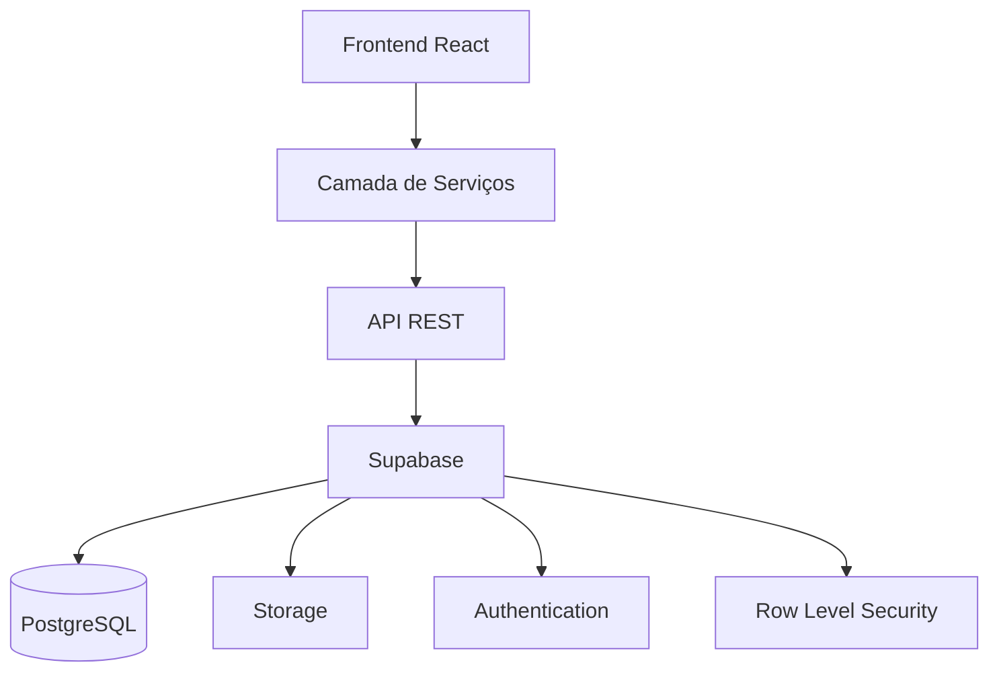
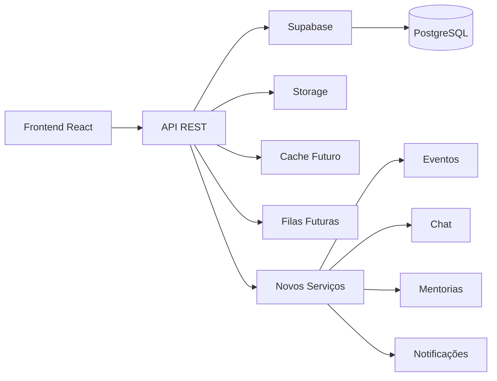

# Documento 03 - Requisitos Não Funcionais

# ConectaDRP

## Objetivo do Documento

Este documento define todos os requisitos não funcionais do sistema ConectaDRP.

Enquanto o Documento 02 especifica **o que o sistema deve fazer**, este documento especifica **como o sistema deverá se comportar** em relação à qualidade, desempenho, segurança, confiabilidade, arquitetura, escalabilidade, acessibilidade, disponibilidade, observabilidade e manutenção.

Todos os requisitos descritos neste documento possuem caráter obrigatório para a versão 1.0 do ConectaDRP.

---

# Índice

1. Objetivo
2. Conceitos Gerais
3. RNF001 - Arquitetura Geral
4. RNF002 - Qualidade do Software
5. RNF003 - Desempenho
6. RNF004 - Escalabilidade
7. RNF005 - Disponibilidade
8. RNF006 - Confiabilidade
9. RNF007 - Manutenibilidade
10. RNF008 - Observabilidade
11. RNF009 - Compatibilidade
12. RNF010 - Critérios Gerais de Aceitação

---

# Conceitos Gerais

Os requisitos não funcionais representam características de qualidade do sistema.

Eles definem como cada funcionalidade deverá ser implementada.

São requisitos que normalmente não são percebidos diretamente pelo usuário, porém determinam a qualidade final da aplicação.

Exemplos:

- Velocidade.
- Segurança.
- Organização do código.
- Tempo de resposta.
- Disponibilidade.
- Facilidade de manutenção.
- Escalabilidade.
- Confiabilidade.

---

# Objetivos de Qualidade

O ConectaDRP deverá ser desenvolvido seguindo os seguintes objetivos.

- Fácil utilização.
- Baixo tempo de resposta.
- Alta disponibilidade.
- Baixo consumo de recursos.
- Código limpo.
- Arquitetura modular.
- Facilidade de evolução.
- Segurança.
- Alta confiabilidade.
- Excelente experiência do usuário.

---

# RNF001 - Arquitetura Geral

## Objetivo

O sistema deverá possuir uma arquitetura moderna, modular, desacoplada e preparada para crescimento contínuo.

Cada camada deverá possuir responsabilidade única.

Nenhum componente poderá assumir responsabilidades pertencentes a outra camada.

---

# Arquitetura em Camadas

O projeto deverá seguir obrigatoriamente a arquitetura abaixo.



---

# Camadas

## Camada de Apresentação

Responsável por:

Interface.

Componentes.

Navegação.

Formulários.

Estados da interface.

Jamais acessar diretamente o banco de dados.

---

## Camada de Serviços

Responsável por:

Comunicação com APIs.

Tratamento de respostas.

Tratamento de erros.

Conversão de dados.

Centralização das chamadas HTTP.

---

## Camada de API

Responsável por:

Validação.

Autorização.

Regras de negócio.

Persistência.

Integração com banco.

---

## Camada de Persistência

Responsável por:

Armazenamento.

Consultas.

Índices.

Relacionamentos.

Integridade.

---

# Responsabilidade Única

Todo módulo deverá possuir apenas uma responsabilidade.

Exemplo.

SearchForm

Responsável apenas pela pesquisa.

ResultCard

Responsável apenas pela apresentação de um colega.

CadastroService

Responsável apenas pelas operações de cadastro.

---

# Modularização

Cada funcionalidade deverá permanecer isolada.

Exemplo.

Módulo Pesquisa.

Módulo Cadastro.

Módulo Administração.

Módulo Grupos.

Módulo Estatísticas.

Um módulo nunca deverá depender diretamente de outro.

Toda comunicação deverá ocorrer através de serviços.

---

# Organização do Projeto

Estrutura mínima.

```
src/

assets/

components/

contexts/

hooks/

layouts/

pages/

routes/

services/

repositories/

types/

utils/

styles/

config/

constants/

validators/

```

---

# Organização dos Componentes

Cada componente deverá possuir.

Arquivo principal.

Arquivo de estilos.

Arquivo de testes.

Arquivo de tipos.

Exemplo.

```
ResultCard/

ResultCard.tsx

ResultCard.test.tsx

ResultCard.types.ts

index.ts

```

---

# Reutilização

Todo componente reutilizável deverá ser criado apenas uma vez.

Jamais duplicar código.

Caso uma funcionalidade seja utilizada em mais de um local.

Criar componente compartilhado.

---

# Gerenciamento de Estado

Utilizar React Context apenas para estados globais.

Exemplos.

Tema.

Autenticação.

Colega logado (futuras versões).

Configurações.

Estados locais deverão permanecer dentro dos componentes.

---

# Separação de Responsabilidades

Toda lógica de negócio deverá permanecer fora dos componentes visuais.

Componentes React não deverão conter regras complexas.

Essas regras deverão permanecer em:

Services.

Hooks.

Repositories.

---

# Tratamento de Erros

Toda exceção deverá ser tratada.

Nunca permitir que erros cheguem diretamente ao usuário.

Toda mensagem deverá ser amigável.

Erros técnicos deverão ser registrados em log.

---

# Configurações

Todas as configurações deverão permanecer centralizadas.

Exemplos.

URLs.

Timeouts.

Versão.

Limites.

Constantes.

---

# Dependências

Todas as bibliotecas utilizadas deverão possuir.

Documentação oficial.

Manutenção ativa.

Boa reputação.

Licença compatível.

---

# Atualização

Dependências deverão permanecer atualizadas.

Atualizações deverão ser realizadas de forma controlada.

Sempre executar testes antes da publicação.

---

# Casos de Teste

CT001

Projeto organizado conforme estrutura definida.

Resultado esperado.

Arquitetura aprovada.

---

CT002

Componente reutilizado.

Resultado esperado.

Sem duplicação de código.

---

CT003

Serviços separados dos componentes.

Resultado esperado.

Arquitetura desacoplada.

---

CT004

Erro interno.

Resultado esperado.

Mensagem amigável para o usuário.

Log registrado.

---

# Critérios de Aceitação

A arquitetura será considerada aprovada quando.

✓ Todas as camadas estiverem corretamente separadas.

✓ Não existir acesso direto ao banco pelo Frontend.

✓ Componentes possuírem responsabilidade única.

✓ Toda regra de negócio permanecer centralizada.

✓ O projeto possuir estrutura modular.

✓ O código apresentar alta legibilidade.

✓ O sistema estiver preparado para crescimento futuro.

# RNF002 - Qualidade do Software

## Objetivo

Estabelecer os padrões mínimos de qualidade que deverão ser seguidos durante todo o desenvolvimento do ConectaDRP.

Todo código produzido deverá priorizar:

- Legibilidade.
- Facilidade de manutenção.
- Baixa complexidade.
- Reutilização.
- Testabilidade.
- Escalabilidade.
- Desempenho.
- Segurança.

O objetivo é garantir que o sistema possa evoluir durante vários anos sem necessidade de grandes reescritas.

---

# Filosofia de Desenvolvimento

Todo o desenvolvimento deverá seguir a seguinte ordem de prioridade.

1. Código correto.
2. Código simples.
3. Código legível.
4. Código reutilizável.
5. Código performático.

Jamais sacrificar legibilidade apenas para ganhar pequenas melhorias de desempenho.

---

# Clean Code

Todo código deverá seguir os princípios de Clean Code.

---

## Nomes

Todos os nomes deverão ser autoexplicativos.

Exemplo correto

```

buscarColegas()

```

Exemplo incorreto

```

buscar()

```

---

Outro exemplo correto

```

cidadeSelecionada

```

Incorreto

```

c

```

---

# Métodos

Cada função deverá executar apenas uma responsabilidade.

Exemplo correto

```

salvarColega()

```

Incorreto

```

salvarColegaEnviarEmailAtualizarEstatistica()

```

Cada responsabilidade deverá existir em uma função diferente.

---

# Tamanho das Funções

Objetivo

Até 30 linhas.

Máximo aceitável

50 linhas.

Caso ultrapasse.

Refatorar.

---

# Complexidade

Evitar grandes blocos condicionais.

Sempre que possível utilizar:

Early Return.

Strategy Pattern.

Polimorfismo.

Funções auxiliares.

---

# Comentários

Comentários deverão explicar:

O motivo.

Nunca explicar:

O óbvio.

Exemplo incorreto

```

// Soma 1 ao contador

contador++

```

Exemplo correto

```

// Necessário manter compatibilidade com a regra de semestre da UNIVESP.

```

---

# DRY

Don't Repeat Yourself.

Nenhuma regra de negócio poderá existir duplicada.

Caso uma lógica seja utilizada mais de uma vez.

Criar função reutilizável.

---

# KISS

Keep It Simple.

Sempre escolher a solução mais simples que resolva corretamente o problema.

Evitar arquiteturas excessivamente complexas.

---

# YAGNI

You Aren't Gonna Need It.

Não implementar funcionalidades "porque poderão ser úteis um dia".

Implementar apenas aquilo que estiver documentado.

Preparar a arquitetura para crescer.

Não desenvolver funcionalidades futuras antecipadamente.

---

# SOLID

Todo desenvolvimento deverá seguir os cinco princípios SOLID.

---

## S

Single Responsibility Principle.

Cada classe.

Cada serviço.

Cada componente.

Cada hook.

Cada página.

Cada módulo.

Possuir apenas uma responsabilidade.

---

## O

Open Closed Principle.

Os módulos deverão ser preparados para extensão.

Sem necessidade de modificar código existente.

---

## L

Liskov Substitution Principle.

Componentes derivados deverão substituir corretamente seus componentes base.

---

## I

Interface Segregation Principle.

Interfaces pequenas.

Especializadas.

Nunca criar interfaces gigantes.

---

## D

Dependency Inversion Principle.

Depender sempre de abstrações.

Nunca diretamente de implementações.

---

# Organização dos Arquivos

Nunca criar arquivos enormes.

Objetivo

Até 300 linhas.

Máximo

500 linhas.

Caso ultrapasse.

Separar responsabilidades.

---

# Organização das Pastas

Cada módulo deverá permanecer isolado.

Exemplo

```

modules/

pesquisa/

cadastro/

grupos/

admin/

estatisticas/

```

Dentro de cada módulo.

```

components/

hooks/

services/

types/

pages/

utils/

```

---

# Componentização

Todo componente reutilizável deverá ser independente.

Receber dados por propriedades.

Nunca acessar diretamente dados globais quando não for necessário.

---

# Hooks

Criar hooks personalizados sempre que existir reutilização de lógica.

Exemplos

usePesquisa()

useColegas()

useGrupos()

useToast()

useLoading()

---

# Services

Toda comunicação externa deverá ocorrer através de Services.

Exemplos

PesquisaService

ColegaService

GrupoService

CidadeService

CursoService

---

# Repository Pattern

Toda comunicação com o banco deverá utilizar Repository.

Nunca acessar Supabase diretamente dentro dos componentes React.

Fluxo esperado.

```

Página

↓

Hook

↓

Service

↓

Repository

↓

Supabase

```

---

# Tratamento de Erros

Utilizar tratamento padronizado.

Nunca utilizar.

```

console.log()

```

para controle de erros em produção.

Utilizar Logger.

---

# Logger

Preparar interface única.

Exemplo

Logger.error()

Logger.warn()

Logger.info()

Logger.debug()

Posteriormente poderá integrar com.

Sentry.

OpenTelemetry.

---

# Formatação

Utilizar obrigatoriamente.

Prettier.

ESLint.

Configuração compartilhada.

Nunca permitir código sem formatação.

---

# Imports

Ordem obrigatória.

Bibliotecas externas.

Componentes.

Hooks.

Services.

Utils.

Styles.

Nunca misturar a ordem.

---

# Tipagem

Utilizar TypeScript em todo o projeto.

Jamais utilizar:

any

Exceto quando tecnicamente inevitável.

---

# Constantes

Nunca utilizar números mágicos.

Exemplo incorreto

```

if(resultado.length > 20)

```

Exemplo correto

```

const MAX_RESULTADOS = 20

```

---

# Qualidade do Código

Objetivos mínimos.

Duplicação.

Menor que 3%.

Cobertura de testes.

Maior que 80%.

Complexidade ciclomática.

Baixa.

Lint.

Sem erros.

Sem warnings.

Build.

Sem erros.

---

# Git

Utilizar Git desde o início do projeto.

Commits pequenos.

Objetivos.

Uma alteração.

Um commit.

---

# Padrão de Commits

Utilizar Conventional Commits.

Exemplos.

feat:

fix:

refactor:

docs:

style:

test:

build:

chore:

---

Exemplo

```

feat: adiciona pesquisa inteligente por cidade

```

---

# Branches

Estratégia recomendada.

main

develop

feature/

bugfix/

hotfix/

release/

---

# Pull Requests

Todo Pull Request deverá conter.

Descrição.

Objetivo.

Checklist.

Capturas de tela quando houver alteração visual.

---

# Revisão de Código

Antes da aprovação verificar.

Legibilidade.

Performance.

Segurança.

Reutilização.

Complexidade.

Testes.

---

# Critérios de Aprovação

Nenhum código poderá ser aceito caso.

Possua duplicação.

Possua warnings.

Possua erros de lint.

Possua funções enormes.

Possua responsabilidades múltiplas.

Não esteja documentado.

---

# Casos de Teste

CT005

Função acima de cinquenta linhas.

Resultado esperado.

Refatoração obrigatória.

---

CT006

Código duplicado.

Resultado esperado.

Criar função reutilizável.

---

CT007

Uso de any.

Resultado esperado.

Substituir por tipo específico.

---

CT008

Componente realizando consulta ao banco.

Resultado esperado.

Refatorar utilizando Repository.

---

CT009

Commit fora do padrão.

Resultado esperado.

Corrigir mensagem.

---

# Critérios de Aceitação

A qualidade do software será considerada aprovada quando.

✓ Todo o código seguir os princípios SOLID.

✓ Todo o código seguir Clean Code.

✓ Não existir duplicação significativa.

✓ Todos os componentes possuírem responsabilidade única.

✓ Toda comunicação com o banco ocorrer através de Repository.

✓ Todo o projeto utilizar TypeScript.

✓ O projeto permanecer organizado e preparado para evolução.

# RNF003 - Desempenho

## Objetivo

O ConectaDRP deverá apresentar excelente desempenho em dispositivos móveis, tablets e computadores, garantindo tempos reduzidos de carregamento, navegação fluida e baixo consumo de recursos.

A experiência do usuário deverá permanecer satisfatória mesmo em conexões lentas e equipamentos de baixo desempenho.

---

# Princípios de Performance

Todo o desenvolvimento deverá priorizar:

- Rapidez.
- Baixo consumo de memória.
- Baixo consumo de processamento.
- Poucas requisições.
- Reutilização de dados.
- Carregamento progressivo.
- Otimização de imagens.
- Cache inteligente.

---

# Metas de Performance

## Tempo de carregamento inicial

Objetivo

Até 2 segundos.

Máximo aceitável

3 segundos.

---

## Pesquisa de colegas

Objetivo

Até 2 segundos.

Máximo aceitável

3 segundos.

---

## Cadastro

Objetivo

Até 2 segundos.

---

## Atualização de cadastro

Objetivo

Até 2 segundos.

---

## Login administrativo

Objetivo

Até 2 segundos.

---

## Dashboard Administrativo

Objetivo

Até 3 segundos.

---

# Core Web Vitals

O sistema deverá atender aos indicadores recomendados pelo Google.

## Largest Contentful Paint (LCP)

Objetivo

Menor que 2,5 segundos.

---

## Interaction to Next Paint (INP)

Objetivo

Menor que 200 ms.

---

## Cumulative Layout Shift (CLS)

Objetivo

Menor que 0,10.

---

# Lighthouse

Pontuação mínima esperada.

Performance

95+

Accessibility

100

Best Practices

100

SEO

95+

PWA

100

---

# Bundle JavaScript

Objetivo.

Bundle inicial reduzido.

Sempre utilizar:

Code Splitting.

Tree Shaking.

Lazy Loading.

Dynamic Import.

---

# Lazy Loading

Todas as páginas deverão utilizar carregamento sob demanda.

Exemplos.

Painel Administrativo.

Estatísticas.

Configurações.

Sobre.

Termos de Uso.

Política de Privacidade.

Essas páginas não deverão fazer parte do bundle inicial.

---

# Componentes Pesados

Componentes grandes deverão ser carregados apenas quando necessários.

Exemplo.

Gráficos.

Importação.

Exportação.

Dashboard.

---

# Carregamento de Dados

Nunca carregar informações desnecessárias.

Toda consulta deverá solicitar apenas os campos utilizados.

---

Exemplo correto.

Nome.

Cidade.

Curso.

Telefone.

---

Exemplo incorreto.

Buscar todos os campos quando apenas quatro serão utilizados.

---

# Paginação

Toda listagem superior a cinquenta registros deverá utilizar paginação.

Nunca carregar grandes quantidades de registros simultaneamente.

---

# Pesquisa Incremental

Campos Cidade e Curso deverão utilizar pesquisa incremental.

A pesquisa deverá iniciar apenas após três caracteres digitados.

---

# Debounce

Toda pesquisa automática deverá utilizar debounce.

Tempo recomendado.

300 ms.

---

# Virtualização

Caso uma listagem ultrapasse duzentos registros.

Utilizar virtualização.

Exemplo.

React Window.

---

# Cache

Sempre utilizar cache quando possível.

Exemplos.

Lista de cidades.

Lista de cursos.

Lista de eixos.

Lista de DRPs.

Essas informações mudam pouco e não deverão ser consultadas continuamente.

---

# Atualização do Cache

Sempre que um catálogo for atualizado.

Invalidar automaticamente o cache correspondente.

---

# Compressão

Todos os arquivos enviados ao navegador deverão utilizar compressão.

Preferencialmente.

Brotli.

Alternativamente.

Gzip.

---

# Imagens

Utilizar preferencialmente.

SVG.

WebP.

AVIF.

Evitar imagens PNG ou JPEG quando houver alternativa mais eficiente.

---

# Tamanho das Imagens

Nunca enviar imagens maiores que a área de exibição.

Utilizar versões responsivas.

---

# Ícones

Utilizar biblioteca vetorial.

Nunca utilizar imagens para representar ícones.

---

# Fontes

Utilizar no máximo duas famílias tipográficas.

Carregar apenas os pesos utilizados.

---

# CSS

Remover CSS não utilizado.

Minificar arquivos.

Evitar duplicação.

---

# JavaScript

Remover código morto.

Eliminar dependências desnecessárias.

Utilizar importação modular.

---

# Consultas ao Banco

Toda consulta deverá utilizar índices.

Evitar consultas completas na tabela.

Utilizar filtros específicos.

---

# Índices Obrigatórios

Telefone.

Cidade.

Curso.

Eixo.

DRP.

Status.

Data de Cadastro.

---

# Consultas

Evitar consultas repetidas.

Sempre reutilizar resultados quando possível.

---

# Timeout

Toda requisição deverá possuir timeout.

Valor recomendado.

15 segundos.

---

# Retry

Em falhas temporárias.

Permitir até três tentativas automáticas.

Intervalo crescente.

Primeira tentativa.

1 segundo.

Segunda.

2 segundos.

Terceira.

4 segundos.

---

# Offline

Sempre que possível.

Utilizar dados em cache.

Quando a conexão retornar.

Sincronizar automaticamente.

---

# Service Worker

O Service Worker deverá armazenar.

Arquivos estáticos.

CSS.

JavaScript.

Ícones.

Manifest.

Páginas institucionais.

---

# Estratégia de Cache

Arquivos estáticos.

Cache First.

Dados dinâmicos.

Network First.

---

# Consumo de Memória

Evitar manter grandes coleções carregadas.

Liberar recursos não utilizados.

Cancelar requisições abandonadas.

---

# Monitoramento de Performance

Preparar integração futura com.

Google Lighthouse.

Google PageSpeed Insights.

Chrome DevTools.

Microsoft Clarity.

OpenTelemetry.

---

# Testes de Performance

Executar testes periódicos.

Tempo de abertura.

Tempo de pesquisa.

Tempo de cadastro.

Tempo de atualização.

Tempo do Dashboard.

Tempo das APIs.

---

# Casos de Teste

CT010

Abrir aplicação.

Resultado esperado.

Até dois segundos.

---

CT011

Executar pesquisa.

Resultado esperado.

Até dois segundos.

---

CT012

Carregar lista de cidades.

Resultado esperado.

Utilização do cache.

---

CT013

Abrir Dashboard.

Resultado esperado.

Até três segundos.

---

CT014

Executar consulta com grande quantidade de registros.

Resultado esperado.

Paginação ou virtualização.

---

CT015

Simular conexão lenta.

Resultado esperado.

Aplicação permanece utilizável.

---

# Critérios de Aceitação

O desempenho será considerado aprovado quando.

✓ O carregamento inicial ocorrer dentro dos tempos definidos.

✓ As pesquisas responderem rapidamente.

✓ O bundle inicial permanecer reduzido.

✓ O sistema utilizar Lazy Loading.

✓ O cache funcionar corretamente.

✓ Todas as consultas utilizarem índices.

✓ O Lighthouse atingir as metas estabelecidas.

✓ O sistema apresentar excelente desempenho em dispositivos móveis.

```
# RNF004 - Escalabilidade

## Objetivo

O ConectaDRP deverá ser projetado para crescer continuamente sem necessidade de reestruturações significativas na arquitetura.

A inclusão de novos usuários, cidades, cursos, funcionalidades ou integrações futuras não deverá comprometer o desempenho nem exigir alterações profundas no código existente.

A arquitetura deverá ser preparada para suportar a evolução do sistema pelos próximos anos.

---

# Conceito de Escalabilidade

O sistema deverá crescer de forma sustentável.

Sempre que novos recursos forem adicionados, estes deverão ser incorporados sem modificar funcionalidades já existentes.

A arquitetura deverá favorecer expansão e manutenção contínua.

---

# Crescimento de Usuários

O sistema deverá suportar crescimento gradual do número de usuários cadastrados.

A arquitetura deverá permanecer estável independentemente do aumento da base de dados.

---

# Crescimento de Funcionalidades

Novos módulos poderão ser adicionados futuramente.

Exemplos.

Eventos.

Calendário Acadêmico.

Mensagens internas.

Notificações Push.

Chat entre colegas.

Sistema de Mentorias.

Área para Projetos Integradores.

Área para TCC.

Biblioteca Compartilhada.

Marketplace de Materiais Acadêmicos.

Nenhuma dessas funcionalidades deverá exigir reestruturação da arquitetura principal.

---

# Crescimento dos Catálogos

O sistema deverá permitir expansão dos seguintes cadastros.

Cursos.

Eixos.

DRPs.

Cidades.

Estados.

Instituições.

Sem alteração estrutural do banco de dados.

---

# Modularização

Cada módulo deverá permanecer totalmente independente.

Exemplos.

Pesquisa.

Cadastro.

Administração.

Grupos.

Catálogos.

Estatísticas.

Configurações.

Cada módulo deverá possuir seus próprios componentes, serviços, tipos e regras de negócio.

---

# Acoplamento

O acoplamento entre módulos deverá ser mínimo.

Sempre que possível utilizar.

Interfaces.

Serviços.

Injeção de dependência.

Eventos.

Nunca permitir dependência direta entre módulos distintos.

---

# Expansão da API

Toda API deverá ser preparada para inclusão de novos endpoints.

A inclusão de novos recursos não deverá alterar contratos já publicados.

---

# Versionamento

Toda API deverá utilizar versionamento.

Exemplo.

```
/api/v1/
```

Versões futuras.

```
/api/v2/

/api/v3/
```

Versões anteriores deverão permanecer funcionais durante o período de transição.

---

# Banco de Dados

O modelo relacional deverá permitir expansão sem necessidade de alteração das tabelas principais.

Novas entidades deverão ser adicionadas através de novos relacionamentos.

Evitar alterações destrutivas.

---

# Migrações

Toda alteração estrutural deverá ocorrer através de migrações versionadas.

Nunca modificar diretamente a estrutura do banco em produção.

Cada migração deverá possuir.

Identificação.

Data.

Autor.

Objetivo.

Procedimento de reversão.

---

# Compatibilidade

Novas versões deverão preservar compatibilidade com dados já existentes.

Jamais invalidar cadastros antigos.

---

# Estrutura Preparada para Novos Cursos

Caso a UNIVESP crie novos cursos.

O administrador deverá apenas cadastrá-los.

Nenhuma alteração no código deverá ser necessária.

---

# Estrutura Preparada para Novos DRPs

Novos DRPs deverão ser cadastrados através do painel administrativo.

Nenhuma alteração estrutural deverá ocorrer.

---

# Estrutura Preparada para Novas Cidades

Novas cidades deverão ser adicionadas ao catálogo oficial.

O mecanismo de pesquisa deverá reconhecê-las automaticamente.

---

# Estrutura Preparada para Novos Eixos

Novos eixos poderão ser cadastrados sem necessidade de atualização da aplicação.

---

# Escalabilidade Horizontal

A arquitetura deverá permitir execução em múltiplas instâncias da aplicação.

O sistema não deverá depender de armazenamento local para funcionamento.

Todos os dados persistentes deverão permanecer centralizados.

---

# Escalabilidade Vertical

O aumento de recursos computacionais deverá melhorar o desempenho sem necessidade de alteração da aplicação.

---

# Balanceamento de Carga

A arquitetura deverá ser compatível com utilização futura de Load Balancer.

Nenhuma funcionalidade deverá depender de sessão armazenada localmente.

---

# Armazenamento

Arquivos enviados ao sistema deverão utilizar serviço de armazenamento compatível com crescimento contínuo.

Preparar integração com o Storage do Supabase.

---

# Cache Distribuído

A arquitetura deverá permitir futura utilização de cache distribuído.

Exemplos.

Redis.

Upstash Redis.

---

# Filas de Processamento

Operações demoradas deverão ser preparadas para utilização futura de filas.

Exemplos.

Importações.

Exportações.

Envio de notificações.

Processamento de relatórios.

---

# Agendamentos

Preparar arquitetura para execução de tarefas automáticas.

Exemplos.

Limpeza de cache.

Atualização de estatísticas.

Backup.

Importação de catálogos.

Verificação de links de grupos.

---

# Limites Configuráveis

Todos os limites deverão permanecer configuráveis.

Exemplos.

Quantidade de resultados.

Tempo de cache.

Timeout.

Quantidade de tentativas.

Tempo entre tentativas.

Nunca utilizar valores fixos espalhados pelo código.

---

# Configuração Centralizada

Todas as configurações deverão permanecer em um único módulo.

Exemplos.

URLs.

Timeouts.

Versões.

Quantidade máxima de registros.

Configurações do PWA.

---

# Feature Flags

Preparar arquitetura para ativação futura de funcionalidades através de Feature Flags.

Exemplos.

Chat.

Notificações Push.

Eventos.

Mentorias.

Gamificação.

Essas funcionalidades poderão ser ativadas sem necessidade de nova publicação da aplicação.

---

# Diagramas de Escalabilidade



---

# Casos de Teste

CT016

Adicionar novo curso.

Resultado esperado.

Disponível imediatamente para novos cadastros.

---

CT017

Adicionar nova cidade.

Resultado esperado.

Disponível na pesquisa.

---

CT018

Criar novo módulo.

Resultado esperado.

Sem impacto nos módulos existentes.

---

CT019

Adicionar nova versão da API.

Resultado esperado.

Versão anterior permanece funcional.

---

CT020

Executar aplicação em múltiplas instâncias.

Resultado esperado.

Funcionamento correto.

---

# Critérios de Aceitação

A escalabilidade será considerada aprovada quando.

✓ A arquitetura permitir crescimento contínuo.

✓ Novos módulos puderem ser adicionados sem reestruturação.

✓ Novos cursos, cidades, eixos e DRPs puderem ser cadastrados pelo administrador.

✓ A API suportar versionamento.

✓ O banco de dados permanecer preparado para expansão.

✓ O sistema estiver preparado para balanceamento de carga.

✓ A arquitetura permitir futuras integrações sem alterações significativas.

```
# RNF005 - Disponibilidade

## Objetivo

O ConectaDRP deverá permanecer disponível ao maior tempo possível, garantindo que estudantes possam pesquisar colegas e cadastrar informações sempre que necessário.

A indisponibilidade do sistema deverá ocorrer apenas em situações excepcionais, como manutenções programadas ou falhas de infraestrutura.

---

# Meta de Disponibilidade

Disponibilidade anual mínima.

99,5%

Objetivo recomendado.

99,9%

---

# Horário de Funcionamento

O sistema deverá operar continuamente.

24 horas por dia.

7 dias por semana.

365 dias por ano.

---

# Manutenções Programadas

Sempre que possível.

Realizar em horários de menor utilização.

Preferencialmente.

Entre 00h00 e 05h00.

Horário de Brasília.

---

# Comunicação de Manutenções

Quando houver manutenção programada.

O sistema deverá informar previamente.

Exibir mensagem institucional.

Caso exista página oficial.

Publicar aviso.

---

# Recuperação Automática

Sempre que ocorrer falha temporária.

O sistema deverá tentar restabelecer automaticamente a comunicação.

Sem necessidade de recarregar toda a página.

---

# Reconexão Automática

Caso a conexão com a API seja interrompida.

O Frontend deverá tentar nova conexão.

Quantidade máxima.

3 tentativas.

Intervalo.

1 segundo.

2 segundos.

4 segundos.

Após a última tentativa.

Exibir mensagem amigável.

---

# Continuidade da Navegação

Sempre que possível.

O usuário deverá continuar navegando pelas páginas que não dependam da API.

Exemplos.

Tela Inicial.

Página Sobre.

Política de Privacidade.

Termos de Uso.

---

# Tolerância a Falhas

Falhas em um módulo não deverão interromper os demais módulos.

Exemplo.

Caso o módulo de estatísticas fique indisponível.

Pesquisa de colegas deverá continuar funcionando normalmente.

---

# Isolamento de Serviços

Cada módulo deverá operar independentemente.

Pesquisa.

Cadastro.

Administração.

Grupos.

Catálogos.

Estatísticas.

Falhas localizadas não deverão afetar todo o sistema.

---

# Degradação Controlada

Quando algum recurso estiver indisponível.

O sistema deverá continuar funcionando com funcionalidades reduzidas.

Exemplo.

Caso gráficos estatísticos não possam ser carregados.

Exibir mensagem.

"Estatísticas temporariamente indisponíveis."

Sem bloquear o restante da aplicação.

---

# Página de Indisponibilidade

Caso o sistema esteja completamente indisponível.

Apresentar página institucional contendo.

Logo.

Nome do projeto.

Mensagem amigável.

Previsão de retorno.

Data.

Hora.

Contato do administrador.

---

# Timeout

Nenhuma operação deverá permanecer aguardando indefinidamente.

Tempo máximo.

15 segundos.

Após esse período.

Cancelar operação.

Registrar log.

Exibir mensagem.

---

# Estado Offline

Quando não houver conexão.

Informar claramente ao usuário.

Exemplo.

"Você está offline."

Quando a conexão retornar.

Sincronizar automaticamente.

Atualizar indicadores.

---

# Persistência Temporária

Sempre que possível.

Operações iniciadas durante perda de conexão deverão permanecer armazenadas temporariamente.

Após o retorno da internet.

Realizar sincronização automática.

---

# Integridade

Nenhuma falha de comunicação poderá causar corrupção de dados.

Todas as operações deverão ser atômicas.

---

# Operações Atômicas

Cada gravação deverá ser concluída integralmente.

Ou cancelada completamente.

Nunca permitir gravações parciais.

---

# Saúde dos Serviços

Preparar endpoint para verificação de saúde.

Exemplo.

GET

```
/api/v1/health
```

Resposta esperada.

```json
{
  "status": "ok",
  "database": "online",
  "storage": "online",
  "authentication": "online",
  "timestamp": "2026-07-08T12:00:00Z"
}
```

---

# Indicadores de Disponibilidade

Monitorar.

Tempo online.

Tempo offline.

Número de interrupções.

Tempo médio de recuperação.

Quantidade de falhas.

---

# Dependências Externas

Caso algum serviço externo fique indisponível.

O sistema deverá continuar operando normalmente sempre que possível.

Exemplo.

Falha temporária no Storage.

Não impedir pesquisas de colegas.

---

# Atualizações

Atualizações da aplicação deverão preservar.

Cadastros.

Configurações.

Histórico.

Grupos.

Catálogos.

---

# Monitoramento

Registrar automaticamente.

Início da indisponibilidade.

Fim da indisponibilidade.

Tempo total.

Serviço afetado.

Descrição do incidente.

---

# Casos de Teste

CT021

API indisponível.

Resultado esperado.

Mensagem amigável.

Nova tentativa automática.

---

CT022

Queda temporária da internet.

Resultado esperado.

Aplicação identifica estado offline.

---

CT023

Retorno da conexão.

Resultado esperado.

Sincronização automática.

---

CT024

Falha em módulo de estatísticas.

Resultado esperado.

Demais módulos permanecem operando.

---

CT025

Consulta superior ao timeout.

Resultado esperado.

Operação cancelada.

Mensagem exibida.

Log registrado.

---

# Critérios de Aceitação

A disponibilidade será considerada aprovada quando.

✓ O sistema permanecer disponível conforme a meta estabelecida.

✓ As reconexões ocorrerem automaticamente.

✓ O usuário for informado sobre indisponibilidades.

✓ Nenhuma falha comprometer a integridade dos dados.

✓ Os módulos permanecerem independentes.

✓ O sistema suportar degradação controlada.

✓ O endpoint de saúde funcionar corretamente.

# RNF006 - Confiabilidade

## Objetivo

O ConectaDRP deverá operar de maneira previsível, consistente e segura, garantindo que todas as operações produzam resultados corretos e confiáveis.

O sistema deverá minimizar falhas, impedir inconsistências de dados e assegurar que todas as informações armazenadas permaneçam íntegras durante todo o seu ciclo de vida.

---

# Conceito de Confiabilidade

A confiabilidade representa a capacidade do sistema executar corretamente suas funções durante o tempo esperado de utilização.

Toda operação deverá produzir sempre o mesmo resultado quando executada sob as mesmas condições.

---

# Integridade dos Dados

Todas as informações gravadas deverão permanecer consistentes.

O sistema deverá impedir:

Duplicidade de registros.

Perda de informações.

Relacionamentos inválidos.

Referências inexistentes.

Dados parcialmente gravados.

---

# Consistência

Toda operação deverá obedecer às regras de negócio estabelecidas.

Exemplos.

Um colega não poderá existir sem cidade.

Um colega não poderá existir sem curso.

Um curso deverá pertencer obrigatoriamente a um eixo.

Uma cidade deverá pertencer obrigatoriamente a um DRP.

---

# Atomicidade

Toda gravação deverá ocorrer integralmente.

Caso qualquer etapa apresente erro.

Toda a operação deverá ser cancelada.

Jamais permitir gravações incompletas.

---

# Transações

Operações que envolvam múltiplas tabelas deverão utilizar transações.

Caso ocorra qualquer falha.

Efetuar rollback automaticamente.

---

# Idempotência

Sempre que possível.

As operações deverão ser idempotentes.

Exemplo.

Caso o usuário pressione o botão Salvar diversas vezes.

O cadastro deverá ser criado apenas uma vez.

---

# Controle de Duplicidade

O sistema deverá impedir duplicidade de.

Telefone.

Link de grupo.

Cidade cadastrada repetidamente.

Curso repetido.

Cadastro administrativo repetido.

---

# Validação

Toda informação deverá ser validada em três níveis.

Interface.

API.

Banco de Dados.

Nenhuma camada deverá confiar integralmente na outra.

---

# Integridade Referencial

Todos os relacionamentos deverão utilizar chaves estrangeiras.

Nunca permitir registros órfãos.

---

# Atualizações

Toda atualização deverá preservar o histórico sempre que necessário.

Alterações críticas deverão registrar.

Data.

Hora.

Administrador.

Valor anterior.

Novo valor.

---

# Exclusão

O sistema utilizará preferencialmente exclusão lógica.

O registro permanecerá armazenado.

Apenas deixará de aparecer nas pesquisas.

---

# Recuperação de Erros

Caso uma operação falhe.

O sistema deverá retornar ao estado anterior.

Nunca permitir estado intermediário.

---

# Consistência da Interface

Toda informação exibida ao usuário deverá refletir exatamente o estado atual do banco de dados.

Após alterações.

Atualizar automaticamente os componentes necessários.

---

# Concorrência

O sistema deverá suportar múltiplos usuários utilizando simultaneamente a aplicação.

Operações concorrentes não poderão provocar inconsistências.

---

# Bloqueios

Sempre que necessário.

Utilizar mecanismos de bloqueio otimista.

Evitar bloqueios pessimistas sempre que possível.

---

# Reenvio de Requisições

Caso uma requisição seja reenviada automaticamente.

O sistema deverá identificar operações duplicadas.

Evitar múltiplas gravações.

---

# Auditoria

Toda operação administrativa deverá ser registrada.

Exemplos.

Cadastro.

Alteração.

Aprovação.

Desativação.

Importação.

Exportação.

---

# Integridade dos Catálogos

Cursos.

Eixos.

DRPs.

Cidades.

Jamais poderão ser removidos caso existam registros relacionados.

Permitir apenas desativação.

---

# Integridade dos Grupos

Todo grupo deverá possuir.

Curso válido.

Cidade válida.

Link válido.

Responsável.

Status.

Data de criação.

---

# Validação de Telefones

Todo telefone deverá ser normalizado antes da gravação.

Remover.

Espaços.

Parênteses.

Traços.

Caracteres especiais.

Armazenar apenas números.

---

# Validação de Links

Todo link de grupo deverá ser validado.

Aceitar apenas domínio oficial do WhatsApp.

---

# Controle de Histórico

Preparar estrutura para armazenar.

Data de criação.

Data da última alteração.

Usuário responsável.

Operação realizada.

---

# Disponibilidade dos Dados

Os dados deverão permanecer disponíveis após.

Atualizações.

Publicações.

Reinicializações.

Implantações.

Migrações.

---

# Integridade Durante Importações

Caso qualquer registro da importação apresente erro.

Toda a importação deverá ser cancelada.

Gerar relatório detalhado.

---

# Integridade Durante Exportações

Os arquivos exportados deverão representar exatamente o estado atual do banco de dados.

---

# Consistência dos Relatórios

Os relatórios deverão utilizar informações atualizadas.

Nunca apresentar dados inconsistentes.

---

# Tratamento de Exceções

Toda exceção deverá possuir tratamento específico.

Nunca ocultar erros silenciosamente.

Registrar.

Data.

Hora.

Operação.

Mensagem técnica.

Código do erro.

---

# Casos de Teste

CT026

Salvar cadastro duplicado.

Resultado esperado.

Operação bloqueada.

---

CT027

Falha durante gravação.

Resultado esperado.

Rollback executado.

---

CT028

Excluir cidade utilizada.

Resultado esperado.

Operação negada.

---

CT029

Cadastrar grupo com link inválido.

Resultado esperado.

Cadastro recusado.

---

CT030

Executar múltiplos salvamentos simultâneos.

Resultado esperado.

Apenas um registro criado.

---

# Critérios de Aceitação

A confiabilidade será considerada aprovada quando.

✓ Não existirem inconsistências de dados.

✓ Todas as operações utilizarem validações.

✓ Todas as transações garantirem integridade.

✓ Não existirem registros órfãos.

✓ Toda alteração administrativa for auditada.

✓ O sistema impedir duplicidades.

✓ Toda falha permitir recuperação segura.

✓ O banco de dados permanecer consistente após qualquer operação.


# RNF007 - Manutenibilidade

## Objetivo

O ConectaDRP deverá ser desenvolvido de forma que futuras correções, melhorias, adaptações e novas funcionalidades possam ser implementadas rapidamente, com baixo risco de introdução de novos erros.

A arquitetura deverá favorecer a manutenção contínua do sistema durante todo o seu ciclo de vida.

---

# Conceito de Manutenibilidade

Manutenibilidade é a capacidade de modificar o sistema com facilidade.

As modificações poderão incluir.

Correções.

Melhorias.

Refatorações.

Novas funcionalidades.

Atualizações tecnológicas.

Integrações futuras.

---

# Organização do Código

Todo o projeto deverá permanecer organizado em módulos independentes.

Cada módulo deverá possuir.

Componentes.

Serviços.

Hooks.

Tipos.

Utilitários.

Testes.

Documentação.

---

# Responsabilidade Única

Cada arquivo deverá possuir apenas uma responsabilidade.

Exemplos.

CadastroForm.

PesquisaService.

GrupoRepository.

CidadeValidator.

Nunca misturar múltiplas responsabilidades no mesmo arquivo.

---

# Tamanho dos Arquivos

Objetivo.

Até 300 linhas.

Máximo permitido.

500 linhas.

Caso ultrapasse.

Separar responsabilidades.

---

# Tamanho das Funções

Objetivo.

Até 30 linhas.

Máximo permitido.

50 linhas.

Funções maiores deverão ser refatoradas.

---

# Componentização

Todo componente reutilizável deverá permanecer isolado.

Receber informações exclusivamente através de propriedades.

Evitar dependências desnecessárias.

---

# Reutilização

Sempre que uma lógica for utilizada em mais de um local.

Criar.

Hook.

Service.

Utility.

Helper.

Nunca duplicar código.

---

# Documentação do Código

Funções públicas deverão possuir documentação.

Sempre explicar.

Objetivo.

Parâmetros.

Retorno.

Possíveis exceções.

---

# Padronização

Todo o projeto deverá seguir os mesmos padrões.

Nomenclatura.

Indentação.

Estrutura.

Organização.

Formatação.

---

# Refatoração

Refatorações deverão ocorrer continuamente.

Sempre preservar o comportamento original.

Jamais alterar regras de negócio durante refatorações sem atualização da documentação.

---

# Acoplamento

O acoplamento entre módulos deverá ser mínimo.

Sempre depender de interfaces e abstrações.

Nunca depender diretamente da implementação de outro módulo.

---

# Coesão

Cada módulo deverá possuir alta coesão.

Todos os arquivos pertencentes ao módulo deverão trabalhar para um mesmo objetivo.

---

# Convenções

Utilizar nomenclaturas padronizadas.

Componentes.

PascalCase.

Funções.

camelCase.

Constantes.

UPPER_SNAKE_CASE.

Arquivos.

kebab-case.

---

# Estrutura dos Diretórios

Cada módulo deverá seguir a estrutura.

```
modulo/

components/

hooks/

pages/

services/

repositories/

types/

validators/

utils/

tests/

```

---

# Validações

As validações deverão permanecer separadas da interface.

Criar validators específicos.

Exemplos.

telefone.validator.ts

cidade.validator.ts

grupo.validator.ts

---

# Serviços

Cada serviço deverá representar apenas um contexto de negócio.

Exemplos.

ColegaService.

PesquisaService.

GrupoService.

CidadeService.

CursoService.

---

# Repositories

Toda comunicação com o banco deverá ocorrer exclusivamente através de Repositories.

Nunca acessar o banco diretamente em páginas ou componentes.

---

# Configurações

Configurações deverão permanecer centralizadas.

Exemplos.

Timeout.

URLs.

Versão.

Limites.

Constantes.

Configurações do PWA.

---

# Dependências

Adicionar dependências apenas quando realmente necessárias.

Antes de instalar nova biblioteca verificar.

Popularidade.

Licença.

Quantidade de downloads.

Manutenção ativa.

Compatibilidade com TypeScript.

---

# Atualização das Dependências

Atualizações deverão ocorrer periodicamente.

Sempre executar.

Lint.

Testes.

Build.

Antes da publicação.

---

# Documentação da Arquitetura

Toda alteração estrutural deverá atualizar.

Diagramas.

Documentação.

Fluxos.

Modelo do banco.

APIs.

---

# Código Obsoleto

Nunca manter código morto.

Remover.

Arquivos não utilizados.

Componentes antigos.

Variáveis abandonadas.

Funções sem utilização.

---

# TODOs

Evitar utilização excessiva de comentários TODO.

Caso necessário.

Registrar tarefa no backlog do projeto.

---

# Controle de Dívida Técnica

Registrar.

Descrição.

Impacto.

Prioridade.

Responsável.

Data prevista.

Situação.

---

# Testabilidade

Toda regra de negócio deverá ser facilmente testável.

Evitar dependência direta de interface gráfica.

---

# Isolamento

As regras de negócio deverão poder ser executadas independentemente do React.

---

# Evolução Tecnológica

A arquitetura deverá permitir futura migração.

React.

Vite.

Supabase.

PostgreSQL.

Sem necessidade de reescrever toda a aplicação.

---

# Auditoria das Alterações

Toda alteração relevante deverá possuir.

Descrição.

Responsável.

Data.

Versão.

Documentação correspondente.

---

# Checklist de Manutenção

Antes de finalizar qualquer alteração verificar.

Atualizou documentação.

Executou testes.

Executou lint.

Executou build.

Atualizou diagramas.

Atualizou changelog.

Atualizou versão quando necessário.

---

# Casos de Teste

CT031

Arquivo acima de quinhentas linhas.

Resultado esperado.

Refatoração obrigatória.

---

CT032

Código duplicado.

Resultado esperado.

Criar componente reutilizável.

---

CT033

Serviço acessando interface.

Resultado esperado.

Separar responsabilidades.

---

CT034

Validação implementada diretamente na página.

Resultado esperado.

Mover para validator.

---

CT035

Nova funcionalidade adicionada.

Resultado esperado.

Sem impacto nas funcionalidades existentes.

---

# Critérios de Aceitação

A manutenibilidade será considerada aprovada quando.

✓ O projeto permanecer modular.

✓ O código apresentar alta legibilidade.

✓ As responsabilidades estiverem corretamente separadas.

✓ Não existir duplicação significativa.

✓ Toda regra de negócio puder ser testada isoladamente.

✓ A documentação permanecer sincronizada com o código.

✓ Novas funcionalidades puderem ser adicionadas com baixo impacto na arquitetura.

✓ O projeto permanecer preparado para evolução contínua.

# RNF008 - Observabilidade, Monitoramento e Telemetria

## Objetivo

O ConectaDRP deverá possuir mecanismos que permitam acompanhar continuamente o funcionamento da aplicação, identificar falhas rapidamente, medir desempenho, registrar eventos importantes e fornecer informações para manutenção preventiva e corretiva.

A observabilidade deverá permitir compreender o comportamento interno do sistema sem necessidade de acesso direto ao código-fonte.

---

# Conceito de Observabilidade

A observabilidade consiste na capacidade de entender o estado interno da aplicação através da coleta de informações relevantes.

Essas informações deverão auxiliar na identificação de.

Falhas.

Erros.

Problemas de desempenho.

Problemas de infraestrutura.

Uso das funcionalidades.

Comportamento dos usuários.

---

# Pilares da Observabilidade

O sistema deverá ser preparado para trabalhar com três pilares.

Logs.

Métricas.

Rastreamento.

---

# Logs

Todos os eventos relevantes deverão ser registrados.

Exemplos.

Inicialização da aplicação.

Falhas.

Exceções.

Autenticação administrativa.

Importações.

Exportações.

Alterações cadastrais.

Criação de grupos.

Atualização de grupos.

Desativação de registros.

---

# Estrutura dos Logs

Todo registro deverá conter.

Data.

Hora.

Tipo.

Origem.

Descrição.

Identificador da operação.

Usuário responsável quando existir.

---

# Classificação dos Logs

Utilizar níveis padronizados.

DEBUG

Informações detalhadas para desenvolvimento.

INFO

Eventos normais de funcionamento.

WARN

Situações inesperadas sem interromper a operação.

ERROR

Falhas que impediram a execução de uma funcionalidade.

FATAL

Falhas críticas que comprometam o funcionamento da aplicação.

---

# Informações Sensíveis

Jamais registrar.

Senhas.

Tokens.

Cookies.

Dados pessoais completos.

Informações financeiras.

Chaves de acesso.

---

# Correlação de Eventos

Cada requisição deverá possuir um identificador único.

Esse identificador deverá permitir rastrear toda a execução da operação.

---

# Métricas

Preparar estrutura para coleta das seguintes métricas.

Quantidade de acessos.

Pesquisas realizadas.

Cadastros efetuados.

Grupos cadastrados.

Tempo médio das pesquisas.

Tempo médio das APIs.

Tempo médio das páginas.

Quantidade de erros.

Quantidade de exceções.

Tempo médio de resposta.

Disponibilidade.

---

# Métricas Administrativas

Registrar.

Número de administradores.

Quantidade de alterações.

Quantidade de importações.

Quantidade de exportações.

Quantidade de cadastros aprovados.

Quantidade de registros desativados.

---

# Telemetria

Preparar arquitetura para futura integração com ferramentas de telemetria.

Exemplos.

OpenTelemetry.

Google Analytics.

Microsoft Clarity.

Sentry.

Grafana.

Prometheus.

---

# Monitoramento de APIs

Cada endpoint deverá registrar.

Tempo de execução.

Código HTTP.

Quantidade de chamadas.

Quantidade de erros.

Tempo médio de resposta.

---

# Monitoramento do Banco

Registrar.

Tempo das consultas.

Quantidade de consultas.

Consultas lentas.

Falhas de conexão.

Tempo médio das transações.

---

# Monitoramento do Frontend

Preparar coleta de.

Tempo de carregamento.

Tempo da primeira renderização.

Tempo de interação.

Falhas JavaScript.

Erros de renderização.

---

# Health Check

A aplicação deverá disponibilizar endpoint de verificação de saúde.

Exemplo.

```
GET /api/v1/health
```

Resposta esperada.

```json
{
  "status": "healthy",
  "application": "online",
  "database": "online",
  "storage": "online",
  "authentication": "online",
  "version": "1.0.0",
  "timestamp": "2026-07-08T12:00:00Z"
}
```

---

# Readiness Check

Preparar endpoint para indicar se a aplicação está pronta para receber requisições.

Exemplo.

```
GET /api/v1/ready
```

---

# Liveness Check

Preparar endpoint para indicar que a aplicação continua executando normalmente.

Exemplo.

```
GET /api/v1/live
```

---

# Alertas

Preparar arquitetura para geração de alertas automáticos.

Exemplos.

Grande quantidade de erros.

Queda de disponibilidade.

Falhas repetidas.

Tempo elevado de resposta.

Problemas de autenticação.

---

# Painel de Monitoramento

Preparar estrutura para criação futura de painel contendo.

Disponibilidade.

Quantidade de acessos.

Pesquisas.

Cadastros.

Grupos.

Tempo médio das APIs.

Erros.

Alertas.

Uso por cidade.

Uso por curso.

Uso por DRP.

---

# Auditoria

Todas as operações administrativas deverão permanecer auditáveis.

Registrar.

Quem executou.

Quando executou.

Qual operação realizou.

Qual resultado foi obtido.

---

# Rastreamento de Exceções

Toda exceção deverá registrar.

Mensagem.

Origem.

Arquivo.

Linha.

Stack Trace.

Identificador da requisição.

Data.

Hora.

---

# Política de Retenção

Preparar configuração para retenção dos registros.

Logs operacionais.

90 dias.

Logs administrativos.

365 dias.

Logs críticos.

Prazo configurável.

---

# Privacidade

Todos os registros deverão respeitar a LGPD.

Evitar armazenamento de informações pessoais desnecessárias.

Anonimizar dados quando aplicável.

---

# Indicadores Operacionais

Monitorar continuamente.

Tempo médio de pesquisa.

Tempo médio de cadastro.

Tempo médio das APIs.

Tempo médio do banco.

Uso de memória.

Uso de CPU.

Quantidade de usuários simultâneos.

Quantidade de sessões.

---

# Indicadores de Negócio

Preparar métricas para acompanhamento.

Quantidade de colegas cadastrados.

Quantidade de cidades participantes.

Quantidade de cursos.

Quantidade de grupos criados.

Quantidade de contatos realizados.

Crescimento mensal de usuários.

---

# Casos de Teste

CT036

Executar pesquisa.

Resultado esperado.

Registro nas métricas.

---

CT037

Gerar exceção.

Resultado esperado.

Erro registrado com identificador da operação.

---

CT038

Consultar endpoint de saúde.

Resultado esperado.

Status da aplicação informado corretamente.

---

CT039

Realizar alteração administrativa.

Resultado esperado.

Operação registrada na auditoria.

---

CT040

Simular lentidão na API.

Resultado esperado.

Tempo registrado nas métricas.

---

# Critérios de Aceitação

A observabilidade será considerada aprovada quando.

✓ Todos os eventos importantes forem registrados.

✓ As métricas estiverem disponíveis para análise.

✓ Os logs respeitarem os níveis definidos.

✓ Nenhuma informação sensível for registrada.

✓ O sistema possuir endpoints de monitoramento.

✓ Toda operação administrativa permanecer auditável.

✓ A arquitetura estiver preparada para integração com ferramentas de observabilidade.

✓ O comportamento da aplicação puder ser analisado através dos registros gerados.

# RNF009 - Compatibilidade e Portabilidade

## Objetivo

O ConectaDRP deverá ser compatível com os principais navegadores modernos, sistemas operacionais e dispositivos, garantindo uma experiência consistente para todos os usuários.

A aplicação deverá ser desenvolvida de forma que futuras migrações de infraestrutura, banco de dados ou serviços possam ocorrer com o menor impacto possível.

---

# Compatibilidade de Navegadores

A aplicação deverá funcionar corretamente nas duas últimas versões estáveis dos seguintes navegadores.

Google Chrome.

Microsoft Edge.

Mozilla Firefox.

Safari.

Opera.

Samsung Internet.

---

# Compatibilidade com Dispositivos

O sistema deverá funcionar corretamente em.

Smartphones Android.

Smartphones iPhone.

Tablets Android.

iPad.

Notebooks.

Computadores Desktop.

Chromebooks.

---

# Compatibilidade com Sistemas Operacionais

Suporte mínimo para.

Android.

iOS.

Windows.

Linux.

macOS.

ChromeOS.

---

# Responsividade

Toda a interface deverá seguir o conceito Mobile First.

Os componentes deverão adaptar-se automaticamente aos diferentes tamanhos de tela.

Não será permitido:

Rolagem horizontal.

Sobreposição de componentes.

Botões inacessíveis.

Campos cortados.

Textos ilegíveis.

---

# Breakpoints Oficiais

A aplicação deverá ser validada nas seguintes larguras.

320 px.

360 px.

375 px.

390 px.

414 px.

480 px.

600 px.

768 px.

1024 px.

1280 px.

1366 px.

1440 px.

1920 px.

---

# Orientação da Tela

O sistema deverá funcionar corretamente.

Modo retrato.

Modo paisagem.

A troca de orientação não poderá causar perda de informações digitadas.

---

# Progressive Web App

A aplicação deverá ser desenvolvida como Progressive Web App.

Deverá permitir.

Instalação na tela inicial.

Execução em tela cheia.

Ícones personalizados.

Funcionamento offline parcial.

Atualizações automáticas.

Cache inteligente.

---

# Compatibilidade com Toque

Todos os componentes deverão ser adaptados para interação por toque.

Botões.

Menus.

Listas.

Campos.

Links.

Cartões.

---

# Área Mínima de Toque

Todo elemento clicável deverá possuir área mínima de.

44 x 44 pixels.

---

# Compatibilidade com Mouse

A aplicação deverá oferecer suporte completo para utilização através de mouse.

---

# Compatibilidade com Teclado

Toda navegação deverá ser possível utilizando apenas o teclado.

Suportar.

Tab.

Shift + Tab.

Enter.

Espaço.

Esc.

Setas direcionais quando aplicável.

---

# Compatibilidade com Leitores de Tela

Preparar todos os componentes para utilização com tecnologias assistivas.

Utilizar.

ARIA Labels.

ARIA Roles.

ARIA Descriptions.

Textos alternativos.

---

# Compatibilidade com Impressão

Preparar folhas de estilo específicas para impressão.

Ocultar elementos desnecessários.

Menus.

Botões.

Navegação.

Exibir apenas o conteúdo relevante.

---

# Compatibilidade com Diferentes Conexões

A aplicação deverá funcionar adequadamente em.

Wi-Fi.

4G.

5G.

Conexões lentas.

Conexões instáveis.

---

# Compatibilidade Offline

Mesmo sem internet deverá ser possível acessar.

Tela inicial.

Página institucional.

Informações em cache.

Quando a conexão retornar.

Sincronizar automaticamente.

---

# Portabilidade da Aplicação

O projeto deverá permitir implantação em diferentes provedores.

Exemplos.

Vercel.

Netlify.

Cloudflare Pages.

Firebase Hosting.

Servidor próprio.

Docker.

---

# Portabilidade do Banco de Dados

Embora a versão inicial utilize PostgreSQL no Supabase.

A arquitetura deverá permitir futura migração para.

PostgreSQL dedicado.

Amazon RDS.

Google Cloud SQL.

Azure Database.

Servidor próprio.

Sem necessidade de alterar regras de negócio.

---

# Portabilidade dos Serviços

Toda integração externa deverá ocorrer através de interfaces.

Nunca depender diretamente de implementações específicas.

---

# Configurações

Toda configuração deverá permanecer fora do código.

Utilizar variáveis de ambiente.

Exemplos.

URLs.

Chaves públicas.

Timeouts.

Versões.

Configurações do ambiente.

---

# Internacionalização

Preparar estrutura para suporte futuro a múltiplos idiomas.

Idioma inicial.

Português do Brasil.

Idiomas futuros.

Inglês.

Espanhol.

---

# Regionalização

Preparar suporte para.

Datas.

Horários.

Moedas.

Fusos horários.

Formatação numérica.

Embora inicialmente o sistema utilize apenas o padrão brasileiro.

---

# Atualizações

A atualização da aplicação não deverá exigir reinstalação manual do PWA.

Sempre que possível.

Atualizar automaticamente após publicação.

---

# Dependências

Evitar utilização de bibliotecas fortemente dependentes de um único fornecedor.

Sempre priorizar soluções abertas.

---

# Migração Tecnológica

Preparar arquitetura para permitir migração futura de.

Framework Frontend.

Serviços Backend.

Banco de Dados.

Serviços de armazenamento.

Ferramentas de monitoramento.

Sem necessidade de reconstrução completa do sistema.

---

# Casos de Teste

CT041

Abrir aplicação no Android.

Resultado esperado.

Funcionamento completo.

---

CT042

Abrir aplicação no iPhone.

Resultado esperado.

Funcionamento completo.

---

CT043

Alterar orientação da tela.

Resultado esperado.

Interface adaptada.

---

CT044

Instalar o PWA.

Resultado esperado.

Aplicação instalada corretamente.

---

CT045

Executar aplicação em navegador diferente.

Resultado esperado.

Mesmo comportamento.

---

CT046

Executar navegação apenas com teclado.

Resultado esperado.

Todas as funcionalidades acessíveis.

---

CT047

Executar aplicação offline.

Resultado esperado.

Conteúdo em cache disponível.

---

# Critérios de Aceitação

A compatibilidade e portabilidade serão consideradas aprovadas quando.

✓ O sistema funcionar corretamente em todos os navegadores suportados.

✓ A interface permanecer totalmente responsiva.

✓ O PWA puder ser instalado.

✓ Não houver perda de funcionalidade entre plataformas.

✓ O sistema puder ser implantado em diferentes provedores.

✓ A arquitetura permitir futuras migrações tecnológicas.

✓ A aplicação permanecer acessível em dispositivos móveis e desktops.

✓ A estrutura suportar internacionalização futura.

# RNF010 - Segurança Não Funcional e Proteção da Informação

## Objetivo

O ConectaDRP deverá garantir a confidencialidade, integridade, autenticidade e disponibilidade das informações armazenadas e processadas.

Todas as funcionalidades deverão ser desenvolvidas seguindo o princípio de segurança desde a concepção ("Security by Design"), reduzindo riscos de ataques, vazamento de dados e acessos não autorizados.

---

# Princípios de Segurança

Toda implementação deverá seguir os princípios.

Confidencialidade.

Integridade.

Disponibilidade.

Autenticidade.

Rastreabilidade.

Menor privilégio.

Defesa em profundidade.

---

# Security by Design

Toda funcionalidade deverá considerar requisitos de segurança antes da implementação.

A segurança nunca deverá ser adicionada apenas ao final do desenvolvimento.

---

# Princípio do Menor Privilégio

Cada usuário deverá possuir apenas as permissões estritamente necessárias para executar suas funções.

Nenhuma permissão adicional deverá ser concedida por conveniência.

---

# Autenticação

A área administrativa deverá exigir autenticação obrigatória.

Não será permitido acesso administrativo sem identificação válida.

---

# Autorização

Toda operação administrativa deverá verificar permissões antes da execução.

Nenhuma funcionalidade administrativa poderá depender apenas da interface para restringir acesso.

---

# Sessões

As sessões autenticadas deverão possuir.

Tempo de expiração.

Renovação controlada.

Encerramento seguro.

Invalidação após logout.

---

# Tokens

Os tokens utilizados pela aplicação deverão.

Possuir prazo de validade.

Ser assinados.

Ser transmitidos exclusivamente através de HTTPS.

Jamais serem armazenados em locais inseguros.

---

# HTTPS

Toda comunicação deverá utilizar HTTPS.

Não permitir conexões utilizando HTTP em ambiente de produção.

---

# Row Level Security

O banco de dados deverá utilizar políticas de Row Level Security.

Cada operação deverá obedecer às permissões definidas.

---

# Proteção Contra SQL Injection

Todas as consultas deverão utilizar mecanismos seguros.

Jamais concatenar comandos SQL manualmente.

Sempre utilizar consultas parametrizadas.

---

# Proteção Contra Cross Site Scripting

Toda informação apresentada ao usuário deverá ser tratada para impedir execução de código malicioso.

Jamais renderizar HTML recebido de usuários sem sanitização.

---

# Proteção Contra Cross Site Request Forgery

Preparar a arquitetura para impedir requisições forjadas.

Sempre validar origem quando aplicável.

---

# Proteção Contra Clickjacking

Preparar configuração de cabeçalhos HTTP para impedir incorporação da aplicação em páginas externas não autorizadas.

---

# Proteção Contra Brute Force

Preparar mecanismos para limitar tentativas consecutivas de autenticação.

Após sucessivas tentativas inválidas.

Aplicar tempo de espera progressivo.

---

# Rate Limiting

Preparar a API para limitar quantidade de requisições.

Objetivos.

Evitar abuso.

Evitar ataques automatizados.

Proteger recursos da aplicação.

---

# Sanitização

Todos os dados recebidos deverão passar por sanitização antes do processamento.

Aplicar em.

Campos de texto.

Consultas.

Uploads.

Parâmetros.

Cabeçalhos.

---

# Validação

Toda entrada deverá ser validada.

Frontend.

Backend.

Banco de Dados.

Jamais confiar exclusivamente na validação da interface.

---

# Upload de Arquivos

Preparar arquitetura para futura funcionalidade de upload.

Permitir apenas tipos autorizados.

Validar extensão.

Validar conteúdo.

Definir limite máximo de tamanho.

Bloquear arquivos executáveis.

---

# Cabeçalhos de Segurança

Preparar configuração para utilização de cabeçalhos.

Content Security Policy.

X-Frame-Options.

X-Content-Type-Options.

Referrer Policy.

Permissions Policy.

Strict Transport Security.

---

# Variáveis de Ambiente

Nenhuma informação sensível deverá permanecer no código-fonte.

Utilizar variáveis de ambiente para.

URLs.

Tokens.

Chaves.

Configurações de produção.

---

# Segredos

Jamais publicar.

Credenciais.

Tokens.

Senhas.

Chaves privadas.

Arquivos de configuração sensíveis.

Repositórios públicos.

---

# Auditoria

Registrar operações críticas.

Login administrativo.

Logout.

Alterações.

Importações.

Exportações.

Desativações.

Erros de autenticação.

---

# LGPD

A aplicação deverá respeitar os princípios da Lei Geral de Proteção de Dados.

Coletar apenas os dados necessários.

Permitir atualização das informações.

Permitir exclusão lógica quando aplicável.

Informar finalidade da coleta.

---

# Dados Pessoais

O sistema armazenará apenas.

Nome.

Telefone.

Cidade.

Curso.

Eixo.

DRP.

Jamais solicitar informações desnecessárias.

---

# Privacidade

As informações dos colegas deverão ser utilizadas exclusivamente para fins acadêmicos relacionados ao ConectaDRP.

---

# Registro de Incidentes

Preparar estrutura para registrar.

Data.

Hora.

Origem.

Descrição.

Impacto.

Correção aplicada.

Responsável.

---

# Dependências

Monitorar vulnerabilidades conhecidas nas bibliotecas utilizadas.

Atualizar dependências críticas imediatamente após divulgação de falhas relevantes.

---

# Testes de Segurança

Executar periodicamente.

Análise estática.

Análise de dependências.

Varredura de vulnerabilidades.

Testes de autenticação.

Testes de autorização.

Validação das políticas RLS.

---

# Backup das Configurações

As configurações de segurança deverão possuir cópia protegida.

Permitir restauração em caso de falha.

---

# Recuperação

Após incidente de segurança.

Registrar ocorrência.

Analisar causa.

Aplicar correção.

Atualizar documentação.

Executar testes.

---

# Casos de Teste

CT048

Executar tentativa de SQL Injection.

Resultado esperado.

Operação bloqueada.

---

CT049

Inserir código JavaScript em campo de texto.

Resultado esperado.

Conteúdo sanitizado.

---

CT050

Acessar área administrativa sem autenticação.

Resultado esperado.

Acesso negado.

---

CT051

Executar múltiplas tentativas consecutivas de login.

Resultado esperado.

Limitação aplicada.

---

CT052

Verificar transmissão de dados.

Resultado esperado.

Comunicação realizada exclusivamente através de HTTPS.

---

CT053

Validar políticas Row Level Security.

Resultado esperado.

Acesso permitido apenas conforme permissões definidas.

---

# Critérios de Aceitação

A segurança será considerada aprovada quando.

✓ Toda comunicação utilizar HTTPS.

✓ A autenticação administrativa estiver protegida.

✓ Todas as entradas forem validadas e sanitizadas.

✓ Não existirem vulnerabilidades conhecidas críticas.

✓ O banco utilizar políticas RLS.

✓ Os dados sensíveis permanecerem protegidos.

✓ As operações críticas forem auditadas.

✓ A aplicação estiver em conformidade com os princípios da LGPD.

# RNF011 - Backup, Recuperação de Desastres e Continuidade de Negócio

## Objetivo

O ConectaDRP deverá possuir mecanismos que garantam a preservação das informações armazenadas, permitindo recuperação rápida em caso de falhas, perda de dados, indisponibilidade da infraestrutura ou qualquer outro incidente que comprometa o funcionamento da aplicação.

A estratégia deverá minimizar perdas de dados e reduzir o tempo necessário para restauração completa do serviço.

---

# Conceitos

Para efeito deste documento.

Backup.

Cópia de segurança dos dados.

Restauração.

Processo de recuperação dos dados armazenados.

Desastre.

Evento que provoque indisponibilidade parcial ou total da aplicação.

Continuidade.

Capacidade da aplicação continuar operando ou retornar rapidamente ao funcionamento normal.

---

# Objetivos Gerais

Garantir.

Preservação dos dados.

Recuperação rápida.

Baixa perda de informações.

Integridade dos registros.

Continuidade da operação.

---

# Estratégia de Backup

Preparar arquitetura para realização automática de backups.

Banco de Dados.

Arquivos enviados.

Configurações.

Documentação.

Scripts de migração.

---

# Tipos de Backup

Preparar suporte para.

Backup Completo.

Backup Incremental.

Backup Diferencial.

---

# Frequência Recomendada

Banco de Dados.

Backup diário.

Configurações.

Backup semanal.

Documentação.

Backup sempre que houver alteração.

Scripts de migração.

Backup em cada nova versão.

---

# Armazenamento

Os backups deverão permanecer armazenados em local distinto da aplicação principal.

Evitar armazenamento exclusivo no mesmo servidor.

Preparar compatibilidade com.

Supabase Backup.

Amazon S3.

Google Cloud Storage.

Azure Storage.

Servidor dedicado.

---

# Retenção

Preparar política de retenção.

Backups diários.

30 dias.

Backups semanais.

90 dias.

Backups mensais.

12 meses.

Os prazos deverão permanecer configuráveis.

---

# Criptografia

Sempre que possível.

Os backups deverão permanecer criptografados.

Especialmente quando contiverem dados pessoais.

---

# Validação

Todo backup gerado deverá ser validado.

Confirmar.

Integridade.

Tamanho.

Legibilidade.

Possibilidade de restauração.

---

# Testes de Restauração

Executar periodicamente testes de recuperação.

Não considerar um backup confiável sem validação de restauração.

---

# Objetivos de Recuperação

RPO.

Recovery Point Objective.

Objetivo.

Perda máxima de dados.

24 horas.

---

RTO.

Recovery Time Objective.

Objetivo.

Retorno da aplicação.

Até 4 horas.

---

# Recuperação Parcial

Preparar arquitetura para recuperação de.

Tabela específica.

Registro específico.

Arquivo específico.

Sem necessidade de restaurar toda a aplicação.

---

# Recuperação Completa

Permitir restauração integral.

Banco.

Arquivos.

Configurações.

Migrações.

Documentação.

---

# Versionamento

Cada backup deverá possuir.

Identificador.

Data.

Hora.

Versão da aplicação.

Ambiente.

Descrição.

---

# Ambientes

Os backups deverão identificar claramente.

Desenvolvimento.

Homologação.

Produção.

Jamais restaurar backup incorreto por falta de identificação.

---

# Integridade

Após restauração.

Todos os relacionamentos deverão permanecer válidos.

Não poderão existir.

Registros órfãos.

Chaves inválidas.

Relacionamentos quebrados.

---

# Continuidade de Negócio

Mesmo durante incidentes.

Sempre que possível.

A aplicação deverá permanecer parcialmente operacional.

Exemplos.

Páginas institucionais.

Conteúdo em cache.

Modo offline.

---

# Plano de Recuperação

Preparar procedimento documentado contendo.

Identificação do incidente.

Análise da causa.

Escolha do backup.

Restauração.

Validação.

Liberação do ambiente.

Registro do incidente.

---

# Plano de Comunicação

Em caso de indisponibilidade prolongada.

Preparar comunicação contendo.

Descrição do problema.

Impacto.

Serviços afetados.

Previsão de retorno.

Atualizações periódicas.

---

# Logs de Recuperação

Toda restauração deverá registrar.

Responsável.

Data.

Hora.

Motivo.

Backup utilizado.

Resultado.

Tempo de execução.

---

# Migrações

As migrações deverão permitir rollback sempre que possível.

Nenhuma atualização estrutural deverá impossibilitar recuperação da versão anterior.

---

# Testes

Executar periodicamente.

Teste de backup.

Teste de restauração.

Teste de rollback.

Teste de recuperação parcial.

Teste de recuperação completa.

---

# Automação

Preparar arquitetura para automatização de.

Execução dos backups.

Validação.

Monitoramento.

Notificações.

Limpeza de backups antigos.

---

# Monitoramento

Acompanhar.

Último backup realizado.

Última restauração.

Falhas.

Tempo de execução.

Espaço utilizado.

---

# Casos de Teste

CT054

Executar backup completo.

Resultado esperado.

Backup criado com sucesso.

---

CT055

Executar restauração.

Resultado esperado.

Dados recuperados corretamente.

---

CT056

Validar integridade após restauração.

Resultado esperado.

Relacionamentos preservados.

---

CT057

Executar rollback de migração.

Resultado esperado.

Banco restaurado para versão anterior.

---

CT058

Simular perda parcial de dados.

Resultado esperado.

Recuperação apenas dos registros afetados.

---

CT059

Verificar identificação do backup.

Resultado esperado.

Versão e data corretamente registradas.

---

# Critérios de Aceitação

O processo de backup e recuperação será considerado aprovado quando.

✓ Os backups forem executados automaticamente conforme configuração.

✓ Os arquivos permanecerem íntegros.

✓ Os testes de restauração forem bem-sucedidos.

✓ O tempo de recuperação atender ao RTO definido.

✓ A perda máxima de dados respeitar o RPO estabelecido.

✓ Toda restauração for registrada em auditoria.

✓ A aplicação possuir plano documentado de continuidade de negócio.

✓ A arquitetura permitir recuperação parcial e completa dos dados.

# RNF012 - Testabilidade, Garantia da Qualidade e Critérios Finais de Aceitação

## Objetivo

O ConectaDRP deverá ser desenvolvido de forma que todas as funcionalidades possam ser verificadas, testadas, validadas e auditadas durante todo o ciclo de vida do software.

Toda nova funcionalidade implementada deverá possuir critérios objetivos de validação, reduzindo a possibilidade de regressões e aumentando a confiabilidade da aplicação.

---

# Conceito de Testabilidade

A arquitetura deverá facilitar a execução de testes.

Automatizados.

Manuais.

Funcionais.

Não Funcionais.

Integração.

Aceitação.

Performance.

Segurança.

---

# Estratégia de Testes

O projeto deverá seguir a pirâmide de testes.

Testes Unitários.

Testes de Integração.

Testes End-to-End.

Testes Manuais.

---

# Testes Unitários

Objetivo.

Validar funções isoladamente.

Itens obrigatórios.

Validators.

Helpers.

Utilities.

Services.

Regras de negócio.

---

# Testes de Integração

Objetivo.

Validar comunicação entre módulos.

Exemplos.

Frontend.

API.

Banco.

Supabase.

Storage.

---

# Testes End-to-End

Objetivo.

Simular utilização real da aplicação.

Fluxos obrigatórios.

Pesquisar colegas.

Cadastrar colega.

Editar cadastro.

Cadastrar grupo.

Pesquisar grupos.

Acessar painel administrativo.

---

# Testes Manuais

Antes de cada publicação executar.

Checklist completo da aplicação.

Validação visual.

Responsividade.

Pesquisa.

Cadastro.

Links.

Grupos.

Painel administrativo.

---

# Cobertura de Testes

Meta mínima.

80%.

Meta recomendada.

90%.

Cobertura inferior a 80% deverá ser considerada não conforme.

---

# Testes Automatizados

Preparar estrutura para utilização de.

Vitest.

Playwright.

Cypress.

Jest.

A escolha definitiva dependerá da arquitetura adotada durante a implementação.

---

# Testes de Regressão

Toda alteração deverá preservar funcionalidades existentes.

Antes de publicar nova versão executar.

Pesquisa.

Cadastro.

Atualização.

Grupos.

Administração.

Importação.

Exportação.

---

# Testes de Responsividade

Validar funcionamento em.

320 px.

360 px.

375 px.

390 px.

414 px.

768 px.

1024 px.

1366 px.

1920 px.

---

# Testes de Navegadores

Executar testes nos navegadores suportados.

Google Chrome.

Microsoft Edge.

Mozilla Firefox.

Safari.

Samsung Internet.

---

# Testes Offline

Validar.

Instalação do PWA.

Funcionamento em cache.

Reconexão automática.

Sincronização.

---

# Testes de Performance

Executar periodicamente.

Tempo de abertura.

Tempo de pesquisa.

Tempo de cadastro.

Tempo das APIs.

Tempo das consultas.

Tempo do Dashboard.

---

# Testes de Segurança

Executar.

Validação de autenticação.

Validação de autorização.

SQL Injection.

Cross Site Scripting.

Cross Site Request Forgery.

Row Level Security.

Rate Limiting.

---

# Testes de Banco de Dados

Validar.

Relacionamentos.

Integridade.

Índices.

Migrações.

Rollback.

Performance.

---

# Testes das APIs

Cada endpoint deverá validar.

HTTP Status.

Formato JSON.

Mensagens.

Tempo de resposta.

Tratamento de erros.

---

# Checklist Pré-Publicação

Antes de cada publicação verificar.

Build executado.

Lint sem erros.

Testes aprovados.

Documentação atualizada.

Versão atualizada.

Migrações revisadas.

Variáveis de ambiente conferidas.

Backups realizados.

---

# Critérios de Liberação

Uma versão somente poderá ser publicada quando.

Todos os testes obrigatórios forem aprovados.

Não existirem erros críticos.

Não existirem falhas de segurança conhecidas.

Toda documentação estiver atualizada.

---

# Métricas de Qualidade

Monitorar continuamente.

Cobertura de testes.

Quantidade de bugs.

Tempo médio de correção.

Quantidade de regressões.

Disponibilidade.

Performance.

Satisfação dos usuários.

---

# Revisões Técnicas

Antes da conclusão de funcionalidades importantes realizar revisão técnica considerando.

Arquitetura.

Segurança.

Performance.

Legibilidade.

Documentação.

Reutilização.

Escalabilidade.

---

# Auditoria de Qualidade

Toda versão publicada deverá registrar.

Número da versão.

Data.

Responsável.

Alterações realizadas.

Problemas corrigidos.

Novas funcionalidades.

---

# Critérios Gerais de Aprovação do Projeto

A versão 1.0 do ConectaDRP será considerada aprovada quando.

Todos os requisitos funcionais forem implementados.

Todos os requisitos não funcionais forem atendidos.

Todos os testes obrigatórios forem aprovados.

A documentação estiver completa.

A arquitetura permanecer organizada.

Não existirem erros críticos conhecidos.

O sistema apresentar desempenho satisfatório.

A experiência do usuário atender aos objetivos definidos.

---

# Conformidade da Documentação

Toda alteração futura da aplicação deverá refletir imediatamente na documentação correspondente.

Nenhuma funcionalidade poderá permanecer sem documentação.

---

# Evolução Contínua

Após a versão 1.0.

Toda evolução deverá respeitar.

Arquitetura.

Padrões de código.

Requisitos funcionais.

Requisitos não funcionais.

Segurança.

Qualidade.

Documentação.

---

# Casos de Teste

CT060

Executar suíte completa de testes.

Resultado esperado.

Todos aprovados.

---

CT061

Executar build de produção.

Resultado esperado.

Sem erros.

---

CT062

Executar análise de código.

Resultado esperado.

Sem erros de lint.

---

CT063

Executar testes de segurança.

Resultado esperado.

Nenhuma vulnerabilidade crítica.

---

CT064

Executar checklist de publicação.

Resultado esperado.

Todos os itens aprovados.

---

# Critérios de Aceitação

O processo de qualidade será considerado aprovado quando.

✓ Toda funcionalidade possuir testes.

✓ A cobertura mínima for atingida.

✓ Não existirem falhas críticas.

✓ O sistema permanecer documentado.

✓ A arquitetura continuar organizada.

✓ Os requisitos funcionais e não funcionais forem atendidos.

✓ O projeto estiver preparado para manutenção e evolução.

---

# Considerações Finais

Este documento estabelece os requisitos não funcionais oficiais do projeto ConectaDRP.

Todos os módulos, componentes, serviços, APIs, bancos de dados, integrações e futuras evoluções deverão obedecer integralmente às diretrizes aqui definidas.

Os requisitos descritos neste documento complementam os requisitos funcionais apresentados no Documento 02 e possuem o mesmo nível de obrigatoriedade durante o desenvolvimento.

Qualquer alteração estrutural da aplicação deverá resultar na atualização desta documentação antes de sua implementação.

Este documento deverá servir como referência para desenvolvimento, testes, manutenção, auditoria técnica e evolução contínua do sistema.

---
