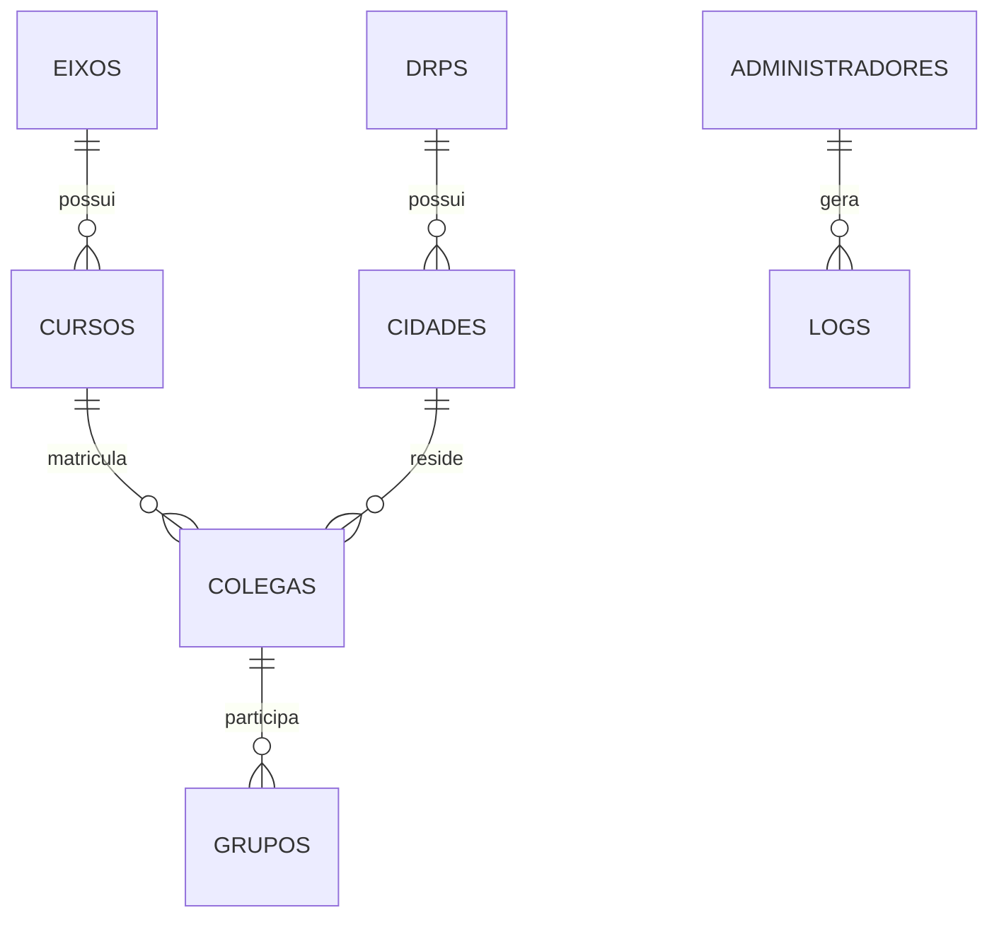
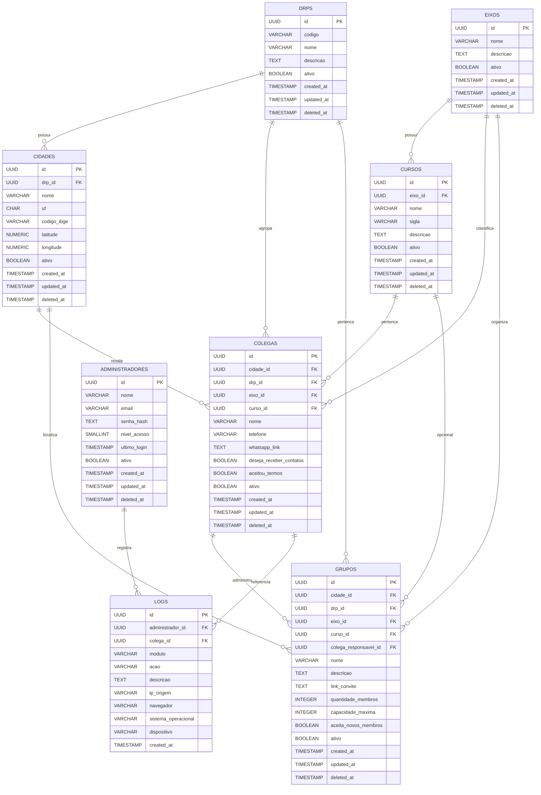

# Documento 04 - Modelo de Dados (Banco de Dados)

# ConectaDRP

## Objetivo do Documento

Este documento define toda a estrutura do banco de dados do sistema ConectaDRP.

Seu objetivo é servir como referência oficial para implementação do banco PostgreSQL hospedado no Supabase, garantindo padronização, integridade dos dados, escalabilidade e facilidade de manutenção.

Toda alteração estrutural do banco deverá obrigatoriamente ser refletida neste documento antes de sua implementação.

---

# Tecnologias Definidas

## Banco de Dados

PostgreSQL 16 ou superior.

---

## Plataforma

Supabase.

---

## ORM

Inicialmente não será utilizado ORM.

Toda comunicação ocorrerá através da API oficial do Supabase.

A arquitetura deverá permitir futura adoção de ORM, caso necessário.

---

## Modelo

Banco de dados relacional.

---

## Normalização

Todo o banco deverá permanecer normalizado até, no mínimo, a Terceira Forma Normal (3FN).

Evitar:

Duplicidade.

Dependências transitivas.

Campos calculados.

Redundância.

---

# Objetivos da Modelagem

A estrutura deverá priorizar.

Integridade.

Performance.

Escalabilidade.

Baixo acoplamento.

Facilidade de manutenção.

Consultas rápidas.

Facilidade para criação de novos módulos.

---

# Princípios Gerais

Toda tabela deverá possuir.

Chave Primária.

Controle de datas.

Status.

Integridade referencial.

Índices adequados.

---

# Convenções de Nomenclatura

## Tabelas

Utilizar sempre nomes no plural.

Exemplos.

colegas

cidades

drps

cursos

eixos

grupos

administradores

logs

---

## Colunas

Utilizar.

snake_case.

Exemplo.

telefone

cidade_id

curso_id

created_at

updated_at

---

## Chaves Primárias

Toda tabela utilizará.

id

Tipo.

UUID.

Gerado automaticamente.

---

## Chaves Estrangeiras

Sempre utilizar o padrão.

nome_da_tabela_id

Exemplos.

cidade_id

curso_id

drp_id

eixo_id

colega_id

grupo_id

---

## Datas

Todas as tabelas deverão possuir.

created_at

updated_at

Quando aplicável.

deleted_at

---

# Tipos de Dados

## Identificadores

UUID.

---

## Texto Curto

VARCHAR.

---

## Texto Longo

TEXT.

---

## Datas

TIMESTAMP WITH TIME ZONE.

---

## Valores Lógicos

BOOLEAN.

---

## Valores Numéricos

INTEGER.

BIGINT.

NUMERIC.

Conforme necessidade.

---

# Estrutura Geral do Banco

O banco será composto inicialmente pelas seguintes tabelas.

```
eixos

↓

cursos

↓

drps

↓

cidades

↓

colegas

↓

grupos

↓

administradores

↓

logs

```

---

# Diagrama Geral



---

# Ordem de Criação das Tabelas

A implementação deverá seguir obrigatoriamente a ordem abaixo.

1.

eixos

↓

2.

cursos

↓

3.

drps

↓

4.

cidades

↓

5.

colegas

↓

6.

grupos

↓

7.

administradores

↓

8.

logs

Essa ordem evita problemas com chaves estrangeiras.

---

# Catálogos

As tabelas abaixo serão consideradas catálogos oficiais.

eixos.

cursos.

drps.

cidades.

Esses registros serão administrados pelo painel administrativo.

Não poderão ser removidos quando existirem relacionamentos.

Será permitida apenas desativação.

---

# Entidades Principais

As principais entidades do sistema serão.

Colega.

Grupo.

Cidade.

Curso.

DRP.

Eixo.

Administrador.

Log.

Cada entidade possuirá documentação individual nas próximas seções.

---

# Integridade Referencial

Toda chave estrangeira deverá possuir.

Restrição de integridade.

Atualização controlada.

Exclusão protegida.

Sempre que possível utilizar.

ON UPDATE CASCADE.

ON DELETE RESTRICT.

Evitar exclusões em cascata que possam remover informações importantes.

---

# Exclusão Lógica

As tabelas principais deverão utilizar exclusão lógica.

Campo.

deleted_at.

Quando preenchido.

O registro será considerado inativo.

Jamais será removido fisicamente sem procedimento administrativo específico.

---

# Controle de Datas

Todas as tabelas deverão possuir.

created_at

Data de criação.

updated_at

Última atualização.

Esses campos deverão ser atualizados automaticamente pelo banco.

---

# Índices

Toda coluna utilizada frequentemente em pesquisas deverá possuir índice.

Inicialmente.

telefone.

cidade_id.

curso_id.

eixo_id.

drp_id.

status.

created_at.

Esses índices poderão ser ampliados conforme necessidade de desempenho.

---

# Chaves Naturais

Embora todas as tabelas utilizem UUID como chave primária.

Alguns campos deverão possuir unicidade.

Exemplos.

Telefone.

Código do DRP.

Sigla do Curso.

Nome do Eixo.

Essas restrições serão detalhadas individualmente em cada tabela.

---

# Políticas de Segurança

O banco deverá utilizar.

Row Level Security.

Políticas de acesso.

Controle de permissões.

Auditoria.

Essas políticas serão detalhadas posteriormente.

---

# Estratégia de Crescimento

A estrutura deverá permitir inclusão futura de.

Eventos.

Projetos Integradores.

TCC.

Mensagens.

Notificações.

Agenda.

Chat.

Gamificação.

Mentorias.

Sem necessidade de alterar as tabelas principais.

---

# Convenções SQL

Todos os scripts deverão seguir.

Palavras-chave SQL em maiúsculas.

Nomes de tabelas em minúsculas.

Indentação padronizada.

Comentários explicativos apenas quando necessários.

---

# Documentação das Tabelas

Cada tabela será documentada contendo.

Objetivo.

Descrição.

Campos.

Tipos.

Restrições.

Índices.

Relacionamentos.

Regras de negócio.

Exemplos de registros.

Scripts SQL.

Casos de teste.

Critérios de aceitação.

---

# Casos de Teste

CT001

Criar banco vazio.

Resultado esperado.

Estrutura criada corretamente.

---

CT002

Criar tabelas seguindo a ordem definida.

Resultado esperado.

Nenhum erro de chave estrangeira.

---

CT003

Validar nomenclatura.

Resultado esperado.

Todas as tabelas seguem o padrão estabelecido.

---

CT004

Executar validação de integridade.

Resultado esperado.

Relacionamentos corretos.

---

# Critérios de Aceitação

A modelagem será considerada aprovada quando.

✓ Todas as tabelas estiverem normalizadas.

✓ Todos os relacionamentos estiverem definidos.

✓ Todas as chaves estrangeiras estiverem corretas.

✓ Os índices principais estiverem implementados.

✓ A estrutura estiver preparada para expansão.

✓ O banco estiver compatível com PostgreSQL e Supabase.

✓ Toda a documentação permanecer sincronizada com a implementação.


# Tabela 01 - eixos

## Objetivo

A tabela **eixos** armazenará todos os eixos acadêmicos oficiais da UNIVESP utilizados pelo ConectaDRP.

Os eixos representam a maior divisão acadêmica do sistema e servirão para organizar os cursos.

Exemplos.

Computação.

Licenciatura.

Negócios e Produção.

Cada curso deverá obrigatoriamente pertencer a um único eixo.

Nenhum colega poderá ser cadastrado diretamente em um eixo.

O vínculo sempre ocorrerá através do curso.

---

# Nome da Tabela

```
eixos
```

---

# Descrição

Tabela de catálogo.

Possui baixa taxa de alteração.

Será administrada apenas pelo painel administrativo.

Os registros raramente sofrerão modificações.

---

# Quantidade Inicial Estimada

Entre 3 e 10 registros.

---

# Estrutura da Tabela

| Campo | Tipo | Obrigatório | Descrição |
|--------|------|-------------|-----------|
| id | UUID | Sim | Identificador único |
| nome | VARCHAR(100) | Sim | Nome oficial do eixo |
| descricao | TEXT | Não | Descrição opcional |
| ativo | BOOLEAN | Sim | Indica se o eixo está disponível |
| created_at | TIMESTAMP WITH TIME ZONE | Sim | Data de criação |
| updated_at | TIMESTAMP WITH TIME ZONE | Sim | Última atualização |
| deleted_at | TIMESTAMP WITH TIME ZONE | Não | Exclusão lógica |

---

# Descrição dos Campos

## id

Identificador único.

Tipo.

UUID.

Gerado automaticamente.

Jamais poderá ser alterado.

---

## nome

Nome oficial do eixo.

Obrigatório.

Único.

Máximo.

100 caracteres.

Exemplos.

Computação.

Licenciatura.

Negócios e Produção.

---

## descricao

Descrição opcional.

Permite detalhar o eixo.

Exemplo.

"Eixo responsável pelos cursos da área de tecnologia."

---

## ativo

Indica disponibilidade.

Valores possíveis.

TRUE.

FALSE.

Quando FALSE.

Não deverá aparecer para novos cadastros.

Entretanto.

Os registros existentes permanecerão válidos.

---

## created_at

Data da criação.

Preenchimento automático.

---

## updated_at

Última atualização.

Atualizado automaticamente.

---

## deleted_at

Utilizado para exclusão lógica.

Enquanto permanecer NULL.

O registro será considerado ativo.

---

# Constraints

Obrigatórias.

Primary Key.

Unique.

Not Null.

Check.

---

## Primary Key

```
PRIMARY KEY (id)
```

---

## Unique

```
UNIQUE (nome)
```

Não poderão existir dois eixos com o mesmo nome.

---

## Not Null

Obrigatório.

nome.

ativo.

created_at.

updated_at.

---

## Check

O nome deverá possuir.

No mínimo.

3 caracteres.

No máximo.

100 caracteres.

---

# Índices

Criar índices para.

```
nome
```

```
ativo
```

```
deleted_at
```

---

# Relacionamentos

A tabela eixos possui relacionamento de um para muitos.

```
eixos

↓

cursos

```

Um eixo.

Pode possuir vários cursos.

Um curso.

Pertence obrigatoriamente a apenas um eixo.

---

# Cardinalidade

```
1 eixo

↓

N cursos
```

---

# Regras de Negócio

RN001

O nome do eixo deverá ser único.

---

RN002

Não permitir cadastro sem nome.

---

RN003

Não permitir exclusão física caso existam cursos vinculados.

---

RN004

Permitir apenas desativação.

---

RN005

Cursos vinculados continuarão válidos mesmo após desativação do eixo.

---

RN006

Apenas administradores poderão cadastrar ou alterar eixos.

---

RN007

Usuários comuns apenas consultarão os eixos disponíveis.

---

# Script SQL

```sql
CREATE TABLE eixos (

    id UUID PRIMARY KEY DEFAULT gen_random_uuid(),

    nome VARCHAR(100) NOT NULL UNIQUE,

    descricao TEXT,

    ativo BOOLEAN NOT NULL DEFAULT TRUE,

    created_at TIMESTAMPTZ NOT NULL DEFAULT NOW(),

    updated_at TIMESTAMPTZ NOT NULL DEFAULT NOW(),

    deleted_at TIMESTAMPTZ

);
```

---

# Índices SQL

```sql
CREATE INDEX idx_eixos_nome
ON eixos(nome);

CREATE INDEX idx_eixos_ativo
ON eixos(ativo);

CREATE INDEX idx_eixos_deleted_at
ON eixos(deleted_at);
```

---

# Trigger de Atualização

Sempre que ocorrer alteração.

Atualizar automaticamente.

```
updated_at
```

Preparar trigger padrão para todas as tabelas.

---

# Exemplos de Registros

| Nome | Ativo |
|-------|--------|
| Computação | TRUE |
| Licenciatura | TRUE |
| Negócios e Produção | TRUE |

---

# Consultas Frequentes

Listar eixos ativos.

```sql
SELECT *

FROM eixos

WHERE ativo = TRUE

AND deleted_at IS NULL

ORDER BY nome;
```

---

Buscar eixo por nome.

```sql
SELECT *

FROM eixos

WHERE nome = 'Computação';
```

---

# Casos de Teste

CT005

Cadastrar eixo.

Resultado esperado.

Registro criado.

---

CT006

Cadastrar eixo duplicado.

Resultado esperado.

Erro de unicidade.

---

CT007

Cadastrar sem nome.

Resultado esperado.

Operação rejeitada.

---

CT008

Desativar eixo.

Resultado esperado.

Cursos permanecem vinculados.

---

CT009

Excluir eixo com cursos relacionados.

Resultado esperado.

Operação bloqueada.

---

# Critérios de Aceitação

A tabela **eixos** será considerada aprovada quando.

✓ O nome possuir unicidade.

✓ Os relacionamentos estiverem íntegros.

✓ Não existir exclusão física de registros utilizados.

✓ O campo `updated_at` for atualizado automaticamente.

✓ A consulta por nome utilizar índice.

✓ A estrutura permanecer compatível com PostgreSQL e Supabase.

✓ Os scripts SQL executarem sem erros.

``` 

# Tabela 01 - eixos

## Objetivo

A tabela **eixos** armazenará todos os eixos acadêmicos oficiais da UNIVESP utilizados pelo ConectaDRP.

Os eixos representam a maior divisão acadêmica do sistema e servirão para organizar os cursos.

Exemplos.

Computação.

Licenciatura.

Negócios e Produção.

Cada curso deverá obrigatoriamente pertencer a um único eixo.

Nenhum colega poderá ser cadastrado diretamente em um eixo.

O vínculo sempre ocorrerá através do curso.

---

# Nome da Tabela

```
eixos
```

---

# Descrição

Tabela de catálogo.

Possui baixa taxa de alteração.

Será administrada apenas pelo painel administrativo.

Os registros raramente sofrerão modificações.

---

# Quantidade Inicial Estimada

Entre 3 e 10 registros.

---

# Estrutura da Tabela

| Campo | Tipo | Obrigatório | Descrição |
|--------|------|-------------|-----------|
| id | UUID | Sim | Identificador único |
| nome | VARCHAR(100) | Sim | Nome oficial do eixo |
| descricao | TEXT | Não | Descrição opcional |
| ativo | BOOLEAN | Sim | Indica se o eixo está disponível |
| created_at | TIMESTAMP WITH TIME ZONE | Sim | Data de criação |
| updated_at | TIMESTAMP WITH TIME ZONE | Sim | Última atualização |
| deleted_at | TIMESTAMP WITH TIME ZONE | Não | Exclusão lógica |

---

# Descrição dos Campos

## id

Identificador único.

Tipo.

UUID.

Gerado automaticamente.

Jamais poderá ser alterado.

---

## nome

Nome oficial do eixo.

Obrigatório.

Único.

Máximo.

100 caracteres.

Exemplos.

Computação.

Licenciatura.

Negócios e Produção.

---

## descricao

Descrição opcional.

Permite detalhar o eixo.

Exemplo.

"Eixo responsável pelos cursos da área de tecnologia."

---

## ativo

Indica disponibilidade.

Valores possíveis.

TRUE.

FALSE.

Quando FALSE.

Não deverá aparecer para novos cadastros.

Entretanto.

Os registros existentes permanecerão válidos.

---

## created_at

Data da criação.

Preenchimento automático.

---

## updated_at

Última atualização.

Atualizado automaticamente.

---

## deleted_at

Utilizado para exclusão lógica.

Enquanto permanecer NULL.

O registro será considerado ativo.

---

# Constraints

Obrigatórias.

Primary Key.

Unique.

Not Null.

Check.

---

## Primary Key

```
PRIMARY KEY (id)
```

---

## Unique

```
UNIQUE (nome)
```

Não poderão existir dois eixos com o mesmo nome.

---

## Not Null

Obrigatório.

nome.

ativo.

created_at.

updated_at.

---

## Check

O nome deverá possuir.

No mínimo.

3 caracteres.

No máximo.

100 caracteres.

---

# Índices

Criar índices para.

```
nome
```

```
ativo
```

```
deleted_at
```

---

# Relacionamentos

A tabela eixos possui relacionamento de um para muitos.

```
eixos

↓

cursos

```

Um eixo.

Pode possuir vários cursos.

Um curso.

Pertence obrigatoriamente a apenas um eixo.

---

# Cardinalidade

```
1 eixo

↓

N cursos
```

---

# Regras de Negócio

RN001

O nome do eixo deverá ser único.

---

RN002

Não permitir cadastro sem nome.

---

RN003

Não permitir exclusão física caso existam cursos vinculados.

---

RN004

Permitir apenas desativação.

---

RN005

Cursos vinculados continuarão válidos mesmo após desativação do eixo.

---

RN006

Apenas administradores poderão cadastrar ou alterar eixos.

---

RN007

Usuários comuns apenas consultarão os eixos disponíveis.

---

# Script SQL

```sql
CREATE TABLE eixos (

    id UUID PRIMARY KEY DEFAULT gen_random_uuid(),

    nome VARCHAR(100) NOT NULL UNIQUE,

    descricao TEXT,

    ativo BOOLEAN NOT NULL DEFAULT TRUE,

    created_at TIMESTAMPTZ NOT NULL DEFAULT NOW(),

    updated_at TIMESTAMPTZ NOT NULL DEFAULT NOW(),

    deleted_at TIMESTAMPTZ

);
```

---

# Índices SQL

```sql
CREATE INDEX idx_eixos_nome
ON eixos(nome);

CREATE INDEX idx_eixos_ativo
ON eixos(ativo);

CREATE INDEX idx_eixos_deleted_at
ON eixos(deleted_at);
```

---

# Trigger de Atualização

Sempre que ocorrer alteração.

Atualizar automaticamente.

```
updated_at
```

Preparar trigger padrão para todas as tabelas.

---

# Exemplos de Registros

| Nome | Ativo |
|-------|--------|
| Computação | TRUE |
| Licenciatura | TRUE |
| Negócios e Produção | TRUE |

---

# Consultas Frequentes

Listar eixos ativos.

```sql
SELECT *

FROM eixos

WHERE ativo = TRUE

AND deleted_at IS NULL

ORDER BY nome;
```

---

Buscar eixo por nome.

```sql
SELECT *

FROM eixos

WHERE nome = 'Computação';
```

---

# Casos de Teste

CT005

Cadastrar eixo.

Resultado esperado.

Registro criado.

---

CT006

Cadastrar eixo duplicado.

Resultado esperado.

Erro de unicidade.

---

CT007

Cadastrar sem nome.

Resultado esperado.

Operação rejeitada.

---

CT008

Desativar eixo.

Resultado esperado.

Cursos permanecem vinculados.

---

CT009

Excluir eixo com cursos relacionados.

Resultado esperado.

Operação bloqueada.

---

# Critérios de Aceitação

A tabela **eixos** será considerada aprovada quando.

✓ O nome possuir unicidade.

✓ Os relacionamentos estiverem íntegros.

✓ Não existir exclusão física de registros utilizados.

✓ O campo `updated_at` for atualizado automaticamente.

✓ A consulta por nome utilizar índice.

✓ A estrutura permanecer compatível com PostgreSQL e Supabase.

✓ Os scripts SQL executarem sem erros.

``` 

---
# Tabela 04 - cidades

## Objetivo

A tabela **cidades** armazenará todas as cidades participantes do ConectaDRP.

Esta é uma das tabelas mais importantes do sistema, pois a cidade será o primeiro critério utilizado na busca por colegas.

Cada cidade pertencerá obrigatoriamente a um único DRP.

Cada colega deverá estar vinculado obrigatoriamente a uma cidade.

---

# Nome da Tabela

```
cidades
```

---

# Descrição

Tabela de catálogo.

Será utilizada em praticamente todas as pesquisas do sistema.

Os registros serão administrados apenas pelo painel administrativo.

Usuários comuns apenas selecionarão sua cidade durante o cadastro.

---

# Quantidade Inicial Estimada

Entre 645 e 700 registros.

A versão inicial deverá contemplar todas as cidades do Estado de São Paulo.

A estrutura permitirá inclusão futura de cidades de outros estados.

---

# Estrutura da Tabela

| Campo | Tipo | Obrigatório | Descrição |
|--------|------|-------------|-----------|
| id | UUID | Sim | Identificador único |
| drp_id | UUID | Sim | DRP responsável pela cidade |
| nome | VARCHAR(150) | Sim | Nome da cidade |
| uf | CHAR(2) | Sim | Unidade Federativa |
| codigo_ibge | VARCHAR(10) | Não | Código oficial do IBGE |
| latitude | NUMERIC(10,7) | Não | Latitude da cidade |
| longitude | NUMERIC(10,7) | Não | Longitude da cidade |
| ativo | BOOLEAN | Sim | Situação da cidade |
| created_at | TIMESTAMP WITH TIME ZONE | Sim | Data de criação |
| updated_at | TIMESTAMP WITH TIME ZONE | Sim | Última atualização |
| deleted_at | TIMESTAMP WITH TIME ZONE | Não | Exclusão lógica |

---

# Descrição dos Campos

## id

Identificador único.

Tipo UUID.

Gerado automaticamente.

Imutável.

---

## drp_id

Identifica o DRP responsável pela cidade.

Obrigatório.

Relacionamento direto com a tabela.

```
drps
```

---

## nome

Nome oficial da cidade.

Obrigatório.

Máximo.

150 caracteres.

Exemplos.

Presidente Prudente.

Adamantina.

Dracena.

Marília.

Bauru.

---

## uf

Sigla da Unidade Federativa.

Obrigatório.

Sempre duas letras.

Inicialmente.

SP.

A estrutura permitirá expansão para outros estados futuramente.

---

## codigo_ibge

Código oficial do IBGE.

Campo opcional.

Permitirá futuras integrações.

---

## latitude

Latitude geográfica.

Campo opcional.

Será utilizada futuramente para cálculo de distância entre cidades.

---

## longitude

Longitude geográfica.

Campo opcional.

Será utilizada futuramente para cálculo de distância entre cidades.

---

## ativo

Indica disponibilidade da cidade.

TRUE.

Cidade disponível para cadastro.

FALSE.

Cidade oculta para novos cadastros.

---

## created_at

Data de criação.

Preenchimento automático.

---

## updated_at

Última atualização.

Atualizado automaticamente.

---

## deleted_at

Campo utilizado para exclusão lógica.

---

# Constraints

Primary Key.

```
PRIMARY KEY (id)
```

---

Foreign Key.

```
FOREIGN KEY (drp_id)
REFERENCES drps(id)
ON UPDATE CASCADE
ON DELETE RESTRICT
```

---

Unique.

Não permitir duas cidades iguais dentro do mesmo estado.

```
UNIQUE(nome, uf)
```

---

Not Null.

drp_id.

nome.

uf.

ativo.

created_at.

updated_at.

---

Check.

UF deverá possuir exatamente duas letras.

---

# Índices

Criar índices para.

```
drp_id
```

```
nome
```

```
uf
```

```
codigo_ibge
```

```
ativo
```

```
deleted_at
```

---

# Relacionamentos

```
drps

↓

cidades

↓

colegas

↓

grupos
```

Cada cidade pertence obrigatoriamente a um único DRP.

Uma cidade poderá possuir diversos colegas.

Uma cidade poderá possuir diversos grupos.

---

# Cardinalidade

```
1 DRP

↓

N cidades

↓

N colegas

↓

N grupos
```

---

# Regras de Negócio

RN024

Toda cidade deverá pertencer a um DRP.

---

RN025

Não permitir cidades duplicadas no mesmo estado.

---

RN026

Não permitir exclusão física caso existam colegas cadastrados.

---

RN027

Não permitir exclusão física caso existam grupos vinculados.

---

RN028

Permitir apenas desativação.

---

RN029

Somente administradores poderão cadastrar ou alterar cidades.

---

RN030

Usuários comuns apenas selecionarão cidades existentes.

---

RN031

A pesquisa principal do sistema utilizará inicialmente a cidade como primeiro critério de localização.

---

RN032

Quando não existirem colegas da mesma cidade.

O sistema deverá utilizar automaticamente o DRP da cidade para ampliar a pesquisa.

---

RN033

As coordenadas geográficas serão utilizadas futuramente para ordenar cidades pela menor distância.

---

# Script SQL

```sql
CREATE TABLE cidades (

    id UUID PRIMARY KEY DEFAULT gen_random_uuid(),

    drp_id UUID NOT NULL,

    nome VARCHAR(150) NOT NULL,

    uf CHAR(2) NOT NULL,

    codigo_ibge VARCHAR(10),

    latitude NUMERIC(10,7),

    longitude NUMERIC(10,7),

    ativo BOOLEAN NOT NULL DEFAULT TRUE,

    created_at TIMESTAMPTZ NOT NULL DEFAULT NOW(),

    updated_at TIMESTAMPTZ NOT NULL DEFAULT NOW(),

    deleted_at TIMESTAMPTZ,

    CONSTRAINT fk_cidade_drp
        FOREIGN KEY (drp_id)
        REFERENCES drps(id)
        ON UPDATE CASCADE
        ON DELETE RESTRICT,

    CONSTRAINT uk_cidade
        UNIQUE(nome, uf)

);
```

---

# Índices SQL

```sql
CREATE INDEX idx_cidades_drp
ON cidades(drp_id);

CREATE INDEX idx_cidades_nome
ON cidades(nome);

CREATE INDEX idx_cidades_uf
ON cidades(uf);

CREATE INDEX idx_cidades_ibge
ON cidades(codigo_ibge);

CREATE INDEX idx_cidades_ativo
ON cidades(ativo);

CREATE INDEX idx_cidades_deleted_at
ON cidades(deleted_at);
```

---

# Trigger

Atualizar automaticamente.

```
updated_at
```

Sempre que ocorrer alteração no registro.

---

# Exemplos de Registros

| Cidade | UF | DRP |
|---------|----|-----------------------|
| Presidente Prudente | SP | Presidente Prudente |
| Álvares Machado | SP | Presidente Prudente |
| Dracena | SP | Presidente Prudente |
| Adamantina | SP | Presidente Prudente |
| Marília | SP | Marília |
| Bauru | SP | Bauru |

---

# Consultas Frequentes

Listar cidades ativas.

```sql
SELECT *

FROM cidades

WHERE ativo = TRUE

AND deleted_at IS NULL

ORDER BY nome;
```

---

Buscar cidade pelo nome.

```sql
SELECT *

FROM cidades

WHERE nome ILIKE '%Presidente%';
```

---

Listar cidades pertencentes a um DRP.

```sql
SELECT *

FROM cidades

WHERE drp_id = :drp_id

ORDER BY nome;
```

---

Buscar cidade pelo código IBGE.

```sql
SELECT *

FROM cidades

WHERE codigo_ibge = '3541406';
```

---

# Papel da Cidade no Algoritmo de Busca

A cidade será sempre o primeiro critério utilizado pelo mecanismo inteligente de localização de colegas.

Fluxo de pesquisa.

1.

Pesquisar colegas.

Mesmo curso.

Mesma cidade.

↓

2.

Não encontrou.

Pesquisar.

Mesmo eixo.

Mesma cidade.

↓

3.

Não encontrou.

Pesquisar.

Mesmo curso.

Mesmo DRP.

↓

4.

Não encontrou.

Pesquisar.

Mesmo eixo.

Mesmo DRP.

↓

5.

Não encontrou.

Informar que ainda não existem colegas cadastrados para aquele perfil.

Convidar o usuário a realizar seu cadastro.

---

# Casos de Teste

CT022

Cadastrar cidade.

Resultado esperado.

Registro criado.

---

CT023

Cadastrar cidade sem DRP.

Resultado esperado.

Operação rejeitada.

---

CT024

Cadastrar cidade duplicada.

Resultado esperado.

Erro de unicidade.

---

CT025

Excluir cidade utilizada por colegas.

Resultado esperado.

Operação bloqueada.

---

CT026

Pesquisar cidades por DRP.

Resultado esperado.

Lista correta.

---

CT027

Executar pesquisa utilizando fallback por DRP.

Resultado esperado.

Sistema amplia automaticamente a busca.

---

CT028

Cadastrar cidade com código IBGE existente.

Resultado esperado.

Validação conforme regra administrativa.

---

# Critérios de Aceitação

A tabela **cidades** será considerada aprovada quando.

✓ Toda cidade pertencer a um DRP.

✓ Não existirem cidades duplicadas no mesmo estado.

✓ Os relacionamentos permanecerem íntegros.

✓ A cidade puder ser utilizada como principal critério de pesquisa.

✓ O algoritmo de fallback para DRP funcionar corretamente.

✓ Os índices estiverem implementados.

✓ Os scripts SQL executarem corretamente.

✓ A estrutura permanecer preparada para expansão para outros estados.


# Tabela 05 - colegas

## Objetivo

A tabela **colegas** representa a principal entidade do ConectaDRP.

Ela armazenará os dados dos estudantes cadastrados na plataforma, permitindo que outros colegas possam localizá-los para formação de grupos de Projeto Integrador (PI), TCC e demais atividades acadêmicas.

Toda a lógica principal de pesquisa do sistema será baseada nesta tabela.

---

# Nome da Tabela

```
colegas
```

---

# Descrição

Tabela principal do sistema.

Possui relacionamento com praticamente todas as demais tabelas.

Cada registro representa um estudante que deseja ser encontrado por outros colegas.

---

# Quantidade Inicial Estimada

Primeiro ano.

5.000 registros.

Estimativa para cinco anos.

Mais de 100.000 registros.

A estrutura deverá suportar crescimento contínuo.

---

# Estrutura da Tabela

| Campo | Tipo | Obrigatório | Descrição |
|--------|------|-------------|-----------|
| id | UUID | Sim | Identificador único |
| nome | VARCHAR(150) | Sim | Nome completo do colega |
| telefone | VARCHAR(20) | Sim | Telefone com DDD |
| whatsapp_link | TEXT | Sim | Link automático do WhatsApp |
| cidade_id | UUID | Sim | Cidade do colega |
| drp_id | UUID | Sim | DRP correspondente à cidade |
| eixo_id | UUID | Sim | Eixo acadêmico |
| curso_id | UUID | Sim | Curso do estudante |
| aceitou_termos | BOOLEAN | Sim | Aceite dos termos de uso |
| deseja_receber_contatos | BOOLEAN | Sim | Permite contato por outros colegas |
| ativo | BOOLEAN | Sim | Situação do cadastro |
| created_at | TIMESTAMPTZ | Sim | Data do cadastro |
| updated_at | TIMESTAMPTZ | Sim | Última atualização |
| deleted_at | TIMESTAMPTZ | Não | Exclusão lógica |

---

# Descrição dos Campos

## id

Identificador único.

Tipo UUID.

Gerado automaticamente.

Jamais poderá ser alterado.

---

## nome

Nome completo informado pelo estudante.

Obrigatório.

Quantidade mínima.

5 caracteres.

Quantidade máxima.

150 caracteres.

Permitir acentos.

---

## telefone

Telefone principal.

Obrigatório.

Armazenado apenas com números.

Exemplo.

```
18998112233
```

O sistema deverá remover automaticamente.

Espaços.

Parênteses.

Traços.

Caracteres especiais.

---

## whatsapp_link

Campo gerado automaticamente.

Não será digitado pelo usuário.

Formato.

```
https://wa.me/5518998112233
```

Sempre utilizar o código do Brasil.

55.

---

## cidade_id

Cidade selecionada pelo usuário.

Obrigatório.

Relacionamento com.

```
cidades
```

---

## drp_id

Será preenchido automaticamente.

Obtido a partir da cidade selecionada.

O usuário nunca escolherá o DRP manualmente.

---

## eixo_id

Obtido automaticamente.

Baseado no curso escolhido.

O usuário não selecionará diretamente.

---

## curso_id

Curso informado pelo estudante.

Obrigatório.

Relacionamento com.

```
cursos
```

---

## aceitou_termos

Obrigatório.

Somente permitir cadastro quando.

TRUE.

---

## deseja_receber_contatos

Define se o estudante deseja aparecer nas pesquisas.

TRUE.

Aparece normalmente.

FALSE.

Fica oculto.

---

## ativo

Controle administrativo.

TRUE.

Cadastro ativo.

FALSE.

Cadastro oculto.

---

## created_at

Data do cadastro.

Preenchimento automático.

---

## updated_at

Última alteração.

Atualizado automaticamente.

---

## deleted_at

Utilizado para exclusão lógica.

---

# Constraints

Primary Key.

```
PRIMARY KEY(id)
```

---

Foreign Keys.

```
cidade_id

REFERENCES cidades(id)
```

```
drp_id

REFERENCES drps(id)
```

```
eixo_id

REFERENCES eixos(id)
```

```
curso_id

REFERENCES cursos(id)
```

---

Unique.

Cada telefone poderá possuir apenas um cadastro.

```
UNIQUE(telefone)
```

---

Not Null.

nome.

telefone.

cidade_id.

drp_id.

curso_id.

eixo_id.

aceitou_termos.

ativo.

created_at.

updated_at.

---

# Índices

Criar índices para.

```
telefone
```

```
cidade_id
```

```
drp_id
```

```
curso_id
```

```
eixo_id
```

```
ativo
```

```
deseja_receber_contatos
```

```
deleted_at
```

---

# Relacionamentos

```
eixos

↓

cursos

↓

colegas

↑

cidades

↑

drps
```

Cada colega.

Pertence a.

Um curso.

Um eixo.

Uma cidade.

Um DRP.

---

# Regras de Negócio

RN034

Todo colega deverá possuir apenas um cadastro.

---

RN035

O telefone deverá ser único.

---

RN036

O WhatsApp será gerado automaticamente.

---

RN037

O DRP será preenchido automaticamente conforme a cidade.

---

RN038

O eixo será preenchido automaticamente conforme o curso.

---

RN039

Somente colegas com cadastro ativo aparecerão nas pesquisas.

---

RN040

Somente colegas que aceitarem receber contatos aparecerão para outros estudantes.

---

RN041

Caso o usuário desative o recebimento de contatos.

Seu cadastro continuará existindo.

Porém ficará invisível nas pesquisas.

---

RN042

Toda alteração no cadastro deverá atualizar automaticamente.

```
updated_at
```

---

RN043

A exclusão deverá ser lógica.

Nunca física.

---

RN044

O sistema deverá impedir cadastros duplicados utilizando o mesmo telefone.

---

RN045

Ao localizar um colega.

O sistema exibirá apenas.

Nome.

Cidade.

Curso.

Telefone.

Botão "Conversar no WhatsApp".

Nenhuma outra informação pessoal será exibida.

---

# Geração Automática do Link do WhatsApp

Sempre que um telefone for salvo.

O sistema deverá gerar automaticamente.

```
https://wa.me/55{telefone}
```

Exemplo.

Telefone.

```
18998112233
```

Link.

```
https://wa.me/5518998112233
```

Ao clicar.

O WhatsApp deverá abrir diretamente na conversa com o colega.

---

# Fluxo de Pesquisa

Primeira tentativa.

Mesmo curso.

Mesma cidade.

↓

Segunda tentativa.

Mesmo eixo.

Mesma cidade.

↓

Terceira tentativa.

Mesmo curso.

Mesmo DRP.

↓

Quarta tentativa.

Mesmo eixo.

Mesmo DRP.

↓

Nenhum resultado.

Exibir mensagem incentivando novos cadastros.

---

# Script SQL

```sql
CREATE TABLE colegas (

    id UUID PRIMARY KEY DEFAULT gen_random_uuid(),

    nome VARCHAR(150) NOT NULL,

    telefone VARCHAR(20) NOT NULL UNIQUE,

    whatsapp_link TEXT NOT NULL,

    cidade_id UUID NOT NULL,

    drp_id UUID NOT NULL,

    eixo_id UUID NOT NULL,

    curso_id UUID NOT NULL,

    aceitou_termos BOOLEAN NOT NULL,

    deseja_receber_contatos BOOLEAN NOT NULL DEFAULT TRUE,

    ativo BOOLEAN NOT NULL DEFAULT TRUE,

    created_at TIMESTAMPTZ NOT NULL DEFAULT NOW(),

    updated_at TIMESTAMPTZ NOT NULL DEFAULT NOW(),

    deleted_at TIMESTAMPTZ,

    CONSTRAINT fk_colega_cidade
        FOREIGN KEY (cidade_id)
        REFERENCES cidades(id),

    CONSTRAINT fk_colega_drp
        FOREIGN KEY (drp_id)
        REFERENCES drps(id),

    CONSTRAINT fk_colega_eixo
        FOREIGN KEY (eixo_id)
        REFERENCES eixos(id),

    CONSTRAINT fk_colega_curso
        FOREIGN KEY (curso_id)
        REFERENCES cursos(id)

);
```

# Continuação da Tabela 05 - colegas

## Índices SQL

```sql
CREATE INDEX idx_colegas_telefone
ON colegas(telefone);

CREATE INDEX idx_colegas_cidade
ON colegas(cidade_id);

CREATE INDEX idx_colegas_drp
ON colegas(drp_id);

CREATE INDEX idx_colegas_curso
ON colegas(curso_id);

CREATE INDEX idx_colegas_eixo
ON colegas(eixo_id);

CREATE INDEX idx_colegas_ativo
ON colegas(ativo);

CREATE INDEX idx_colegas_contatos
ON colegas(deseja_receber_contatos);

CREATE INDEX idx_colegas_deleted
ON colegas(deleted_at);
```

---

# Trigger de Atualização

Sempre que um registro for alterado.

Atualizar automaticamente.

```
updated_at
```

---

# Trigger de Geração do Link do WhatsApp

Sempre que um telefone for inserido ou alterado.

Gerar automaticamente.

```
https://wa.me/55{telefone}
```

Remover automaticamente.

Espaços.

Parênteses.

Traços.

Pontos.

Caracteres especiais.

Armazenar apenas números.

---

# Trigger para Definição Automática do DRP

Sempre que o usuário selecionar uma cidade.

O sistema deverá.

Consultar a tabela.

```
cidades
```

↓

Obter.

```
drp_id
```

↓

Gravar automaticamente no cadastro.

O usuário nunca visualizará esse processo.

---

# Trigger para Definição Automática do Eixo

Sempre que um curso for selecionado.

O sistema deverá consultar.

```
cursos
```

↓

Obter.

```
eixo_id
```

↓

Gravar automaticamente.

---

# Políticas Row Level Security (RLS)

A tabela deverá utilizar Row Level Security.

---

## Política de Consulta Pública

Permitir leitura apenas dos registros.

```
ativo = TRUE

AND

deseja_receber_contatos = TRUE

AND

deleted_at IS NULL
```

---

## Política de Cadastro

Qualquer usuário poderá criar seu próprio cadastro.

Não será necessário login para a primeira versão.

---

## Política de Alteração

Somente o proprietário do cadastro ou administrador poderá alterar seus dados.

Na primeira versão.

O usuário utilizará um link seguro de edição enviado ao telefone informado.

---

## Política de Exclusão

Não permitir exclusão física.

Somente exclusão lógica.

---

# Consultas Frequentes

Pesquisar colegas.

Mesmo curso.

Mesma cidade.

```sql
SELECT *

FROM colegas

WHERE curso_id = :curso

AND cidade_id = :cidade

AND ativo = TRUE

AND deseja_receber_contatos = TRUE

AND deleted_at IS NULL

ORDER BY nome;
```

---

Pesquisar colegas.

Mesmo eixo.

Mesma cidade.

```sql
SELECT *

FROM colegas

WHERE eixo_id = :eixo

AND cidade_id = :cidade

AND ativo = TRUE

AND deseja_receber_contatos = TRUE

AND deleted_at IS NULL

ORDER BY nome;
```

---

Pesquisar colegas.

Mesmo curso.

Mesmo DRP.

```sql
SELECT *

FROM colegas

WHERE curso_id = :curso

AND drp_id = :drp

AND ativo = TRUE

AND deseja_receber_contatos = TRUE

AND deleted_at IS NULL

ORDER BY cidade_id, nome;
```

---

Pesquisar colegas.

Mesmo eixo.

Mesmo DRP.

```sql
SELECT *

FROM colegas

WHERE eixo_id = :eixo

AND drp_id = :drp

AND ativo = TRUE

AND deseja_receber_contatos = TRUE

AND deleted_at IS NULL

ORDER BY cidade_id, nome;
```

---

Pesquisar colega pelo telefone.

```sql
SELECT *

FROM colegas

WHERE telefone = :telefone;
```

---

Pesquisar por nome.

```sql
SELECT *

FROM colegas

WHERE nome ILIKE '%' || :nome || '%'

AND ativo = TRUE;
```

---

# Exemplo de Registro

| Campo | Valor |
|--------|-------|
| Nome | André Fernandes Guirro |
| Telefone | 18998112233 |
| Cidade | Presidente Prudente |
| DRP | Presidente Prudente |
| Curso | Engenharia de Computação |
| Eixo | Computação |
| Receber Contatos | Sim |
| Ativo | Sim |

---

# Utilização nas Telas

Tela Inicial.

Pesquisar colegas.

---

Tela Cadastro.

Cadastrar colega.

---

Tela Resultado.

Exibir lista encontrada.

---

Tela Perfil.

Editar cadastro.

---

Tela Administração.

Gerenciar colegas.

---

# Fluxo Completo

Usuário acessa.

↓

Pesquisa colegas.

↓

Encontra colegas.

↓

Clica em.

"Conversar no WhatsApp"

↓

WhatsApp abre automaticamente.

↓

Os colegas combinam.

↓

Criam grupo para Projeto Integrador ou TCC.

---

# Casos de Teste

CT029

Cadastrar colega.

Resultado esperado.

Cadastro realizado.

---

CT030

Cadastrar telefone duplicado.

Resultado esperado.

Operação rejeitada.

---

CT031

Selecionar cidade.

Resultado esperado.

DRP preenchido automaticamente.

---

CT032

Selecionar curso.

Resultado esperado.

Eixo preenchido automaticamente.

---

CT033

Pesquisar por mesma cidade.

Resultado esperado.

Lista correta.

---

CT034

Pesquisar utilizando fallback para DRP.

Resultado esperado.

Sistema amplia automaticamente a busca.

---

CT035

Desativar recebimento de contatos.

Resultado esperado.

Cadastro deixa de aparecer nas pesquisas.

---

CT036

Clicar no botão WhatsApp.

Resultado esperado.

Aplicativo WhatsApp aberto diretamente na conversa.

---

CT037

Excluir cadastro.

Resultado esperado.

Exclusão lógica.

---

CT038

Editar cadastro.

Resultado esperado.

Campo updated_at atualizado automaticamente.

---

# Critérios de Aceitação

A tabela **colegas** será considerada aprovada quando.

✓ O telefone for único.

✓ O link do WhatsApp for gerado automaticamente.

✓ O DRP for preenchido automaticamente pela cidade.

✓ O eixo for preenchido automaticamente pelo curso.

✓ O algoritmo de pesquisa funcionar corretamente.

✓ Apenas colegas ativos aparecerem nas pesquisas.

✓ Apenas colegas que autorizarem contato forem exibidos.

✓ Todos os relacionamentos permanecerem íntegros.

✓ Os índices estiverem implementados.

✓ As políticas RLS estiverem configuradas.

✓ Os scripts SQL executarem corretamente.

✓ A estrutura permanecer compatível com PostgreSQL e Supabase.


# Tabela 06 - grupos

## Objetivo

A tabela **grupos** armazenará os grupos de estudantes cadastrados no ConectaDRP.

Seu objetivo é permitir que colegas encontrem grupos já existentes em sua cidade, curso ou eixo, evitando a criação de grupos duplicados e facilitando a integração entre estudantes.

Na versão inicial, o sistema apenas divulgará grupos existentes.

Em versões futuras, esta estrutura permitirá automação da criação e gerenciamento de grupos.

---

# Nome da Tabela

```
grupos
```

---

# Descrição

Cada registro representa um grupo criado por um estudante.

Todo grupo possuirá um responsável.

O responsável será quem administrará o grupo no WhatsApp.

---

# Quantidade Inicial Estimada

Primeiro ano.

500 grupos.

Estimativa de crescimento.

Até dezenas de milhares de grupos.

---

# Estrutura da Tabela

| Campo | Tipo | Obrigatório | Descrição |
|--------|------|-------------|-----------|
| id | UUID | Sim | Identificador único |
| nome | VARCHAR(150) | Sim | Nome do grupo |
| descricao | TEXT | Não | Descrição do grupo |
| cidade_id | UUID | Sim | Cidade do grupo |
| drp_id | UUID | Sim | DRP correspondente |
| eixo_id | UUID | Sim | Eixo do grupo |
| curso_id | UUID | Não | Curso específico (opcional) |
| colega_responsavel_id | UUID | Sim | Criador do grupo |
| link_convite | TEXT | Não | Link oficial do grupo WhatsApp |
| quantidade_membros | INTEGER | Sim | Quantidade atual de participantes |
| capacidade_maxima | INTEGER | Sim | Limite máximo definido pelo responsável |
| aceita_novos_membros | BOOLEAN | Sim | Permite novas entradas |
| ativo | BOOLEAN | Sim | Situação do grupo |
| created_at | TIMESTAMPTZ | Sim | Data da criação |
| updated_at | TIMESTAMPTZ | Sim | Última atualização |
| deleted_at | TIMESTAMPTZ | Não | Exclusão lógica |

---

# Objetivo dos Campos

## nome

Nome utilizado para identificação do grupo.

Exemplos.

```
PI Engenharia de Computação - Presidente Prudente

TCC Computação DRP Presidente Prudente

PI Licenciatura Adamantina
```

---

## descricao

Descrição livre.

Utilizada para informar.

Semestre.

Objetivo.

Projeto.

Disciplina.

Observações.

---

## cidade_id

Cidade principal do grupo.

Obrigatória.

---

## drp_id

Obtido automaticamente pela cidade.

---

## eixo_id

Obrigatório.

Permite pesquisas por eixo.

---

## curso_id

Opcional.

Quando preenchido.

Indica grupo exclusivo daquele curso.

Quando nulo.

Significa grupo aberto para todo o eixo.

---

## colega_responsavel_id

Responsável pelo grupo.

Relacionamento.

```
colegas
```

---

## link_convite

Link oficial do grupo.

Exemplo.

```
https://chat.whatsapp.com/xxxxxxxxxxxx
```

Opcional.

Caso o responsável prefira.

Os colegas poderão iniciar conversa diretamente com ele.

---

## quantidade_membros

Quantidade atual de participantes.

Atualizada pelo responsável.

---

## capacidade_maxima

Número máximo permitido.

Exemplo.

50.

100.

200.

500.

---

## aceita_novos_membros

TRUE.

Grupo aceita novos participantes.

FALSE.

Grupo fechado.

---

## ativo

Controle administrativo.

---

# Constraints

Primary Key.

```
PRIMARY KEY(id)
```

---

Foreign Keys.

```
cidade_id

REFERENCES cidades(id)
```

```
drp_id

REFERENCES drps(id)
```

```
eixo_id

REFERENCES eixos(id)
```

```
curso_id

REFERENCES cursos(id)
```

```
colega_responsavel_id

REFERENCES colegas(id)
```

---

Not Null.

nome.

cidade_id.

drp_id.

eixo_id.

colega_responsavel_id.

quantidade_membros.

capacidade_maxima.

ativo.

created_at.

updated_at.

---

# Índices

Criar índices para.

```
cidade_id
```

```
drp_id
```

```
curso_id
```

```
eixo_id
```

```
aceita_novos_membros
```

```
ativo
```

---

# Relacionamentos

```
colegas

↓

grupos

↑

cidade

↑

curso

↑

eixo
```

---

# Regras de Negócio

RN046

Todo grupo deverá possuir um responsável.

---

RN047

O responsável deverá possuir cadastro ativo.

---

RN048

Não permitir grupos vinculados a colegas inativos.

---

RN049

Caso o curso seja informado.

O grupo será considerado específico daquele curso.

---

RN050

Caso o curso permaneça nulo.

O grupo será considerado pertencente ao eixo.

---

RN051

Somente grupos ativos aparecerão nas pesquisas.

---

RN052

Somente grupos com.

```
aceita_novos_membros = TRUE
```

serão sugeridos.

---

RN053

Não permitir quantidade de membros superior à capacidade máxima.

---

RN054

Caso a capacidade máxima seja atingida.

O sistema deixará automaticamente de sugerir o grupo.

---

RN055

Um colega poderá administrar mais de um grupo.

---

RN056

O responsável poderá alterar.

Descrição.

Link.

Quantidade.

Status.

---

# Sugestão Automática de Grupo

Após localizar colegas.

O sistema deverá pesquisar.

Grupos.

Mesmo curso.

Mesma cidade.

↓

Caso não existam.

Pesquisar.

Mesmo eixo.

Mesma cidade.

↓

Caso não existam.

Pesquisar.

Mesmo curso.

Mesmo DRP.

↓

Caso não existam.

Pesquisar.

Mesmo eixo.

Mesmo DRP.

---

# Script SQL

```sql
CREATE TABLE grupos (

    id UUID PRIMARY KEY DEFAULT gen_random_uuid(),

    nome VARCHAR(150) NOT NULL,

    descricao TEXT,

    cidade_id UUID NOT NULL,

    drp_id UUID NOT NULL,

    eixo_id UUID NOT NULL,

    curso_id UUID,

    colega_responsavel_id UUID NOT NULL,

    link_convite TEXT,

    quantidade_membros INTEGER NOT NULL DEFAULT 1,

    capacidade_maxima INTEGER NOT NULL DEFAULT 200,

    aceita_novos_membros BOOLEAN NOT NULL DEFAULT TRUE,

    ativo BOOLEAN NOT NULL DEFAULT TRUE,

    created_at TIMESTAMPTZ NOT NULL DEFAULT NOW(),

    updated_at TIMESTAMPTZ NOT NULL DEFAULT NOW(),

    deleted_at TIMESTAMPTZ

);
```

---

# Casos de Teste

CT039

Cadastrar grupo.

Resultado esperado.

Grupo criado.

---

CT040

Cadastrar grupo sem responsável.

Resultado esperado.

Operação rejeitada.

---

CT041

Cadastrar grupo específico de curso.

Resultado esperado.

Grupo localizado apenas por estudantes do curso.

---

CT042

Cadastrar grupo do eixo.

Resultado esperado.

Grupo disponível para todos os cursos do eixo.

---

CT043

Grupo atingir capacidade máxima.

Resultado esperado.

Sistema deixa de sugeri-lo.

---

CT044

Desativar grupo.

Resultado esperado.

Grupo deixa de aparecer nas pesquisas.

---

CT045

Pesquisar grupos.

Resultado esperado.

Sistema apresenta os grupos compatíveis com cidade, curso, eixo e DRP.

---

# Critérios de Aceitação

A tabela **grupos** será considerada aprovada quando.

✓ Todo grupo possuir responsável.

✓ Todo grupo estiver vinculado a uma cidade.

✓ Todo grupo estiver vinculado a um DRP.

✓ Todo grupo estiver vinculado a um eixo.

✓ O curso puder ser opcional.

✓ O algoritmo de sugestão localizar corretamente os grupos.

✓ Grupos lotados não forem sugeridos.

✓ Apenas grupos ativos forem exibidos.

✓ Os scripts SQL executarem corretamente.

✓ A estrutura permanecer compatível com PostgreSQL e Supabase.


# Tabela 07 - administradores

## Objetivo

A tabela **administradores** armazenará os usuários responsáveis pela administração do ConectaDRP.

Os administradores terão acesso ao painel administrativo, podendo gerenciar os cadastros, tabelas de apoio, grupos, configurações do sistema e acompanhar informações estatísticas da plataforma.

Esta tabela não representa estudantes.

Representa apenas usuários autorizados a administrar o sistema.

---

# Nome da Tabela

```
administradores
```

---

# Descrição

Tabela responsável pelo controle administrativo do sistema.

Seu acesso será protegido por autenticação.

Todas as ações executadas pelos administradores deverão ser registradas em auditoria.

---

# Quantidade Inicial Estimada

Entre 1 e 20 administradores.

---

# Estrutura da Tabela

| Campo | Tipo | Obrigatório | Descrição |
|--------|------|-------------|-----------|
| id | UUID | Sim | Identificador único |
| nome | VARCHAR(150) | Sim | Nome completo |
| email | VARCHAR(150) | Sim | E-mail de acesso |
| senha_hash | TEXT | Sim | Senha criptografada |
| nivel_acesso | SMALLINT | Sim | Perfil de acesso |
| ultimo_login | TIMESTAMPTZ | Não | Último acesso realizado |
| ativo | BOOLEAN | Sim | Situação do administrador |
| created_at | TIMESTAMPTZ | Sim | Data de criação |
| updated_at | TIMESTAMPTZ | Sim | Última atualização |
| deleted_at | TIMESTAMPTZ | Não | Exclusão lógica |

---

# Descrição dos Campos

## id

Identificador único.

Tipo UUID.

Gerado automaticamente.

---

## nome

Nome completo do administrador.

Obrigatório.

Máximo.

150 caracteres.

---

## email

Endereço eletrônico utilizado para autenticação.

Obrigatório.

Único.

Deverá ser armazenado em letras minúsculas.

---

## senha_hash

Senha criptografada.

Jamais armazenar senha em texto puro.

Utilizar algoritmo seguro compatível com a autenticação adotada pelo sistema.

---

## nivel_acesso

Determina as permissões do administrador.

Valores.

1.

Administrador Geral.

2.

Administrador Operacional.

3.

Moderador.

Cada nível possuirá permissões específicas.

---

## ultimo_login

Armazena a data e hora do último acesso realizado.

Atualizado automaticamente após autenticação bem-sucedida.

---

## ativo

Indica se o administrador poderá acessar o sistema.

TRUE.

Acesso permitido.

FALSE.

Acesso bloqueado.

---

## created_at

Data de criação.

Preenchimento automático.

---

## updated_at

Última atualização.

Atualizado automaticamente.

---

## deleted_at

Campo utilizado para exclusão lógica.

---

# Constraints

Primary Key.

```
PRIMARY KEY(id)
```

---

Unique.

```
UNIQUE(email)
```

---

Not Null.

nome.

email.

senha_hash.

nivel_acesso.

ativo.

created_at.

updated_at.

---

Check.

```
nivel_acesso
```

Permitido apenas.

1.

2.

3.

---

# Índices

Criar índices para.

```
email
```

```
nivel_acesso
```

```
ativo
```

```
ultimo_login
```

```
deleted_at
```

---

# Relacionamentos

```
administradores

↓

logs
```

Cada administrador poderá gerar diversos registros de auditoria.

---

# Níveis de Permissão

## Nível 1

Administrador Geral.

Permissões.

Gerenciar administradores.

Gerenciar colegas.

Gerenciar grupos.

Gerenciar cidades.

Gerenciar cursos.

Gerenciar eixos.

Gerenciar DRPs.

Visualizar estatísticas.

Visualizar logs.

Alterar configurações do sistema.

---

## Nível 2

Administrador Operacional.

Permissões.

Gerenciar colegas.

Gerenciar grupos.

Gerenciar cidades.

Gerenciar cursos.

Gerenciar DRPs.

Consultar estatísticas.

Não poderá alterar administradores.

---

## Nível 3

Moderador.

Permissões.

Consultar cadastros.

Editar grupos.

Editar colegas.

Consultar estatísticas.

Não poderá alterar configurações do sistema.

---

# Regras de Negócio

RN057

Todo administrador deverá possuir e-mail único.

---

RN058

Somente administradores ativos poderão acessar o painel.

---

RN059

Toda autenticação deverá registrar data e hora do acesso.

---

RN060

Toda ação administrativa deverá ser registrada na tabela de logs.

---

RN061

Não permitir exclusão física de administradores.

---

RN062

Permitir apenas desativação.

---

RN063

Somente administradores de nível 1 poderão criar novos administradores.

---

RN064

Administradores desativados não poderão realizar autenticação.

---

RN065

Toda alteração de permissões deverá ser registrada em auditoria.

---

# Script SQL

```sql
CREATE TABLE administradores (

    id UUID PRIMARY KEY DEFAULT gen_random_uuid(),

    nome VARCHAR(150) NOT NULL,

    email VARCHAR(150) NOT NULL UNIQUE,

    senha_hash TEXT NOT NULL,

    nivel_acesso SMALLINT NOT NULL,

    ultimo_login TIMESTAMPTZ,

    ativo BOOLEAN NOT NULL DEFAULT TRUE,

    created_at TIMESTAMPTZ NOT NULL DEFAULT NOW(),

    updated_at TIMESTAMPTZ NOT NULL DEFAULT NOW(),

    deleted_at TIMESTAMPTZ

);
```

---

# Índices SQL

```sql
CREATE INDEX idx_admin_email
ON administradores(email);

CREATE INDEX idx_admin_nivel
ON administradores(nivel_acesso);

CREATE INDEX idx_admin_ativo
ON administradores(ativo);

CREATE INDEX idx_admin_login
ON administradores(ultimo_login);

CREATE INDEX idx_admin_deleted
ON administradores(deleted_at);
```

---

# Trigger

Atualizar automaticamente.

```
updated_at
```

Sempre que ocorrer alteração no cadastro.

---

# Consultas Frequentes

Buscar administrador pelo e-mail.

```sql
SELECT *

FROM administradores

WHERE email = :email

AND ativo = TRUE;
```

---

Listar administradores ativos.

```sql
SELECT *

FROM administradores

WHERE ativo = TRUE

AND deleted_at IS NULL

ORDER BY nome;
```

---

Listar administradores por nível.

```sql
SELECT *

FROM administradores

WHERE nivel_acesso = 1;
```

---

# Casos de Teste

CT046

Cadastrar administrador.

Resultado esperado.

Cadastro realizado.

---

CT047

Cadastrar e-mail duplicado.

Resultado esperado.

Operação rejeitada.

---

CT048

Desativar administrador.

Resultado esperado.

Acesso bloqueado.

---

CT049

Registrar login.

Resultado esperado.

Campo ultimo_login atualizado.

---

CT050

Administrador nível 2 tentar criar novo administrador.

Resultado esperado.

Operação negada.

---

CT051

Administrador nível 1 criar novo administrador.

Resultado esperado.

Operação realizada.

---

CT052

Administrador inativo tentar autenticar.

Resultado esperado.

Acesso recusado.

---

# Critérios de Aceitação

A tabela **administradores** será considerada aprovada quando.

✓ Todo administrador possuir e-mail único.

✓ As senhas permanecerem armazenadas apenas em formato criptografado.

✓ Os níveis de acesso funcionarem corretamente.

✓ O último login for atualizado automaticamente.

✓ Apenas administradores ativos acessarem o sistema.

✓ Todas as ações administrativas forem registradas em auditoria.

✓ Os índices estiverem implementados.

✓ Os scripts SQL executarem corretamente.

✓ A estrutura permanecer compatível com PostgreSQL e Supabase.


# Tabela 08 - logs

## Objetivo

A tabela **logs** armazenará todos os eventos relevantes ocorridos no sistema ConectaDRP.

Seu objetivo é permitir auditoria, rastreabilidade, monitoramento, identificação de problemas, análise de segurança e acompanhamento das ações executadas por administradores e usuários.

Nenhum registro desta tabela deverá ser alterado após sua criação.

A tabela será utilizada exclusivamente para fins de auditoria e diagnóstico.

---

# Nome da Tabela

```
logs
```

---

# Descrição

Tabela de auditoria.

Alto volume de crescimento.

Não permitirá edição dos registros.

Somente inclusão.

A exclusão deverá ocorrer apenas através de rotinas administrativas previamente definidas.

---

# Quantidade Inicial Estimada

Primeiro ano.

100.000 registros.

Estimativa futura.

Milhões de registros.

A estrutura deverá estar preparada para grande volume de dados.

---

# Estrutura da Tabela

| Campo | Tipo | Obrigatório | Descrição |
|--------|------|-------------|-----------|
| id | UUID | Sim | Identificador único |
| administrador_id | UUID | Não | Administrador responsável pela ação |
| colega_id | UUID | Não | Colega relacionado ao evento |
| modulo | VARCHAR(50) | Sim | Módulo afetado |
| acao | VARCHAR(50) | Sim | Ação executada |
| descricao | TEXT | Sim | Descrição detalhada |
| ip_origem | VARCHAR(45) | Não | Endereço IP da origem |
| navegador | VARCHAR(255) | Não | Navegador utilizado |
| sistema_operacional | VARCHAR(100) | Não | Sistema operacional |
| dispositivo | VARCHAR(50) | Não | Desktop, Tablet ou Smartphone |
| created_at | TIMESTAMPTZ | Sim | Data e hora do evento |

---

# Descrição dos Campos

## id

Identificador único.

Tipo UUID.

Gerado automaticamente.

---

## administrador_id

Administrador responsável pela ação.

Campo opcional.

Será preenchido apenas quando a ação for administrativa.

Relacionamento.

```
administradores
```

---

## colega_id

Colega relacionado ao evento.

Campo opcional.

Relacionamento.

```
colegas
```

---

## modulo

Identifica o módulo onde ocorreu o evento.

Exemplos.

```
Colegas

Grupos

Cidades

Cursos

Eixos

DRPs

Administração

Autenticação

Sistema
```

---

## acao

Tipo de ação executada.

Exemplos.

```
CREATE

UPDATE

DELETE

LOGIN

LOGOUT

PESQUISA

EXPORTAÇÃO

IMPORTAÇÃO
```

---

## descricao

Descrição detalhada da ocorrência.

Exemplo.

```
Administrador alterou o cadastro do colega João da Silva.
```

---

## ip_origem

Endereço IP de origem.

Compatível com IPv4 e IPv6.

---

## navegador

Nome do navegador utilizado.

Exemplos.

Chrome.

Edge.

Firefox.

Safari.

---

## sistema_operacional

Sistema operacional utilizado.

Exemplos.

Android.

Windows.

Linux.

macOS.

iOS.

---

## dispositivo

Tipo do dispositivo.

Valores sugeridos.

Desktop.

Notebook.

Tablet.

Smartphone.

---

## created_at

Data e hora do evento.

Preenchimento automático.

Nunca poderá ser alterado.

---

# Constraints

Primary Key.

```
PRIMARY KEY(id)
```

---

Foreign Keys.

```
administrador_id

REFERENCES administradores(id)
```

```
colega_id

REFERENCES colegas(id)
```

---

Not Null.

modulo.

acao.

descricao.

created_at.

---

# Índices

Criar índices para.

```
administrador_id
```

```
colega_id
```

```
modulo
```

```
acao
```

```
created_at
```

---

# Relacionamentos

```
administradores

↓

logs

↑

colegas
```

Um administrador poderá gerar diversos registros.

Um colega poderá estar relacionado a diversos eventos.

---

# Regras de Negócio

RN066

Nenhum log poderá ser alterado após sua criação.

---

RN067

Nenhum log poderá ser excluído manualmente.

---

RN068

Toda ação administrativa deverá gerar um log.

---

RN069

Toda autenticação deverá gerar um log.

---

RN070

Toda tentativa de acesso negado deverá gerar um log.

---

RN071

Falhas críticas do sistema deverão gerar log automaticamente.

---

RN072

Erros inesperados deverão registrar informações suficientes para diagnóstico.

---

RN073

Operações de importação e exportação deverão ser registradas.

---

RN074

Pesquisas realizadas pelos usuários poderão ser registradas para fins estatísticos, respeitando as políticas de privacidade.

---

# Script SQL

```sql
CREATE TABLE logs (

    id UUID PRIMARY KEY DEFAULT gen_random_uuid(),

    administrador_id UUID,

    colega_id UUID,

    modulo VARCHAR(50) NOT NULL,

    acao VARCHAR(50) NOT NULL,

    descricao TEXT NOT NULL,

    ip_origem VARCHAR(45),

    navegador VARCHAR(255),

    sistema_operacional VARCHAR(100),

    dispositivo VARCHAR(50),

    created_at TIMESTAMPTZ NOT NULL DEFAULT NOW(),

    CONSTRAINT fk_log_admin
        FOREIGN KEY (administrador_id)
        REFERENCES administradores(id),

    CONSTRAINT fk_log_colega
        FOREIGN KEY (colega_id)
        REFERENCES colegas(id)

);
```

---

# Índices SQL

```sql
CREATE INDEX idx_logs_admin
ON logs(administrador_id);

CREATE INDEX idx_logs_colega
ON logs(colega_id);

CREATE INDEX idx_logs_modulo
ON logs(modulo);

CREATE INDEX idx_logs_acao
ON logs(acao);

CREATE INDEX idx_logs_created
ON logs(created_at);
```

---

# Consultas Frequentes

Listar últimos eventos.

```sql
SELECT *

FROM logs

ORDER BY created_at DESC

LIMIT 100;
```

---

Listar logs de um administrador.

```sql
SELECT *

FROM logs

WHERE administrador_id = :administrador_id

ORDER BY created_at DESC;
```

---

Listar logs por módulo.

```sql
SELECT *

FROM logs

WHERE modulo = 'Colegas'

ORDER BY created_at DESC;
```

---

Listar tentativas de login.

```sql
SELECT *

FROM logs

WHERE acao = 'LOGIN'

ORDER BY created_at DESC;
```

---

# Casos de Teste

CT053

Registrar alteração de cadastro.

Resultado esperado.

Log criado automaticamente.

---

CT054

Registrar autenticação.

Resultado esperado.

Evento registrado.

---

CT055

Registrar tentativa de acesso negado.

Resultado esperado.

Evento registrado.

---

CT056

Consultar histórico de um administrador.

Resultado esperado.

Eventos retornados corretamente.

---

CT057

Consultar eventos por módulo.

Resultado esperado.

Lista correspondente ao módulo informado.

---

CT058

Verificar imutabilidade do log.

Resultado esperado.

Registro não pode ser alterado.

---

# Critérios de Aceitação

A tabela **logs** será considerada aprovada quando.

✓ Todo evento importante gerar registro automaticamente.

✓ Nenhum log puder ser alterado após sua criação.

✓ Os relacionamentos permanecerem íntegros.

✓ As consultas de auditoria apresentarem bom desempenho.

✓ Os índices estiverem implementados.

✓ Os scripts SQL executarem corretamente.

✓ A estrutura permanecer compatível com PostgreSQL e Supabase.


# Modelo Entidade-Relacionamento (MER)

## Objetivo

Este diagrama representa a estrutura lógica oficial do banco de dados do ConectaDRP.

Todos os relacionamentos descritos neste documento deverão ser implementados exatamente conforme especificado.

---

# Diagrama Entidade-Relacionamento



---

# Dicionário de Dados

## Tabelas de Catálogo

eixos.

Cursos agrupados por área acadêmica.

---

cursos.

Cursos oficiais da UNIVESP.

---

drps.

Diretorias Regionais de Polo.

---

cidades.

Municípios cadastrados.

---

## Tabelas Operacionais

colegas.

Cadastro dos estudantes.

---

grupos.

Grupos de WhatsApp cadastrados.

---

## Tabelas Administrativas

administradores.

Controle do painel administrativo.

---

logs.

Auditoria completa do sistema.

---

# Triggers Compartilhadas

Todas as tabelas que possuírem.

```
updated_at
```

deverão utilizar trigger automática para atualização da data.

---

Todas as tabelas que utilizarem.

```
deleted_at
```

deverão utilizar exclusão lógica.

Nenhum registro deverá ser removido fisicamente durante o uso normal da aplicação.

---

Toda inclusão de telefone na tabela.

```
colegas
```

deverá gerar automaticamente.

```
whatsapp_link
```

---

Toda alteração de cidade.

Atualizar automaticamente.

```
drp_id
```

---

Toda alteração de curso.

Atualizar automaticamente.

```
eixo_id
```

---

# Views Recomendadas

## vw_colegas_publicos

Objetivo.

Retornar apenas colegas disponíveis para contato.

Campos.

Nome.

Cidade.

Curso.

Eixo.

Telefone.

WhatsApp.

---

## vw_grupos_disponiveis

Objetivo.

Retornar apenas grupos ativos.

Com vagas disponíveis.

---

## vw_estatisticas

Objetivo.

Apresentar indicadores gerais.

Quantidade de colegas.

Quantidade de grupos.

Quantidade de cidades.

Quantidade de cursos.

Quantidade de acessos.

---

# Functions SQL Recomendadas

## fn_pesquisar_colegas()

Executar automaticamente toda a lógica de pesquisa.

Mesmo curso.

Mesma cidade.

↓

Mesmo eixo.

Mesma cidade.

↓

Mesmo curso.

Mesmo DRP.

↓

Mesmo eixo.

Mesmo DRP.

---

## fn_gerar_link_whatsapp()

Receber telefone.

Remover caracteres inválidos.

Gerar.

```
https://wa.me/55XXXXXXXXXXX
```

---

## fn_atualizar_updated_at()

Atualizar automaticamente.

```
updated_at
```

---

## fn_registrar_log()

Registrar automaticamente ações relevantes.

---

# Políticas Row Level Security

## Colegas

Leitura.

Permitida apenas para registros.

Ativos.

Autorizados para contato.

Não excluídos.

---

Inserção.

Permitida ao público.

---

Atualização.

Permitida apenas ao proprietário do cadastro ou administrador.

---

Exclusão.

Somente lógica.

---

## Administradores

Acesso exclusivo para administradores autenticados.

---

## Logs

Somente leitura por administradores autorizados.

Nenhuma alteração permitida.

---

# Estratégia de Backup

Executar backup diário.

Banco de dados.

---

Backup semanal.

Arquivos.

---

Backup mensal.

Documentação.

---

Preparar rotina automática para restauração.

---

# Estratégia de Migração

Toda alteração estrutural deverá ocorrer através de scripts versionados.

Cada migração deverá possuir.

Número.

Descrição.

Data.

Responsável.

Script de rollback.

---

# Escalabilidade

A estrutura deverá suportar.

Mais de 100.000 colegas.

Mais de 50.000 grupos.

Mais de 10 milhões de registros de log.

Sem necessidade de alteração estrutural significativa.

---

# Compatibilidade

Banco.

PostgreSQL.

---

Hospedagem.

Supabase.

---

Frontend.

React.

---

Backend.

Supabase Edge Functions.

---

PWA.

Compatível.

---

# Considerações Finais

Este documento estabelece oficialmente a estrutura do banco de dados do ConectaDRP.

Toda implementação deverá respeitar integralmente esta modelagem.

Qualquer alteração estrutural futura deverá ser refletida primeiramente nesta documentação antes da implementação técnica.

O modelo foi concebido para privilegiar desempenho, escalabilidade, integridade referencial, facilidade de manutenção e evolução contínua da plataforma.

---


